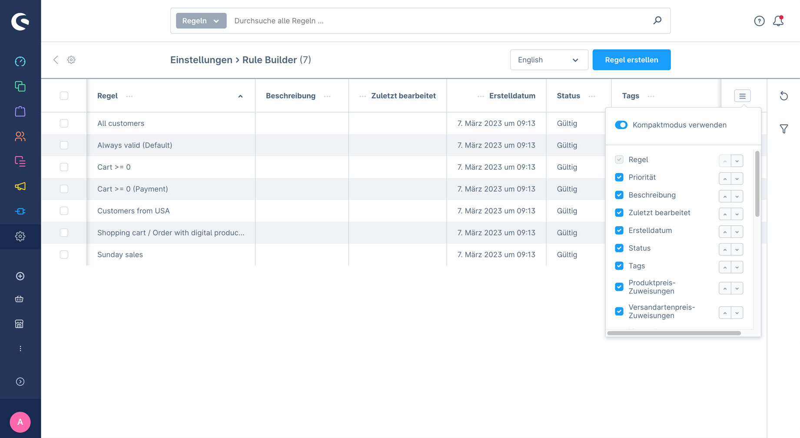
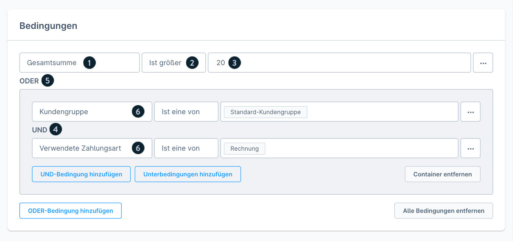
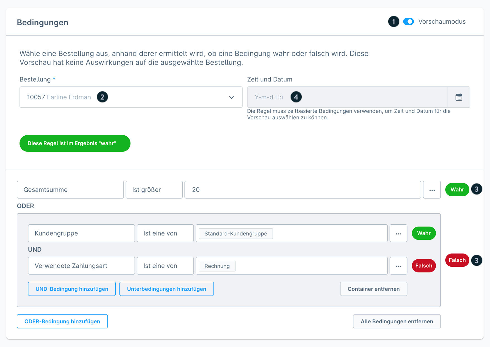
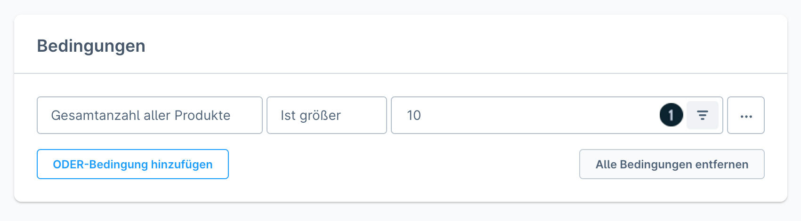
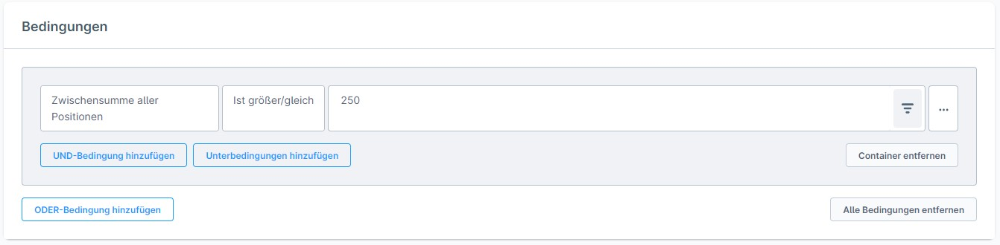
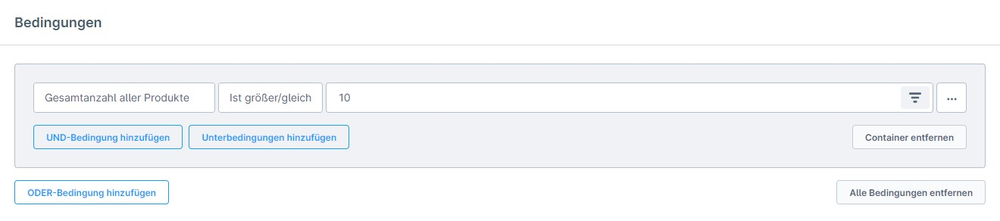
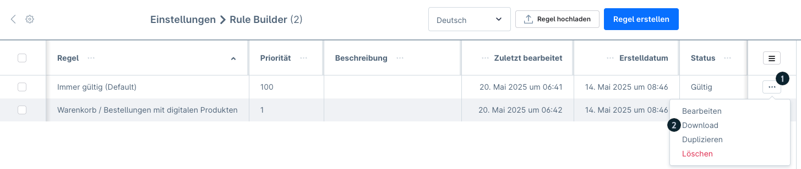
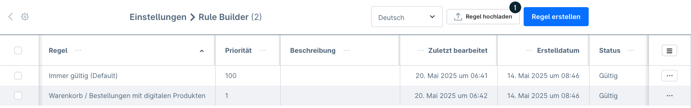
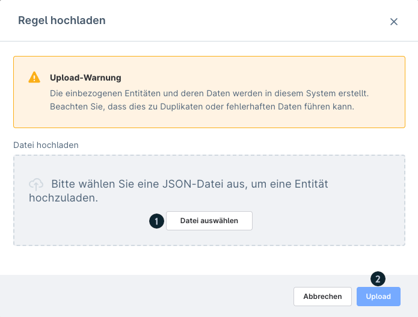

# Rule Builder

**Path:** **Einstellungen > Automatisierung** (Settings > Automation) **> Rule Builder**
**Version:** from Shopware 6.0.0 (sharing rules from v6.7.1.0 with the Rise plan)

## Contents

- [Description](#description)
- [Overview](#overview)
- [Components of a rule](#components-of-a-rule)
- [Creating a rule – step by step](#creating-a-rule-step-by-step)
- [Deleting rules](#deleting-rules)
- [Assignment options](#assignment-options)
- [Preview mode](#preview-mode)
- [Conditions with an optional filter](#conditions-with-an-optional-filter)
- [All operators](#all-operators)
- [All condition categories](#all-condition-categories)
- [Sharing rules (from v6.7.1.0, Rise plan)](#sharing-rules-from-v6710-rise-plan)

## Description

The Rule Builder allows rule-based conditions to be created for various Shopware functions. It is used especially for configuring discount promotions under Marketing > **Rabatte & Aktionen** (Discounts & promotions).

---

## Overview

The overview page shows all rules in a table.

### Standard columns

| Column | Description |
|--------|--------------|
| **Regel** (Rule) | Name of the rule |
| **Priorität** (Priority) | Order in which the rules are executed |
| **Beschreibung** (Description) | Explanation of the rule |
| **Zuletzt bearbeitet** (Last edited) | Date of the last change |
| **Erstelldatum** (Creation date) | Date of creation |
| **Status** | Aktiv / Inaktiv (active / inactive) |

### Extended columns (can be shown)

| Column | Description |
|--------|--------------|
| **Produktpreis-Zuweisung** (Product price assignment) | Number of product prices that use this rule |
| **Versandartenpreis-Zuweisung** (Shipping method price assignment) | Number of shipping methods that use this rule |
| **Flow-Zuweisung** (Flow assignment) | Number of flows that use this rule |
| **Rabatt-Zuweisung** (Discount assignment) | Number of discount promotions that use this rule |

---

## Components of a rule

### General information

| Field | Description |
|------|--------------|
| **Name** | Identification of the rule |
| **Beschreibung** | Documentation of the use case |
| **Priorität** | Higher value = higher priority on simultaneous execution |
| **Typ** (Type) | Restriction of the assignment options |
| **Tags** | Organisational aid for the overview |

### Condition structure

| Element | Description |
|---------|--------------|
| **Bedingung** (Condition) | Parameter query (e.g. "Gesamtsumme" – total sum) |
| **Operator** | Comparison method (greater, less, equal) |
| **Eingabewert** (Input value) | Comparison value (e.g. 50 for €50) |
| **UND-Verknüpfung** (AND combination) | All conditions have to be met |
| **ODER-Verknüpfung** (OR combination) | At least one condition has to be met |
| **Unterbedingungen** (Sub-conditions) | Created automatically when the combination type is changed |

---

## Creating a rule – step by step

1. Navigate to Einstellungen > Automatisierung > Rule Builder
2. Click the "**Regel erstellen**" (Create rule) button
3. Enter a **Name** and optionally a **Beschreibung**
4. Set the **Priorität** (default: 1)
5. Click the "**Bedingung hinzufügen**" (Add condition) button
6. Choose the condition type from the dropdown
7. Select the **Operator**
8. Enter the **Eingabewert**
9. Combine further conditions with AND/OR (optional)
10. Click **Speichern** (Save)

---

## Deleting rules

> **Important:** rules cannot be deleted as long as they are assigned to a function. Remove all assignments first.

- Deletion via the context menu (three dots) in the overview
- Deleted rules cannot be restored

---

## Assignment options

Rules can be assigned to the following areas:

| Area | Purpose |
|---------|-------|
| Payment methods | Restrict the availability |
| Shipping methods | Restrict the availability |
| Shipping costs | Control the calculation |
| Promotions | Conditions for discount promotions |
| Advanced prices | Product price calculation |
| Flow Builder | Automation rules |
| Product visibility | Dynamic Access (paid) |
| Category visibility | Dynamic Access (paid) |
| Shopping Experience | Control the block visibility |

---

## Preview mode

> **Availability:** Rise plan and higher

The preview mode allows a rule to be checked in real time:

1. Open the rule
2. Choose the tab "**Vorschau**" (Preview)
3. Select an order
4. Optional: simulate a point in time
5. Result: TRUE/FALSE for every condition

---

## Conditions with an optional filter

Three conditions offer a filter icon for narrowing things down further:

| Condition | Filter option |
|-----------|---------------|
| **Zwischensumme aller Positionen** (Subtotal of all line items) | Filter by category |
| **Gesamtanzahl aller Produkte** (Total number of all products) | Filter by tags |
| **Gesamtanzahl unterschiedlicher Produkte** (Total number of different products) | Filter by list price |

---

## All operators

| Operator | Description |
|----------|--------------|
| **Mind. eine** (At least one) | At least one value in the list has to match |
| **Alle** (All) | All values in the list have to match |
| **Gleich** (Equal) | Exact match with the value |
| **Ungleich** (Not equal) | No match with the value |
| **Ist eine von** (Is one of) | Match with one of the specified values |
| **Ist keine von** (Is none of) | No match with the specified values |
| **Größer** (Greater) | Greater than the input value |
| **Größer gleich** (Greater or equal) | Greater than or equal to the input value |
| **Kleiner** (Less) | Less than the input value |
| **Kleiner gleich** (Less or equal) | Less than or equal to the input value |

---

## All condition categories

### 1. Allgemein (General) (8 conditions)

| Condition | Description |
|-----------|--------------|
| Ausgelöst durch Admin-API (Triggered by the Admin API) | Checks whether the request came via the Admin API |
| Datumsbereich (Date range) | The date lies between two values |
| Immer zutreffend (Always applies) | The condition is always met |
| Sprache (Language) | Current shop language |
| Steuerdarstellung (Tax display) | Gross or net display |
| Verkaufskanal (Sales channel) | Which sales channel is active |
| Währung (Currency) | Current currency |
| Wochentag (Day of the week) | Current day of the week |
| Zeitraum (Period) | The current point in time lies within a period |

### 2. Bestellungen (Orders) (11 conditions)

| Condition | Description |
|-----------|--------------|
| Affiliate-Code | The order contains a particular affiliate code |
| Bestellstatus (Order status) | Status of the order |
| Bestellung mit Dokument (Order with document) | A document assigned to a type |
| Bestellung mit gesendeter Dokumenten-Art (Order with a sent document type) | The document has been sent |
| Bestellung mit Tag (Order with tag) | The order has a particular tag |
| Bestellung mit Zusatzfeld (Order with custom field) | A custom field has a value |
| Bestellung vom Administrator erstellt (Order created by the administrator) | Created in the administration |
| Kampagnen-Code (Campaign code) | A particular campaign code is present |
| Lieferstatus (Delivery status) | Status of the delivery |
| Zahlungsstatus (Payment status) | Status of the payment |
| In Administration verwendbar (Usable in the administration) | The rule can be used in the administration |

### 3. Kunde (Customer) (25 conditions)

#### Demographic

| Condition | Description |
|-----------|--------------|
| Kundenalter (Customer age) | Age of the customer |
| Kunden-Geburtstag (Customer birthday) | Birthday of the customer (date) |
| Kundenanrede (Customer salutation) | Salutation of the customer |
| Kundennachname (Customer last name) | Last name of the customer |
| Kundennummer (Customer number) | Customer number |

#### Behaviour

| Condition | Description |
|-----------|--------------|
| Angemeldeter Kunde (Logged-in customer) | The customer is logged in |
| Anzahl abgeschlossener Bestellungen (Number of completed orders) | Order history of the customer |
| Firmenkunde (Business customer) | Is a B2B customer |
| Gastbesteller (Guest orderer) | Order placed as a guest |
| Gesamtwert aller abgeschlossenen Bestellungen (Total value of all completed orders) | Sum of all orders |
| Kunde ist aktiv (Customer is active) | The customer account is active |
| Kunde ist Newsletter-Empfänger (Customer is a newsletter recipient) | Has subscribed to the newsletter |
| Zeit seit der ersten Anmeldung (Time since first registration) | How long the customer has been registered |
| Zeit seit der letzten Anmeldung (Time since last login) | Time of the last login |
| Zeit seit letzter Bestellung (Time since last order) | Last order |

#### Address data

| Condition | Description |
|-----------|--------------|
| Lieferadresse: Bundesland (Shipping address: state) | State of the shipping address |
| Lieferadresse: Land (Shipping address: country) | Country of the shipping address |
| Lieferadresse: Postleitzahl (Shipping address: postcode) | Postcode of the shipping address |
| Lieferadresse: Stadt (Shipping address: city) | City of the shipping address |
| Lieferadresse: Straße (Shipping address: street) | Street of the shipping address |
| Rechnungsadresse: Bundesland (Billing address: state) | State of the billing address |
| Rechnungsadresse: Land (Billing address: country) | Country of the billing address |
| Rechnungsadresse: Postleitzahl (Billing address: postcode) | Postcode of the billing address |
| Rechnungsadresse: Stadt (Billing address: city) | City of the billing address |
| Rechnungsadresse: Straße (Billing address: street) | Street of the billing address |

#### Configuration

| Condition | Description |
|-----------|--------------|
| Kunden-E-Mail-Adresse (Customer email address) | Email address (wildcard `*` supported) |
| Kunde mit abweichender Lieferadresse (Customer with a differing shipping address) | The shipping address differs from the billing address |
| Kunde mit Standardzahlungsart (Customer with a default payment method) | The stored default payment method |
| Kunde mit Tag (Customer with tag) | The customer has a particular tag |
| Kunde mit Zusatzfeld (Customer with custom field) | A custom field has a value |
| Neukunde *(deprecated)* (New customer) | Use "Zeit seit erste Anmeldung" instead |

### 4. Marketing & Rabattaktionen (Marketing & discount promotions) (4 conditions)

| Condition | Description |
|-----------|--------------|
| Anzahl der Rabatte (Number of discounts) | Number of active discount promotions in the cart |
| Rabattaktion (Discount promotion) | A particular discount promotion is active |
| Rabattaktionen mit Aktionscodetyp (Discount promotions with promotion code type) | Type of the promotion code used |
| Zwischensumme aller Rabatte (Subtotal of all discounts) | Total discount sum in the cart |

### 5. Positionen im Warenkorb (Line items in the cart) (30+ conditions)

#### Stock

| Condition | Description |
|-----------|--------------|
| Position mit Lagerbestand (Line item with stock) | Stock level of the item |
| Position mit verfügbarem Bestand (Line item with available stock) | Available stock |
| Artikel auf Lager (Item in stock) | The item is in stock |

#### Product properties

| Condition | Description |
|-----------|--------------|
| Position mit Breite/Höhe/Länge/Volumen (Line item with width/height/length/volume) | Dimensions of the product |
| Position mit Einkaufspreis (Line item with purchase price) | Purchase price |
| Position mit Erscheinungsdatum (Line item with release date) | Release date |
| Position mit Erstellungsdatum (Line item with creation date) | Creation date |
| Position mit Gewicht (Line item with weight) | Weight of the product |
| Position mit Hersteller (Line item with manufacturer) | Manufacturer of the product |
| Position mit prozentualen Preis/Streichpreis Verhältnis (Line item with a percentage price/list price ratio) | Discount ratio |
| Position mit Steuersatz (Line item with tax rate) | VAT rate |
| Position mit Streichpreis (Line item with list price) | A list price is present |
| Position mit Tag (Line item with tag) | The product has a particular tag |
| Position mit Varianten- oder Eigenschaftsausprägung (Line item with a variant or property value) | Variant/property |
| Position mit Zusatzfeld (Line item with custom field) | Custom field value |

#### Status & categorisation

| Condition | Description |
|-----------|--------------|
| Position als "neu" markiert (Line item marked as "new") | The product is marked as new |
| Position im Abverkauf (Line item in clearance) | Clearance product |
| Position in dynamischer Produktgruppe (Line item in a dynamic product group) | Dynamic group |
| Position in Kategorie (Line item in category) | Category of the product |
| Position ist hervorgehoben (Line item is highlighted) | Featured product |
| Position ist versandkostenfrei (Line item is free of shipping costs) | Free shipping flag |
| Position mit Durchschnittsbewertung (Line item with average rating) | Customer rating |
| Position vom Typ (Line item of type) | Product or voucher type |

#### Quantities & prices

| Condition | Description |
|-----------|--------------|
| Anzahl unterschiedlicher Positionen (Number of different line items) | Number of different items |
| Positionsanzahl (Line item count) | Quantity of one item in the cart |
| Positionsstückpreis (Line item unit price) | Price per unit |
| Positionszwischensumme (Line item subtotal) | Subtotal of one line item |
| Zwischensumme aller Positionen (Subtotal of all line items) | Total value of all line items (with filter) |

### 6. Warenkorb (Cart) (10 conditions)

| Condition | Description |
|-----------|--------------|
| Gesamtanzahl aller Produkte (Total number of all products) | Total product quantity (with filter) |
| Gesamtanzahl unterschiedlicher Produkte (Total number of different products) | Number of different products (with filter) |
| Gesamtgewicht aller Produkte (Total weight of all products) | Total weight |
| Gesamtsumme (Total sum) | Total amount of the cart |
| Gesamtvolumen aller Produkte (Total volume of all products) | Total volume |
| Summe (Sum) | Sum (excluding certain line items) |
| Versandkosten (Shipping costs) | Current shipping costs |
| Verwendete Versandart (Shipping method used) | The chosen shipping method |
| Verwendete Zahlungsart (Payment method used) | The chosen payment method |

---

## Sharing rules (from v6.7.1.0, Rise plan)

### Downloading a rule (export)

1. In the overview open the context menu `[...]` of the rule
2. Choose the option "**Herunterladen**" (Download)
3. A JSON file is downloaded (contains all conditions, operators, references)

> **Note:** customers, customer groups and sales channels from the rule may be missing in the target shop.

### Uploading a rule (import)

1. In the overview click the "**Regel hochladen**" (Upload rule) button
2. Select the JSON file
3. Validation runs automatically
4. Missing references can be reassigned

