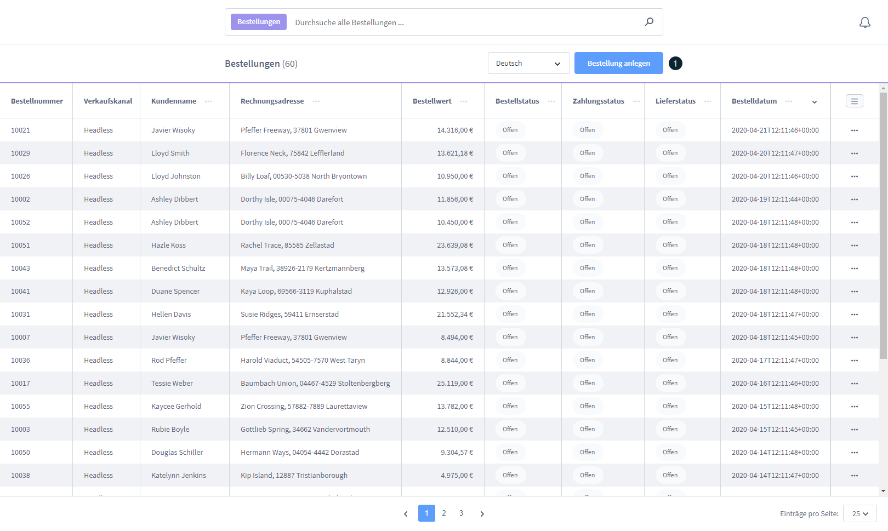
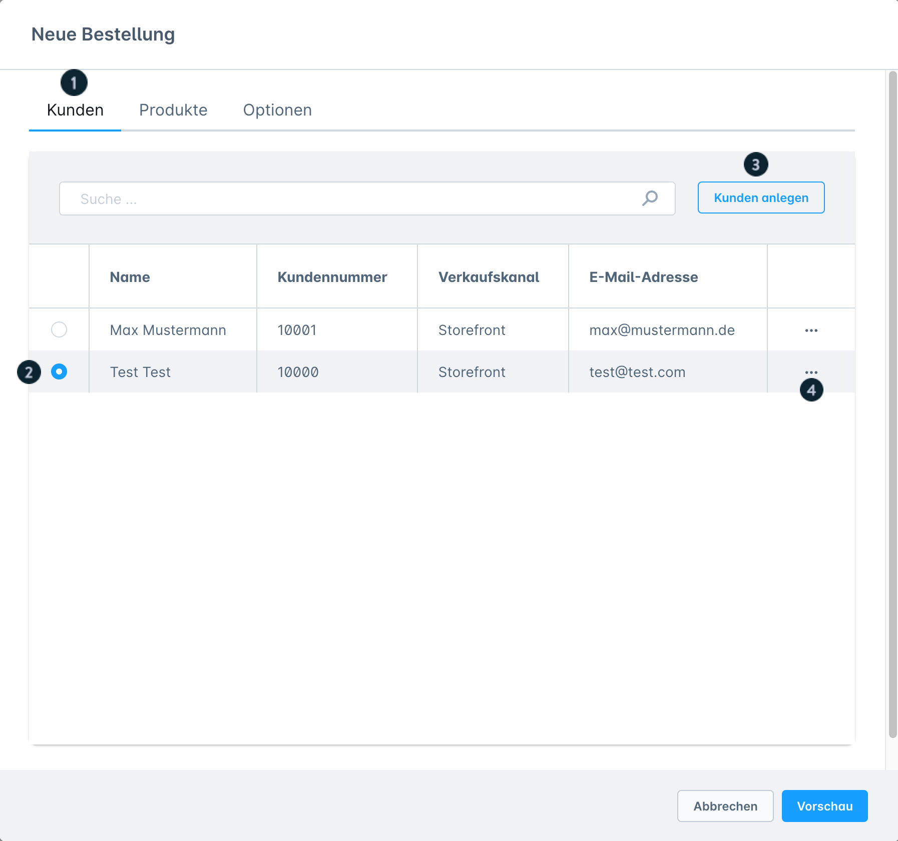
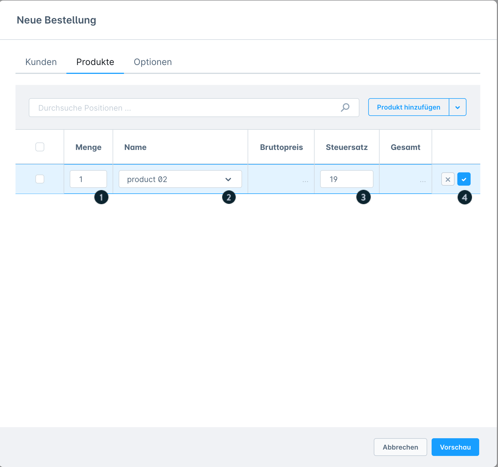
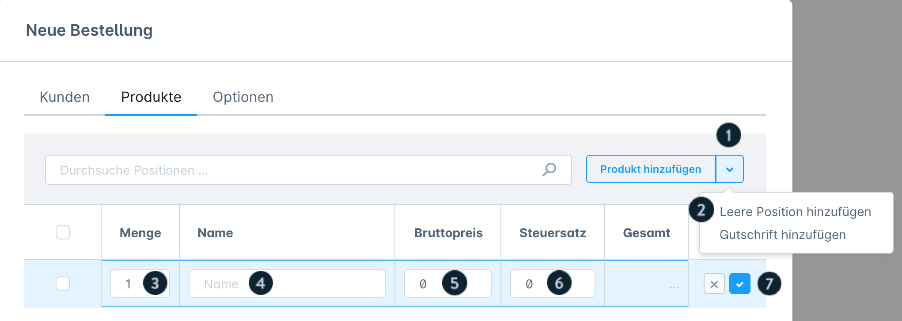
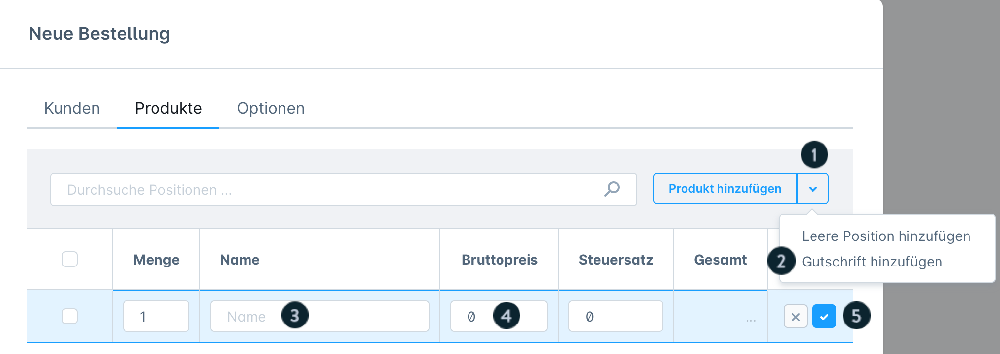
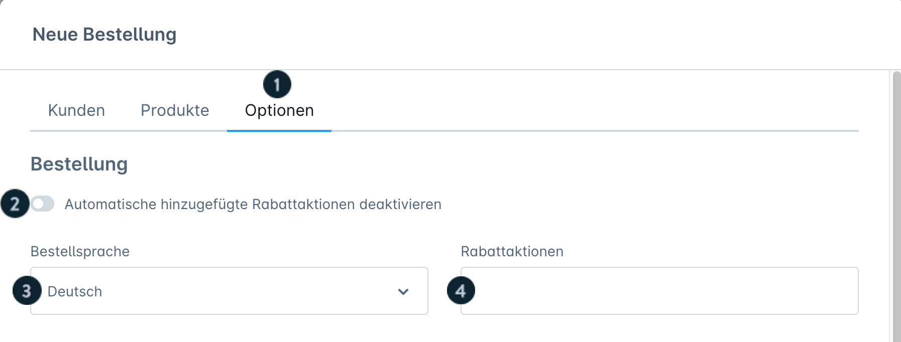
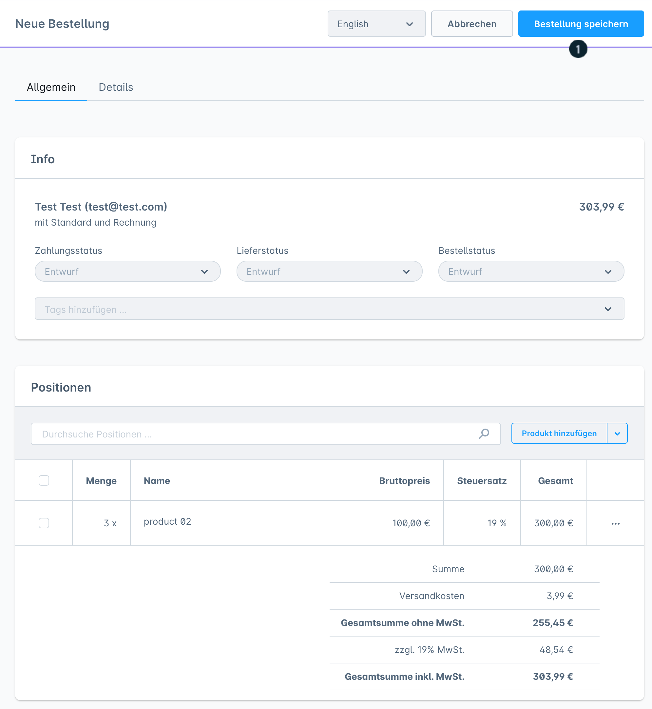

# Shopware 6 – Bestellung manuell im Admin anlegen: Vollständige Referenz

## Einstieg

Unter **Bestellungen** befindet sich der Button **„Bestellung anlegen"**. Darüber öffnet sich das Modul zur manuellen Bestellerfassung. Dieses Modul ist ab Shopware **6.5.0.0** verfügbar.

---

## Schritt 1: Kunden auswählen

In der Kundenliste werden angezeigt:
- Name
- Kundennummer
- Verkaufskanal
- E-Mail-Adresse

**Alternativen:**
- Bestehenden Kunden aus der Liste wählen
- Neuen Kunden direkt über „Kunden anlegen" anlegen (ohne die Ansicht zu verlassen)
- Bearbeiten-Icon öffnet den Kunden zur direkten Bearbeitung

---

## Schritt 2: Positionen hinzufügen

### Produkt aus Katalog hinzufügen

1. Button **„Produkt hinzufügen"** klicken
2. Produkt im Suchdialog finden und auswählen
3. Zeile per Doppelklick bearbeiten:
   - **Preis**: wird automatisch aus dem Produktstamm übernommen, ist manuell überschreibbar
   - **Steuersatz**: wird automatisch aus dem Produktstamm übernommen
   - **Menge**: beeinflusst den Gesamtpreis
4. Eingabe mit Häkchen-Button bestätigen

> Das Suchfeld filtert nur Positionen der aktuellen Bestellung, **nicht** den gesamten Produktkatalog.

### Leere Position hinzufügen

Zugang: Dropdown-Pfeil neben „Produkt hinzufügen" > **„Leere Position hinzufügen"**

Verwendung für Nicht-Katalog-Produkte oder Dienstleistungen:

| Feld | Pflicht | Hinweis |
|---|---|---|
| Name | Ja | Erscheint auf Dokumenten |
| Bruttopreis | Ja | Erst nach Steuersatz-Eingabe korrekt angezeigt |
| Steuersatz | Ja | Muss zuerst eingegeben werden |
| Menge | Ja | Standard: 1 |

Eingabe mit Häkchen-Button bestätigen.

### Gutschrift / Rabatt hinzufügen

Zugang: Dropdown-Pfeil neben „Produkt hinzufügen" > **„Gutschrift hinzufügen"**

| Feld | Pflicht | Hinweis |
|---|---|---|
| Name | Ja | Beschriftung auf Dokumenten |
| Bruttopreis | Ja | Negativer Betrag = Abzug |

> Steuersatz wird automatisch aus den Produktpositionen berechnet. Eine manuelle Anpassung des Steuersatzes ist bei Gutschriften **nicht** möglich.

### Position löschen

Checkbox neben einer Position aktivieren > Löschen-Button erscheint. Kopf-Checkbox selektiert alle Positionen auf einmal.

---

## Schritt 3: Optionen konfigurieren

| Option | Beschreibung |
|---|---|
| **Automatische Rabattaktionen** | Vorhandene Rabattregeln aktivieren/deaktivieren |
| **Bestellsprache** | Sprache für E-Mails und Dokumente |
| **Rabatt** | Gutscheincode eingeben |
| **Zahlungsart** | Nur Zahlungsarten auswählbar, die für den Verkaufskanal aktiv und als „nachträgliche Zahlart erlaubt" markiert sind |
| **Rechnungsadresse** | Auswahl aus gespeicherten Kundenadressen |
| **Währung** | Nur im Verkaufskanal aktivierte Währungen |
| **Versandart** | Auswahl aus konfigurierten Versandarten |
| **Versandkosten** | Manuelle Versandkosten eingeben |
| **Lieferadresse gleich Rechnungsadresse** | Toggle; wenn deaktiviert, separate Lieferadresse wählen |
| **Lieferadresse** | Separate Lieferadresse (wenn Toggle deaktiviert) |
| **Vorschau** | Bestellung vorab anzeigen (noch nicht gespeichert) |

### Versandkosten nachträglich ändern

Nach dem Speichern: Versandkosten-Zeile per Doppelklick bearbeiten und neuen Betrag eingeben.

---

## Schritt 4: Bestellung speichern

Button **„Bestellung speichern"** klickt:
- Bestellung wird angelegt
- Bestätigungs-E-Mail wird **automatisch** an die hinterlegte Kunden-E-Mail-Adresse gesendet

Nach dem Speichern stehen im Tab **„Details"** zur Verfügung:
- Zahlungsinformationen
- Versandinformationen
- Allgemeine Bestelldetails

---

## Neuen Kunden direkt anlegen

Button **„Kunden anlegen"** öffnet ein Modul mit folgenden Tabs:

### Tab: Details
- Allgemeine Kundendaten
- Option: Gastkonto (kein Passwort erforderlich)

### Tab: Rechnungsadresse
- Vollständige Rechnungsadressdaten

### Tab: Lieferadresse
- Lieferadresse; Toggle „entspricht Rechnungsadresse" übernimmt Rechnungsadresse

---

## PayPal-Zahlung nach manueller Bestellung

Wenn PayPal als Zahlungsart ausgewählt wurde, schließt der Kunde die Zahlung nachträglich im Kundenkonto ab:

1. Kundenkonto > Bestellungen
2. „..."-Menü > **„Zahlungsart ändern"**
3. Wenn PayPal bereits ausgewählt: AGB akzeptieren > **„Änderung bestätigen"**
4. Wenn PayPal noch nicht ausgewählt: Zahlungsart auf PayPal wechseln

Alternativ: Zahlungsänderungs-Link aus der Auftragsbestätigungs-E-Mail nutzen.

> Menübeschriftung anpassbar über Textbaustein `account.orderContextMenuChangePayment`.

---

## Voraussetzungen

- Shopware **6.5.0.0** oder höher
- Für ältere Versionen (6.2.0 – 6.4.20.0): separate Legacy-Dokumentation verfügbar

---

## Quelle
https://docs.shopware.com/de/shopware-6-de/bestellungen/bestellung-im-admin-anlegen
