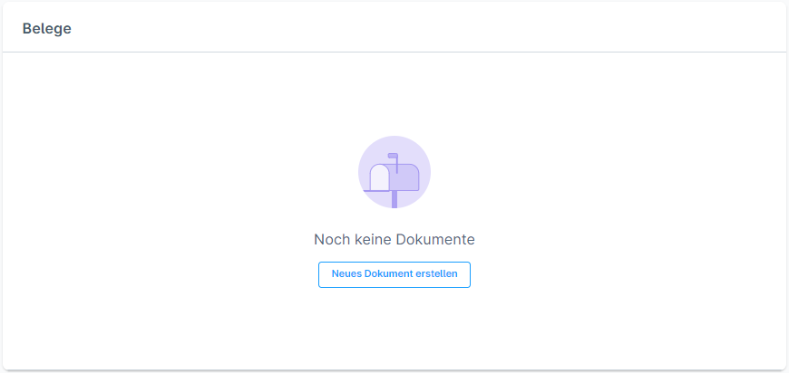
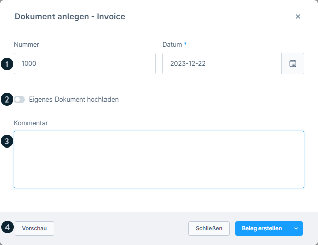
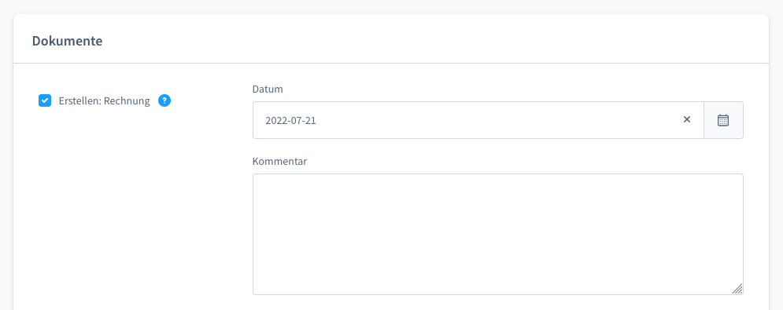
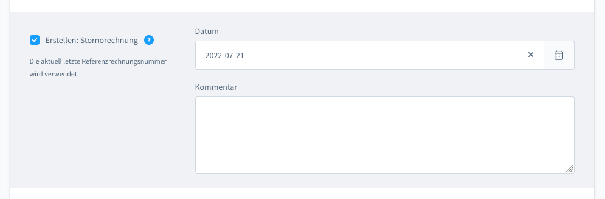
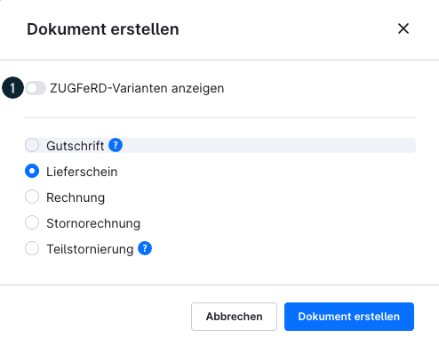
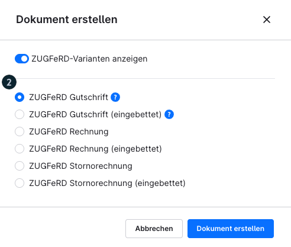
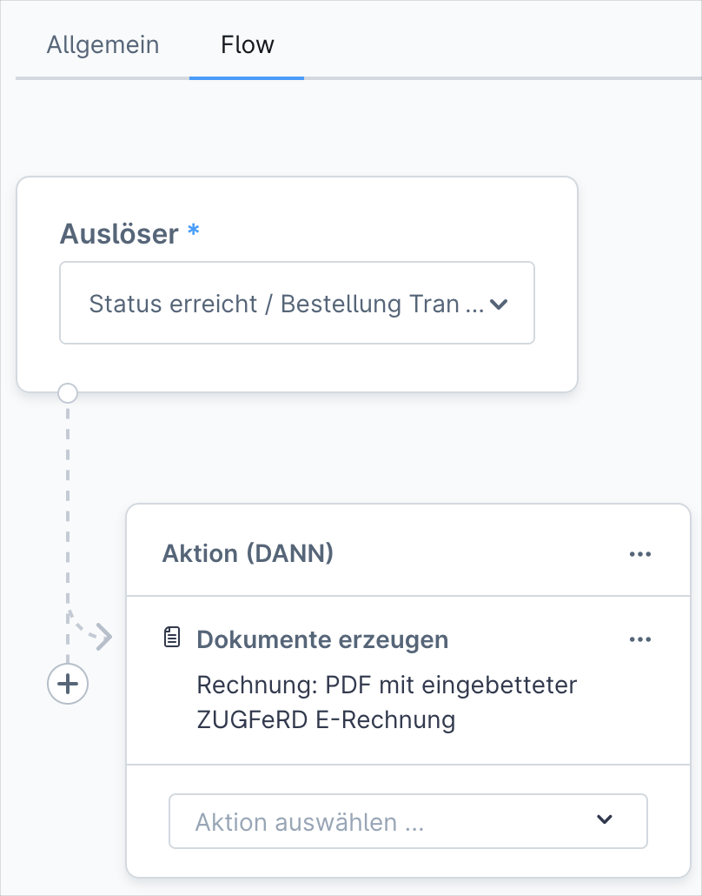

# Shopware 6 – Bestelldokumente: Vollständige Referenz

## Dokumentenübersicht



Die Dokumentenverwaltung befindet sich im Tab **„Allgemein"** einer geöffneten Bestellung, im Bereich **„Dokumente"**.

---

## Einzelnes Dokument erstellen



Klick auf **„Dokument hinzufügen"** öffnet den Erstellungsdialog.

### Gemeinsame Felder (alle Dokumenttypen)

| Feld | Beschreibung |
|---|---|
| Dokumentdatum | Pflichtfeld; erscheint auf dem Dokument |
| Kommentar | Optionaler Text, der auf dem Dokument erscheint |
| Nummernkreis | Automatisch aus konfigurierten Nummernkreisen |
| Vorschau | Dokument vor Erstellung ansehen |

---

## Dokumenttypen im Detail

### Rechnung (Rechnung)



- Grunddokument für alle Bestellungen
- Nummernvergabe aus dem Rechnungs-Nummernkreis
- Voraussetzung für Stornorechnung und Gutschrift

### Stornorechnung



- Storniert eine bestehende Rechnung
- **Voraussetzung:** Rechnung muss für die Bestellung existieren
- Referenziert automatisch die Rechnungsnummer
- Hebt die originale Rechnung buchhalterisch auf

### Lieferschein

- Begleitdokument für den Versand
- Felder: Datum, Kommentar
- Keine Voraussetzungen

### Gutschrift

- Erstellt eine Gutschrift für den Kunden
- **Voraussetzungen:**
  1. Rechnung muss für die Bestellung existieren
  2. Bestellung muss Gutschrift-Positionen enthalten
- Beträge aus den Gutschrift-Positionen werden übernommen

### Eigene PDF hochladen

- Möglichkeit, eine externe PDF-Datei als Dokument anzuhängen
- Erscheint wie ein reguläres Dokument in der Dokumentenliste

---

## ZUGFeRD – Elektronische Rechnung (ab Version 6.6.10.0)



### Rechtlicher Hintergrund

> Ab dem **1. Januar 2025** ist die Ausstellung elektronischer Rechnungen für **inländische B2B-Transaktionen in Deutschland verpflichtend** (§ 14 UStG).

### Was ist ZUGFeRD?

ZUGFeRD (Zentraler User Guide des Forums elektronische Rechnung Deutschland) ist ein hybrides Dokumentformat:
- **Maschinenlesbare XML-Daten** (CII-Standard, EU-Norm EN 16931)
- **Menschenlesbare PDF-Ansicht**
- Beides in einer Datei zusammengeführt

### ZUGFeRD-Varianten



| Variante | Beschreibung |
|---|---|
| **XML eingebettet** | XML-Datei ist in die PDF eingebettet (Standard-ZUGFeRD) |
| **Reine XML-Datei** | Nur XML ohne PDF-Hülle |

### Voraussetzung: Geschäftsadresse

Für die Erstellung von ZUGFeRD-Rechnungen muss die Geschäftsadresse vollständig gepflegt sein.

### Automatisierung mit dem Flow-Builder



ZUGFeRD-Rechnungen können über den **Flow-Builder** automatisch beim Zahlungseingang oder anderen Triggern erstellt werden:

1. Einstellungen > Flow-Builder > „Flow hinzufügen"
2. Trigger: z. B. „Bestellung - Zahlungsstatus geändert" > Bedingung: „Bezahlt"
3. Aktion: „Dokument erstellen" > Typ: „ZUGFeRD-Rechnung"

---

## Dokument per E-Mail versenden

### Beim Statuswechsel

Beim Ändern eines Status kann ein Dokument direkt als Anhang mitgesendet werden:

1. Status-Dropdown öffnen
2. „E-Mail an Kunden senden" aktivieren
3. Dokument aus der Dropdown-Liste wählen
4. E-Mail-Template zuweisen

### HTML-Version per Link

Dokumente stehen dem Kunden auch als HTML-Version zur Verfügung:
- Zugang über sicheren Link in der Bestätigungs-E-Mail
- Kunde muss im Kundenkonto eingeloggt sein (oder sich via Gast authentifizieren)
- Der Link ist nicht öffentlich zugänglich

---

## Bulk-Dokumente erstellen (Mehrfachänderung)

Aus der Bestellübersicht können für mehrere Bestellungen gleichzeitig Dokumente erstellt werden:

| Aktion | Details |
|---|---|
| Rechnung erstellen | Datum pflichtpflichtig; Nummernsequenz wird automatisch inkrementiert |
| Stornorechnung erstellen | Referenziert automatisch vorherige Rechnungsnummer |
| Lieferschein erstellen | Datum + Kommentar optional |
| Gutschrift erstellen | Nur wenn Gutschrift-Positionen vorhanden |
| Bulk-Download | Alle generierten PDFs als zusammengeführte PDF herunterladen |

**Duplikatschutz:** Für Bestellungen, die bereits ein Dokument des jeweiligen Typs haben, wird die Erstellung übersprungen. Die Checkbox **„Bereits versendete Dokumente überspringen"** verhindert zusätzlich doppelten Versand.

---

## Abhängigkeiten zwischen Dokumenten

```
Rechnung
  ├─→ Stornorechnung (benötigt Rechnung)
  └─→ Gutschrift (benötigt Rechnung + Gutschrift-Positionen)
```

> Teilstornierungen, vollständige Stornierungen und Gutschriften setzen eine **vorhandene Rechnung** als Grundlage voraus.

---

## Quelle
https://docs.shopware.com/de/shopware-6-de/bestellungen/uebersicht
