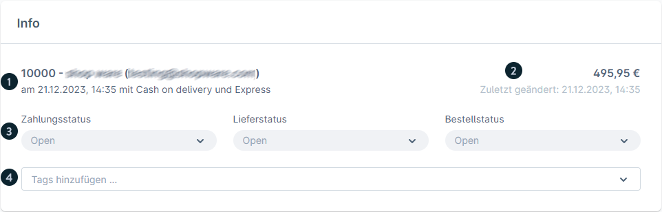
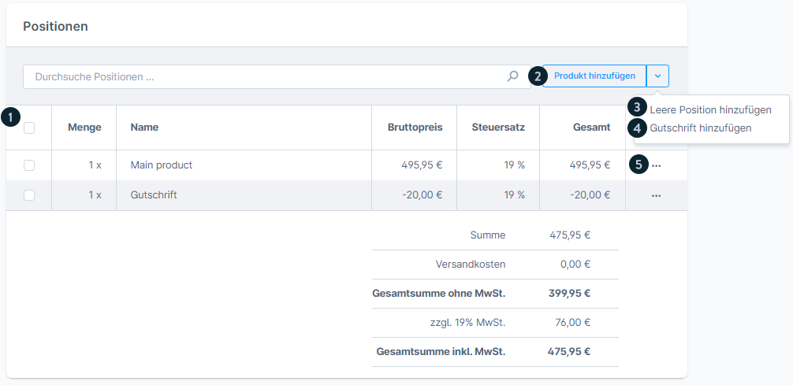
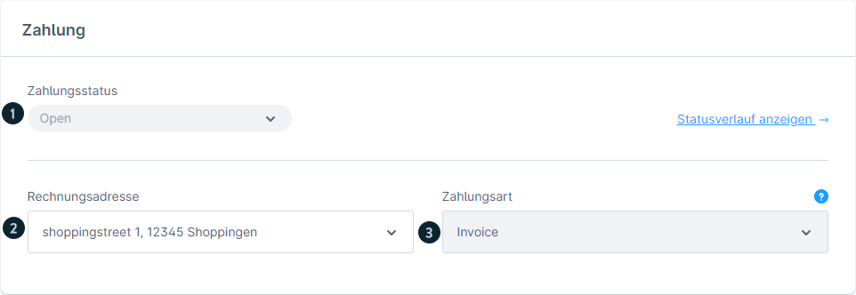
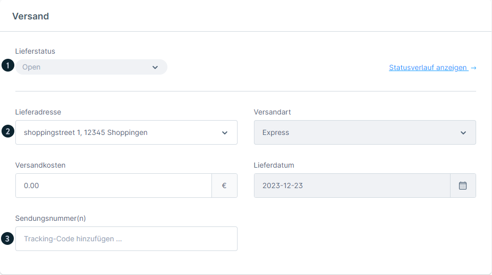
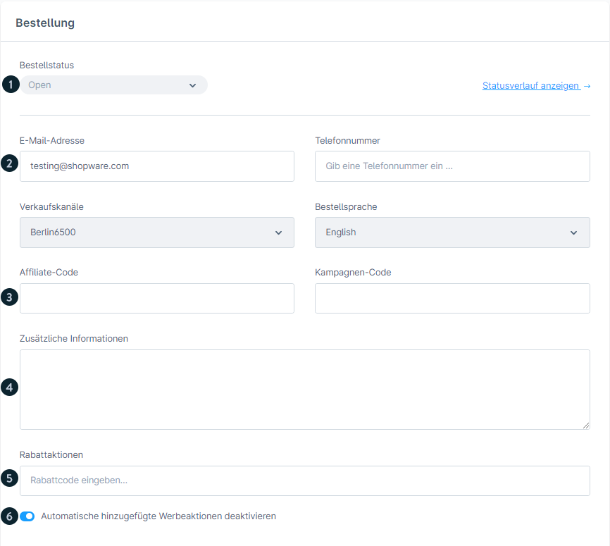

# Shopware 6 – Bestellung bearbeiten: Vollständige Referenz

## Tab „Allgemein"

### Info-Bereich

Der Info-Bereich oben zeigt auf einen Blick:

| Element | Beschreibung |
|---|---|
| Bestellnummer | Eindeutige ID der Bestellung |
| Kunde | Name + Link zum Kundenprofil |
| Bestellzeitpunkt | Datum und Uhrzeit der Bestellung |
| Zahlungsart | Verwendete Zahlungsmethode |
| Versandart | Verwendete Versandmethode |
| Bestellsumme | Brutto-Gesamtbetrag |
| Letzte Änderung | Zeitstempel der letzten Bearbeitung |
| **Bestellstatus** | Dropdown zur direkten Statusänderung |
| **Zahlungsstatus** | Dropdown zur direkten Statusänderung |
| **Lieferstatus** | Dropdown zur direkten Statusänderung |
| Tags | Freie Verschlagwortung der Bestellung |

#### Status aktualisieren – Modal

Beim Klick auf einen Status-Dropdown öffnet sich ein Modal mit:
- Ziel-Status auswählen
- Option: **E-Mail an Kunden senden** (Toggle)
- Wenn E-Mail aktiv: Dokument auswählen (z. B. Rechnung als Anhang)
- E-Mail-Template zuweisen

---

### Positionen (Allgemein-Tab)

In den Positionen sind alle Bestellpositionen aufgelistet. Folgende Bearbeitungen sind möglich:

#### Produkt aus Katalog hinzufügen
- „Produkt hinzufügen"-Button
- Produkt per Suche auswählen
- Preis, Menge und Steuersatz können angepasst werden

#### Leere Position hinzufügen
- Dropdown neben „Produkt hinzufügen" > „Leere Position hinzufügen"
- Name, Bruttopreis, Steuersatz, Menge manuell eingeben

#### Gutschrift hinzufügen
- Dropdown > „Gutschrift hinzufügen"
- Negativer Betrag → wird von Bestellsumme abgezogen
- Steuersatz wird aus Produktpositionen berechnet

#### Positionen bearbeiten
- Doppelklick auf Zeile → inline bearbeiten
- Änderbar: Preis, Menge, Steuersatz
- Produktseite direkt über Icon aufrufbar
- Gemischte Steuersätze (unterschiedliche Steuersätze je Position) werden unterstützt

#### Positionen löschen
- Checkbox aktivieren → Löschen-Button erscheint

---

### Stornierung einer Bestellung

> **Wichtig:** Lagerbestand wird nur freigegeben, wenn der **Bestellstatus** auf „Storniert" gesetzt wird. Eine alleinige Änderung des Zahlungs- oder Lieferstatus auf „Storniert" reicht **nicht** aus.

---

## Tab „Details"

### Bereich: Zahlung

| Element | Beschreibung |
|---|---|
| Aktueller Zahlungsstatus | Anzeige mit Verlauf-Link |
| Statusverlauf | Alle historischen Statusänderungen |
| Rechnungsadresse | Änderbar über Dropdown |
| Zahlungsart | Information über verwendete Methode |
| Statusabhängigkeiten | Welche Übergänge von aktuellem Status aus möglich sind |

### Bereich: Versand

| Element | Beschreibung |
|---|---|
| Aktueller Lieferstatus | Anzeige mit Verlauf-Link |
| Statusverlauf | Alle historischen Statusänderungen |
| Lieferadresse | Vollständige Lieferadresse |
| Versandart | Verwendete Versandmethode |
| Versandkosten | Kosten |
| Geplantes Lieferdatum | Datum (wenn hinterlegt) |
| **Tracking-Nummer** | Eingabefeld für Sendungsverfolgung des Carriers |

### Bereich: Bestellung

| Element | Beschreibung |
|---|---|
| Bestellstatus | Anzeige mit Verlauf-Link |
| Kunden-E-Mail | Bearbeitbar |
| Kundentelefon | Bearbeitbar |
| Verkaufskanal | Quelle der Bestellung |
| Bestellsprache | Sprache des Kunden beim Bestellvorgang |
| Affiliate-Code | Tracking-Code (wenn verwendet) |
| Kampagnen-Code | Marketing-Code (wenn verwendet) |
| Kundenkommentar | Freitext-Kommentar aus dem Checkout |
| Aktive Rabattaktionen | Angewendete Promotions |
| Automatische Rabattaktionen | Toggle zum De-/Aktivieren |

---

## Gastbestellungen & Kundenkonto-Ansicht

### Registrierte Kunden
Können im Kundenkonto unter **Bestellungen**:
- Bestellungen einsehen
- Status verfolgen
- Zahlungsart ändern (sofern noch nicht bezahlt)
- Bestellung stornieren (wenn in Einstellungen > Warenkorb aktiviert)
- Bestellung wiederholen (legt neuen Warenkorb mit denselben Artikeln an)

### Gastbestellungen
Gäste erhalten keine Konto-Zugangsdaten, aber:
- Bestätigungs-E-Mail mit Zugangslink zur Bestellung
- Authentifizierung via **E-Mail-Adresse + PLZ**

---

## Quelle
https://docs.shopware.com/de/shopware-6-de/bestellungen/uebersicht
