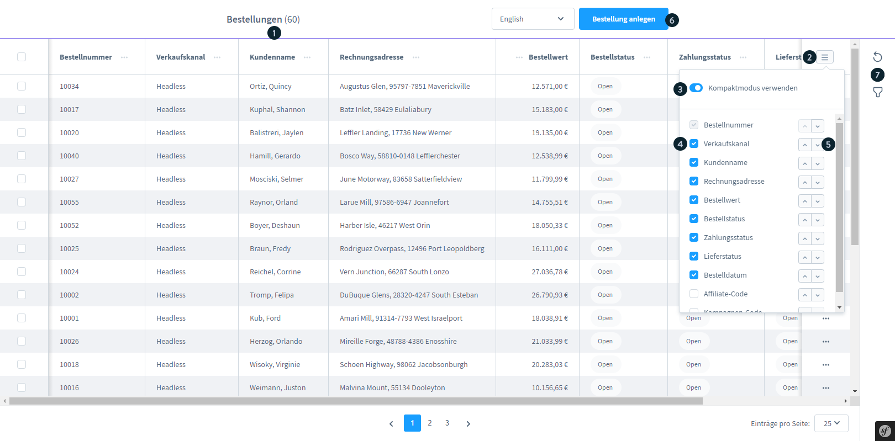
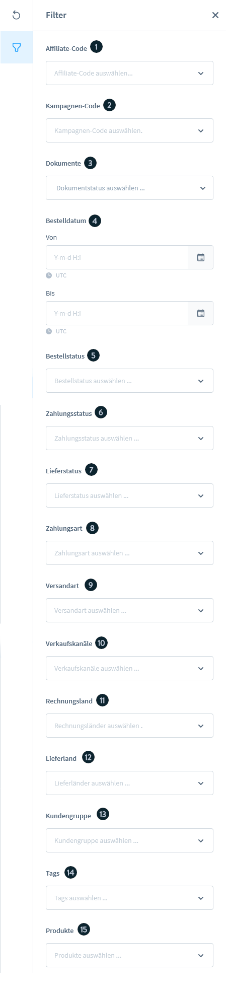
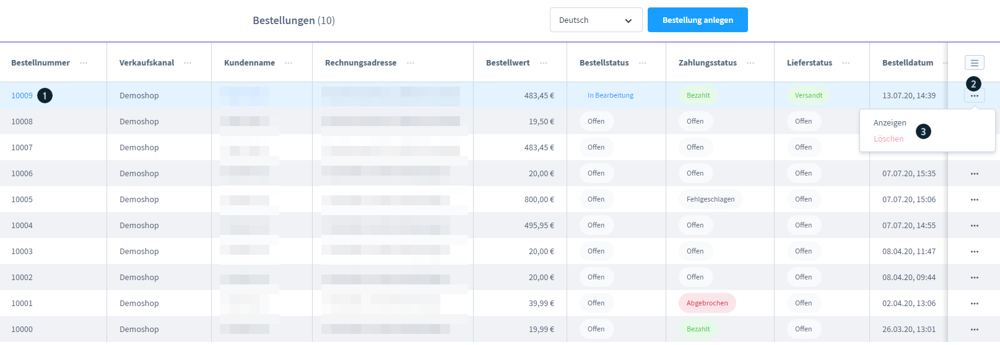
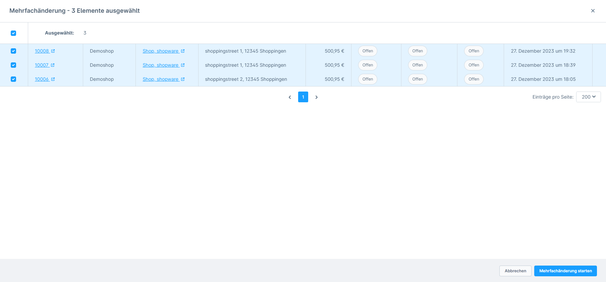

# Shopware 6 – Bestellübersicht: Vollständige Referenz

## Bestellliste (Übersicht)

Die Bestellübersicht ist unter **Bestellungen** in der Administration erreichbar.

### Listenansicht-Elemente

| Element | Beschreibung |
|---|---|
| „Bestellung anlegen"-Button | Neue manuelle Bestellung erstellen |
| Spalten-Dropdown | Sichtbarkeit einzelner Tabellenspalten steuern |
| Kompaktmodus | Platzsparende Ansicht der Listenzeilen |
| Spaltensortierung | Klick auf Spaltenüberschrift sortiert auf-/absteigend |
| Filterbereich | 15+ Filterkriterien kombinierbar |

---

## Filteroptionen

Folgende Filterkriterien stehen zur Verfügung (Kombination möglich):

| Filter | Werte / Hinweis |
|---|---|
| Affiliate-Code | Freitext |
| Kampagnen-Code | Freitext |
| Dokumente | Mit / Ohne Anhang |
| Bestelldatum | Datumsbereich (von–bis) |
| Bestellstatus | Offen, In Bearbeitung, Abgeschlossen, Storniert, Abgelehnt, Ausstehende Freigabe |
| Zahlungsstatus | 12 Varianten: Bezahlt, Offen, Erstattet, Teilweise bezahlt, Teilweise erstattet, Genehmigt, Erinnerung zugeschickt, Beauftragt, Fehlgeschlagen, Storniert, In Bearbeitung, Widerrufen |
| Lieferstatus | Geliefert, Teilweise geliefert, Offen, Teilretoure, Retoure, Storniert |
| Zahlungsart | Aus konfigurierten Zahlungsarten wählen |
| Versandart | Aus konfigurierten Versandarten wählen |
| Verkaufskanal | Alle aktiven Verkaufskanäle |
| Rechnungsland | Länderliste |
| Lieferland | Länderliste |
| Kundengruppe | Alle angelegten Kundengruppen |
| Tags | Vergebene Bestell-Tags |
| Produkte | Suche nach enthaltenen Produkten |

---

## Listenmenü

Über das Aktionsmenü (drei Punkte) je Zeile oder per Checkbox-Auswahl sind Einzelaktionen verfügbar: Bestellung öffnen, bearbeiten, löschen.

---

## Bulk-Aktionen (Mehrfachänderung)

### Auswahl

- Einzelne Bestellungen per Checkbox selektieren
- Alle sichtbaren Bestellungen per Kopf-Checkbox auswählen
- Seitenübergreifende Auswahl möglich
- **Maximum: 1.000 Bestellungen pro Batch**
- Auswahlzähler wird eingeblendet
- Abwahl-Option für seitenübergreifende Selektionen

### Verfügbare Bulk-Operationen

#### Statusänderungen

Gleichzeitige Änderung von:
- Zahlungsstatus
- Lieferstatus
- Bestellstatus

Optionen:
- E-Mail-Benachrichtigung an Kunden (Toggle)
- Dokument mitsenden (wenn E-Mail aktiv)
- **„Bereits versendete Dokumente überspringen"**: Verhindert doppelten Dokumentversand

> **Hinweis:** Statusübergänge unterliegen Validierungsregeln – inkompatible Übergänge über mehrere Bestellungen werden abgefangen.

#### Dokumente stapelweise erstellen

| Dokument | Besonderheit |
|---|---|
| Rechnung | Datum pflichtpflichtig; automatische Nummernvergabe |
| Stornorechnung | Referenziert automatisch vorherige Rechnungsnummer |
| Lieferschein | Datum + Kommentar optional |
| Gutschrift | Nur wenn Gutschrift-Positionen in der Bestellung vorhanden |

- Sammelseitige PDF-Download möglich (Bestellungen werden zu einer PDF zusammengeführt)
- Duplikatprüfung: bereits vorhandene Dokumente werden übersprungen

#### Flow-Ausführungssteuerung

Toggle **„Flows auslösen"**: Verhindert doppelte Ausführung von Automatisierungsregeln bei Bulk-Operationen.

---

## Status-Übersichten

Die folgenden Status-Diagramme zeigen erlaubte Übergänge:

### Bestellstatus-Übergänge
Offen → In Bearbeitung → Abgeschlossen oder Storniert

### Zahlungsstatus-Übergänge
Offen → Bezahlt / Fehlgeschlagen / Erstattet (je nach Zahlungsart)

### Lieferstatus-Übergänge
Offen → Geliefert → Retoure / Teilretoure

> **Stornierung**: Erst wenn der **Bestellstatus** auf „Storniert" gesetzt wird, werden reservierte Lagerbestände wieder freigegeben. Die alleinige Änderung von Zahlungs- oder Lieferstatus auf „Storniert" genügt nicht.

---

## Quelle
https://docs.shopware.com/de/shopware-6-de/bestellungen/uebersicht
