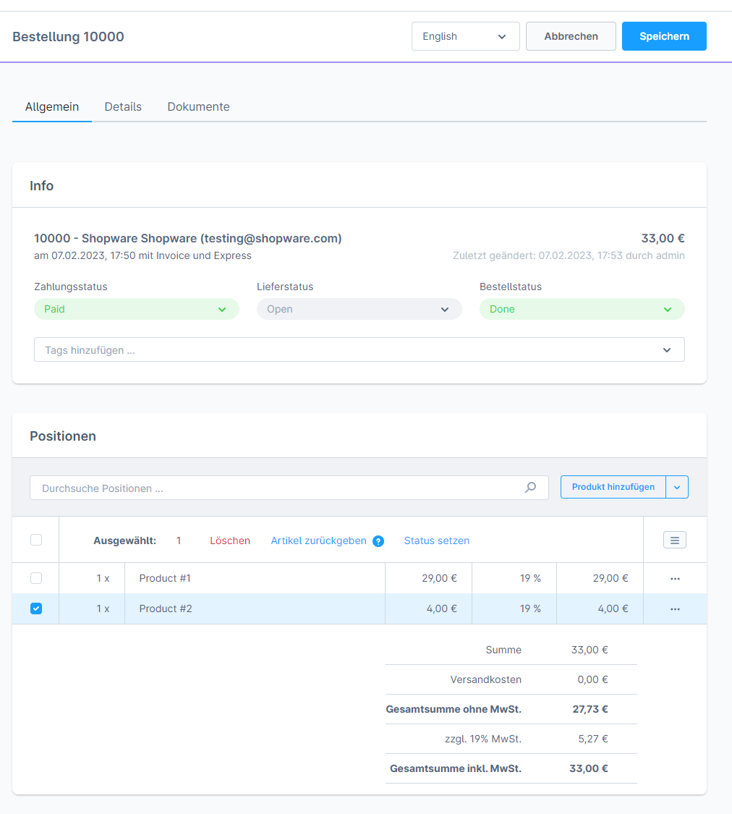
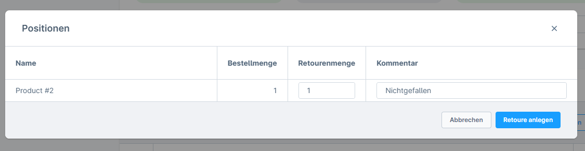
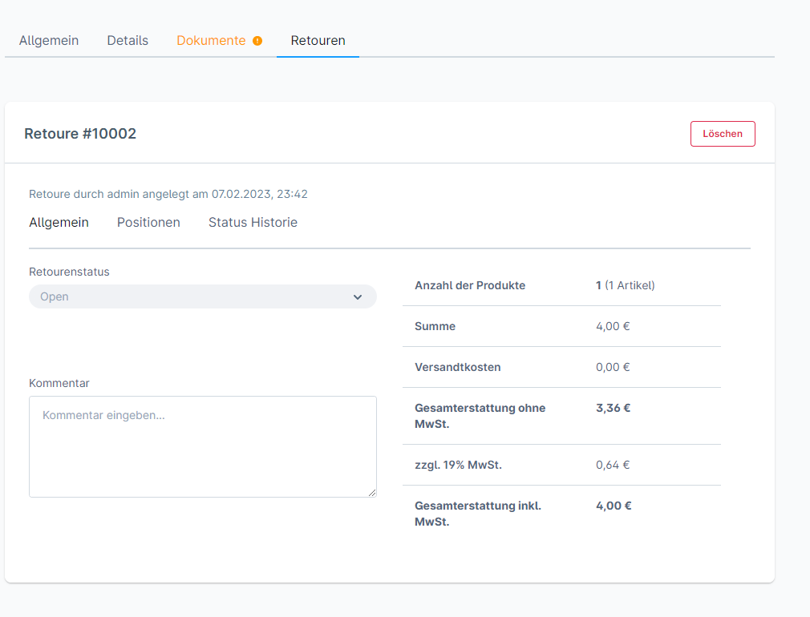
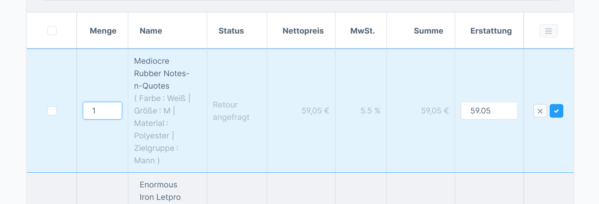
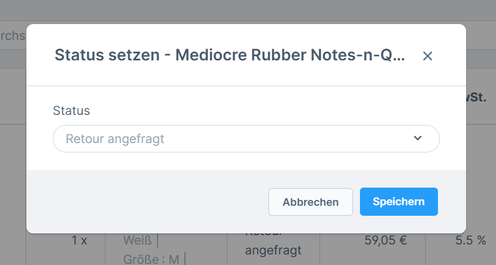
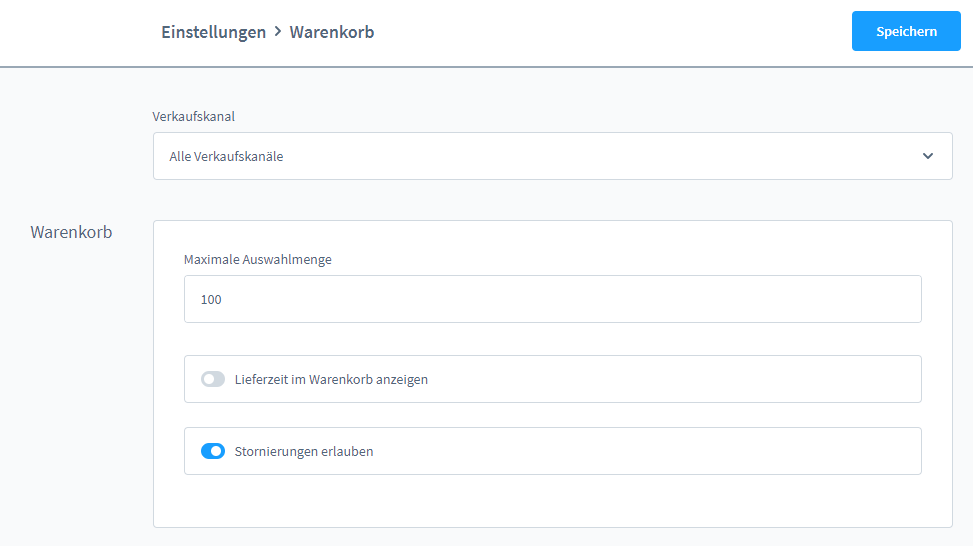

# Shopware 6 – Retouren & Rückerstattungen: Vollständige Referenz

## Retouren-Management

### Voraussetzungen

| Bedingung | Detail |
|---|---|
| Shopware-Plan | **Rise** oder höher |
| Extension | **Commercial** Extension muss installiert sein |
| Mindestversion | Shopware **6.5.0.0** |

> Das Retouren-Management ist eine kommerzielle Funktion und **nicht** im kostenlosen Shopware-Plan enthalten.

---

## Retoure erstellen

### Schritt 1: Bestellung öffnen



Eine bestehende Bestellung in der Administration öffnen (Bestellungen > Bestellung anklicken).

### Schritt 2: Positionen auswählen



Im Tab **„Allgemein"** unter **Positionen**:
1. Artikel-Checkboxen für Rückgabepositionen aktivieren
2. Button **„Artikel zurückgeben"** anklicken

> **Einschränkung:** Derzeit kann **nur eine Retoure pro Bestellung** erstellt werden.

### Schritt 3: Rückgabe-Dialog ausfüllen

Im Dialog:
- **Rückgabemenge** je Position festlegen
- **Kommentar** (optional) hinzufügen
- Bestätigen mit „Retoure erstellen"

---

## Retoure bearbeiten



Nach der Erstellung erscheint der Tab **„Retouren"** in der Bestellansicht.

### Bereich „Allgemein" im Retouren-Tab

| Feld | Beschreibung |
|---|---|
| Retouren-Nummer | Eindeutige Nummer der Retoure |
| Status | Aktueller Retouren-Status |
| Kommentar | Interner Kommentar zur Retoure |



### Status ändern



Der Retouren-Status kann direkt im Tab gesetzt werden. Kunden sehen diesen Status in ihrem Kundenkonto.

### Positionen anpassen

Im Bereich **Positionen** des Retouren-Tabs sind folgende Anpassungen möglich:

| Aktion | Beschreibung |
|---|---|
| Rückgabemenge ändern | Menge pro Position anpassen |
| Status je Position | Individuellen Status pro Retourenposition setzen |
| Positionen entfernen | Einzelne Positionen aus der Retoure löschen |
| Versandkosten anpassen | Doppelklick auf Versandkosten > Betrag ändern |

### Teilgutschrift erstellen

Wenn für die Bestellung bereits eine **Rechnung** vorhanden ist, kann aus der Retoure eine **Teilgutschrift** erstellt werden:

1. Im Retouren-Tab auf „Gutschrift erstellen" klicken
2. Positionen und Beträge werden aus der Retoure übernommen
3. Das Gutschrift-Dokument erscheint in der Dokumentenliste der Bestellung

---

## Kundensicht: Retouren im Kundenkonto

Registrierte Kunden können die Retoure in ihrem Konto einsehen:
- **Pfad:** Kundenkonto > Bestellungen > [Bestellung] > Retouren-Tab
- Angezeigt werden: Retouren-Status, zurückgegebene Positionen
- Kunden können den Status verfolgen, aber keine Änderungen vornehmen

---

## Bestellung stornieren (Zahlungsabbruch)

### Stornierungseinstellung aktivieren

Damit Kunden Bestellungen nach einem Zahlungsabbruch selbst stornieren können:

**Admin-Pfad:** Einstellungen > Warenkorb > **„Stornierungen erlauben"** aktivieren



### Stornierungsfluss aus Kundensicht

1. Bestellung wurde aufgegeben, Zahlung ist fehlgeschlagen
2. Im Kundenkonto: Bestellungen > „..."-Menü > **„Bestellung stornieren"**
3. Lagerbestand wird bei Stornierung über das Kundenkonto wieder freigegeben

> **Hinweis:** Das Stornieren ist nur möglich, solange der Zahlungsstatus **nicht** „Bezahlt" ist.

---

## Rückerstattung / Erstatten über Zahlungsanbieter

Shopware verwaltet den **Zahlungsstatus**, die eigentliche Rückbuchung erfolgt über den **Zahlungsanbieter** (z. B. PayPal, Stripe). Der Ablauf:

1. Retoure in Shopware erfassen
2. Rückbuchung beim Zahlungsanbieter veranlassen (je nach Zahlungsanbieter-Plugin automatisch oder manuell)
3. Zahlungsstatus in Shopware manuell auf „Erstattet" oder „Teilweise erstattet" setzen

---

## Zusammenfassung: Rückgabe-Workflows

```
Kunde sendet Ware zurück
  └─→ Admin: Retoure erstellen (Artikel zurückgeben)
        ├─→ Retoure bearbeiten (Status, Mengen)
        ├─→ Teilgutschrift erstellen (wenn Rechnung vorhanden)
        └─→ Rückerstattung beim Zahlungsanbieter auslösen
              └─→ Zahlungsstatus → "Erstattet"
```

---

## Quelle
https://docs.shopware.com/de/shopware-6-de/bestellungen/retouren-management
https://docs.shopware.com/de/shopware-6-de/bestellungen/zahlungsvorgang-nach-bestellung
