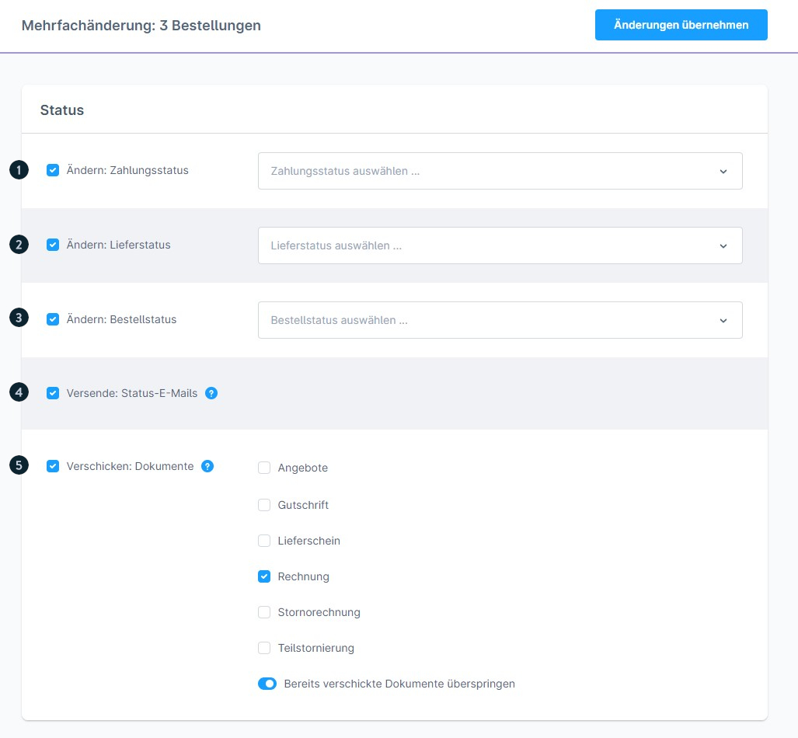
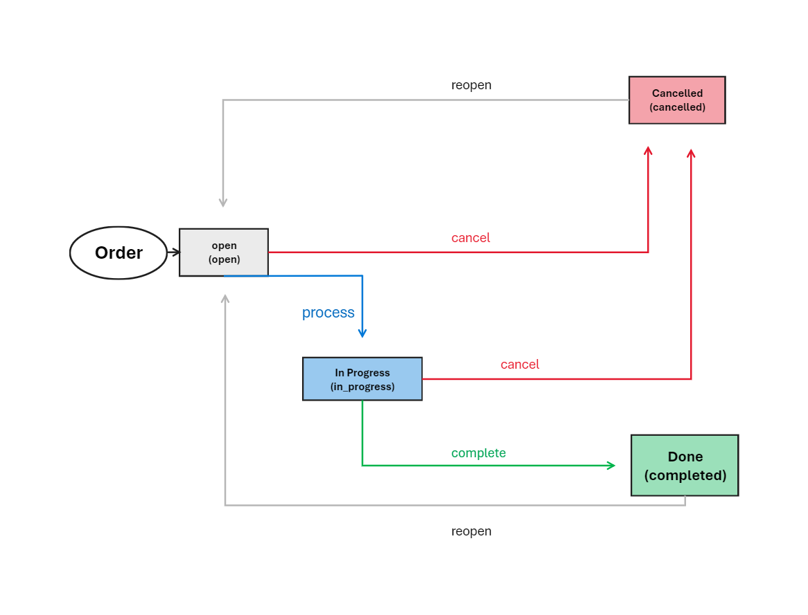
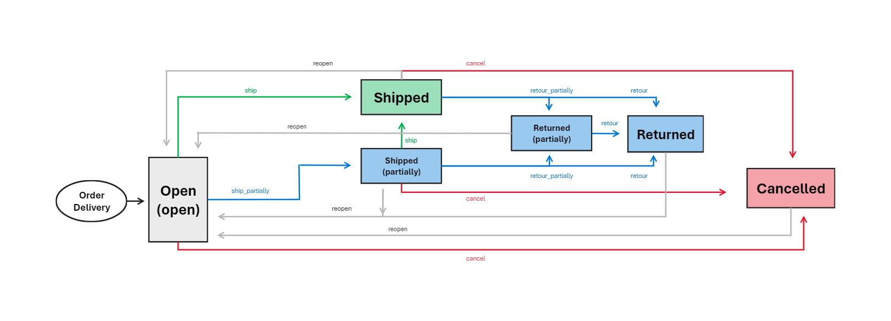
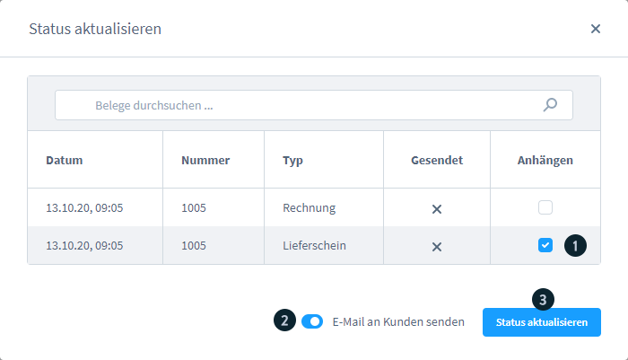
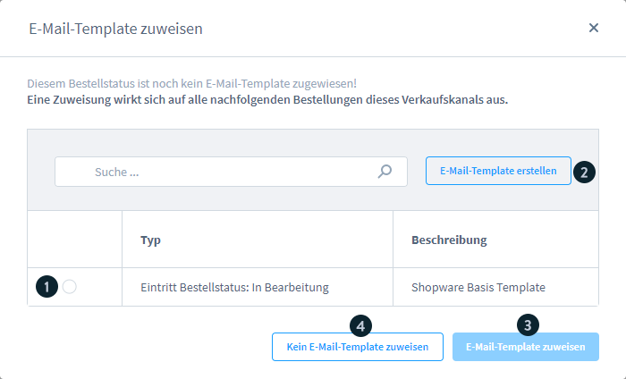

# Shopware 6 – Status-Management: Vollständige Referenz

## Grundprinzip: Bestellung und Zahlung sind getrennt

> **Wichtig:** In Shopware 6 sind Zahlung und Bestellung **komplett voneinander losgelöst**.  
> Anders als in Shopware 5 wird eine Bestellung sofort angelegt, sobald der Kunde auf **„Zahlungspflichtig bestellen"** klickt – unabhängig davon, ob die Zahlung erfolgreich war.

---

## Die drei Status-Dimensionen

### 1. Bestellstatus



| Status | Bedeutung |
|---|---|
| **Offen** | Bestellung eingegangen, noch keine Bearbeitung |
| **In Bearbeitung** | Bestellung wird aktiv bearbeitet |
| **Abgeschlossen** | Bestellung vollständig abgewickelt |
| **Storniert** | Bestellung storniert; Lagerbestand wird **freigegeben** |
| **Abgelehnt** | Bestellung wurde abgelehnt |
| **Ausstehende Freigabe** | Bestellung wartet auf manuelle Freigabe |

> **Stornierungslogik:** Nur das Setzen des **Bestellstatus** auf „Storniert" gibt reservierte Lagermengen wieder frei. Das Ändern von Zahlungs- oder Lieferstatus auf „Storniert" allein genügt **nicht**.

#### Bestellstatus-Übergänge



```
Offen
  └─→ In Bearbeitung
        ├─→ Abgeschlossen
        └─→ Storniert
  └─→ Storniert (direkt)
```

---

### 2. Zahlungsstatus

| Status | Bedeutung |
|---|---|
| **Offen** | Zahlung noch nicht erfolgt (Initialstatus) |
| **In Bearbeitung** | Zahlung wird verarbeitet |
| **Fehlgeschlagen** | Zahlung abgebrochen oder fehlgeschlagen |
| **Bezahlt** | Zahlung vollständig eingegangen |
| **Teilweise bezahlt** | Nur ein Teil der Summe bezahlt |
| **Erstattet** | Vollständige Rückerstattung |
| **Teilweise erstattet** | Teilrückerstattung |
| **Genehmigt** | Zahlung genehmigt (z. B. Vorkasse) |
| **Erinnerung zugeschickt** | Zahlungserinnerung wurde gesendet |
| **Beauftragt** | Zahlung beauftragt (z. B. Lastschrift) |
| **Widerrufen** | Zahlung widerrufen |
| **Storniert** | Zahlung storniert |

---

### 3. Lieferstatus



| Status | Bedeutung |
|---|---|
| **Offen** | Noch nicht versendet |
| **Geliefert** | Vollständig geliefert |
| **Teilweise geliefert** | Nur ein Teil der Bestellung geliefert |
| **Retoure** | Vollständige Retoure |
| **Teilretoure** | Teilweise zurückgesendet |
| **Storniert** | Versand storniert |

---

## Status ändern – So geht es

### Einzelbestellung



1. Bestellung öffnen
2. Im Info-Bereich (Tab „Allgemein") das gewünschte Status-Dropdown anklicken
3. Im Modal den Ziel-Status auswählen
4. Optional: **E-Mail an Kunden senden** aktivieren
5. Wenn E-Mail aktiv: Dokument als Anhang wählen (z. B. Rechnung)
6. E-Mail-Template zuweisen



### Mehrere Bestellungen (Bulk)

Über die Mehrfachauswahl in der Bestellliste können Bestellstatus, Zahlungsstatus und Lieferstatus für bis zu **1.000 Bestellungen** gleichzeitig geändert werden (siehe `sw-merchant-orders-overview`).

---

## After-Order-Payment: Zahlung nach Bestellung abschließen

### Prozessablauf

1. Bestellung wird angelegt (Klick auf „Zahlungspflichtig bestellen")
2. Initialer Zahlungsstatus: **Offen**
3. Wenn Zahlung abgeschlossen: Status wechselt auf **Bezahlt**
4. Wenn Zahlung unterbrochen/fehlgeschlagen: Status wird **Fehlgeschlagen**

### Kundenoptionen bei fehlgeschlagener Zahlung

Kunden können die Zahlung nachholen über:

| Weg | Aktion |
|---|---|
| Kundenkonto | Bestellungen > „Zahlung abschließen"-Button |
| Kundenkonto | „..."-Menü > „Zahlungsart ändern" |
| E-Mail | Link aus Bestätigungs-E-Mail nutzen |

**Zahlungsänderungs-Link:**
- Führt zurück in den Checkout
- Kunde wählt neue oder bestehende Zahlungsart
- Zahlung wird erneut ausgeführt

> Sobald der Zahlungsstatus **„Bezahlt"** erreicht wurde, kann der Kunde die Bestellung nur noch stornieren (nicht mehr die Zahlungsart ändern).

### Einstellung: Stornierung erlauben

Um Kunden die Stornierung nach einem Zahlungsabbruch zu ermöglichen:

**Admin-Pfad:** Einstellungen > Warenkorb > **„Stornierungen erlauben"** aktivieren

---

## Flow-Builder: Automatisierungen auf Statusänderungen

Unter **Einstellungen > Flow-Builder** können Workflows konfiguriert werden, die auf Statusänderungen reagieren:

### Flow-Konfiguration

| Element | Beschreibung |
|---|---|
| **Trigger** | Auslöser (z. B. Bestellstatus geändert, Zahlungsstatus geändert) |
| **Bedingung** | Regel aus dem Rule-Builder (z. B. bestimmte Zahlungsart) |
| **Aktion (wenn wahr)** | z. B. E-Mail senden, Dokument erstellen |
| **Aktion (wenn falsch)** | Alternative Aktion |

### E-Mail-Empfänger-Optionen

| Option | Empfänger |
|---|---|
| Standard | Systemdefinierte Empfänger |
| Administrator | Alle als Administrator markierten Benutzer |
| Eigener Empfänger | Benutzerdefinierte E-Mail-Adressen |

### Flow-Tabellen-Spalten

1. Aktiv (An/Aus)
2. Name (Pflichtfeld)
3. Trigger (Pflichtfeld)
4. Beschreibung (optional)
5. Flow-Optionen (Bearbeiten / Löschen)
6. „Flow hinzufügen"-Button

---

## Gastbestellungen: Statusanzeige

Gäste ohne Kundenkonto erhalten eine Bestätigungs-E-Mail mit einem Link. Nach Authentifizierung über **E-Mail + PLZ** können sie den Bestell- und Lieferstatus einsehen.

---

## Quelle
https://docs.shopware.com/de/shopware-6-de/bestellungen/uebersicht
https://docs.shopware.com/de/shopware-6-de/bestellungen/zahlungsvorgang-nach-bestellung
