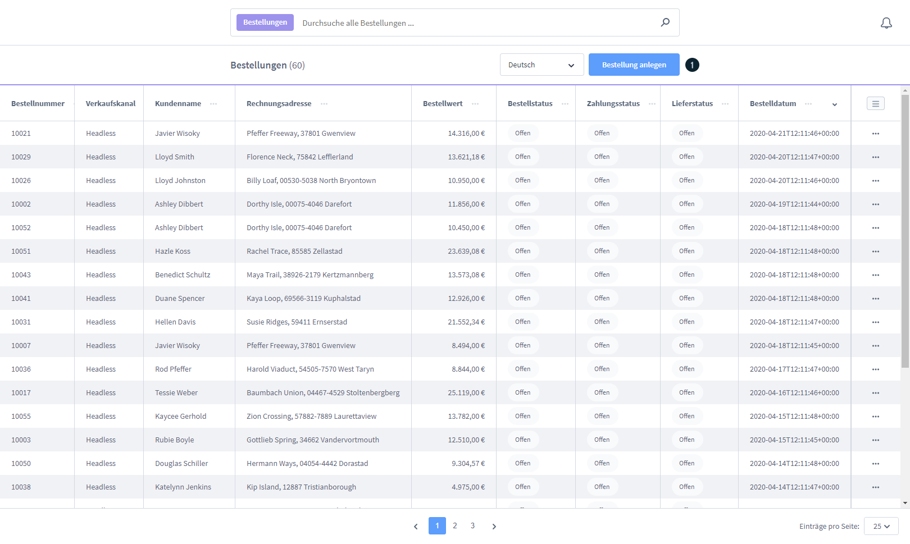
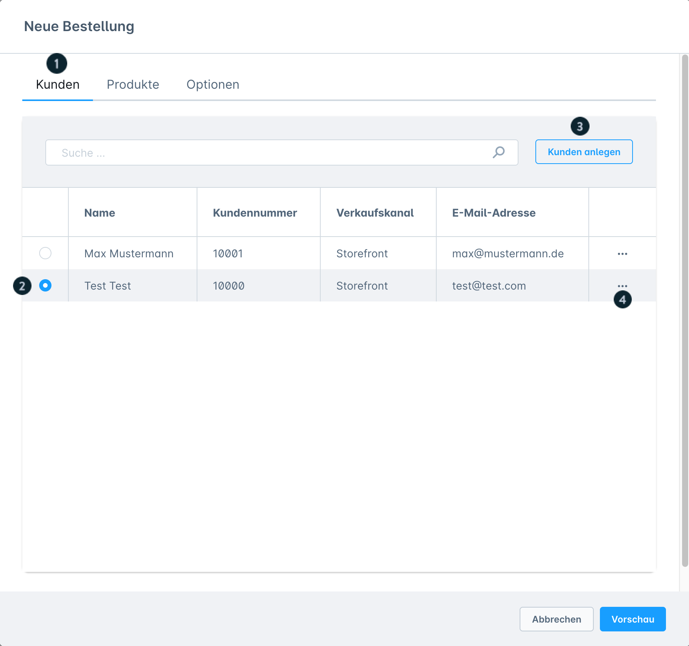
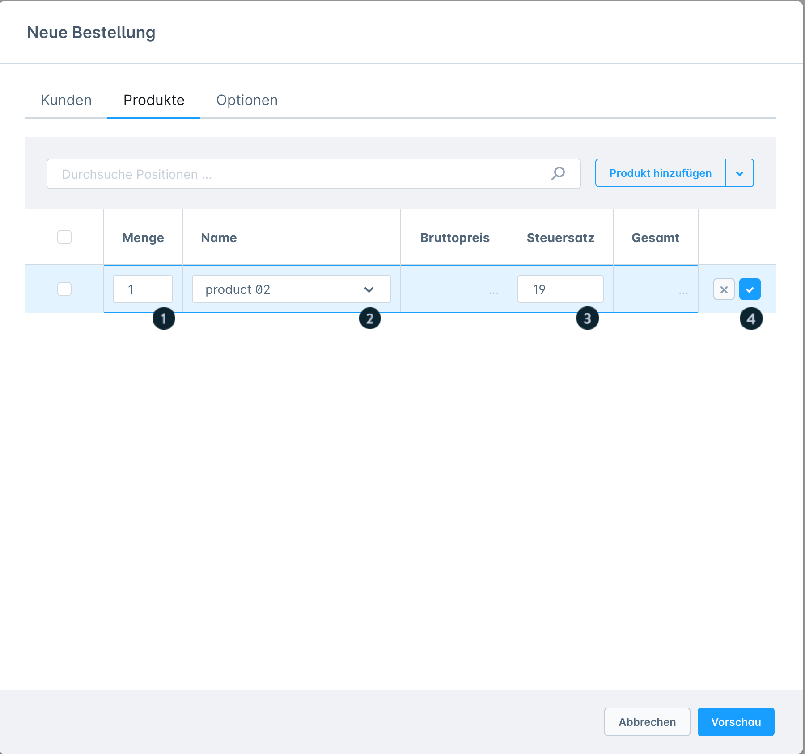
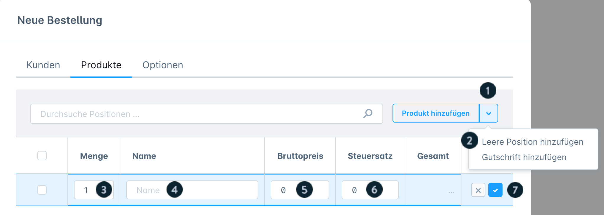
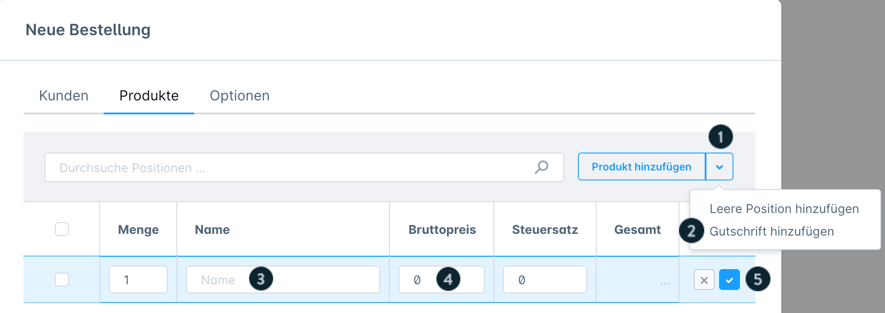
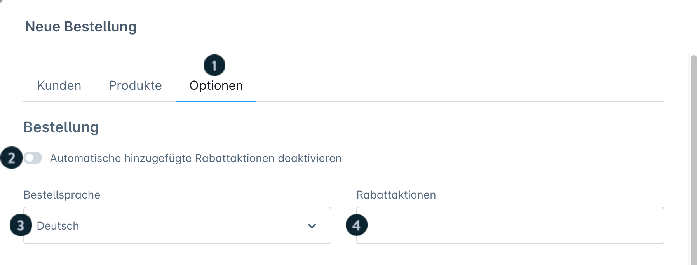
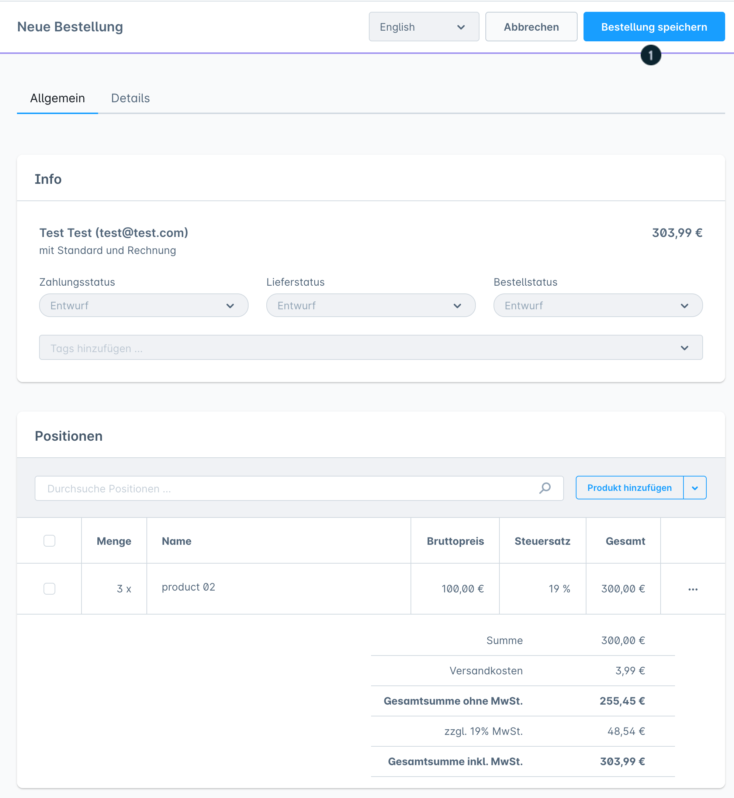

# Shopware 6 – Creating an order manually in the admin: complete reference

## Contents

- [Entry point](#entry-point)
- [Step 1: Select a customer](#step-1-select-a-customer)
- [Step 2: Add line items](#step-2-add-line-items)
- [Step 3: Configure options](#step-3-configure-options)
- [Step 4: Save the order](#step-4-save-the-order)
- [Creating a new customer inline](#creating-a-new-customer-inline)
- [PayPal payment after a manual order](#paypal-payment-after-a-manual-order)
- [Prerequisites](#prerequisites)
- [Source](#source)

## Entry point

Under **Bestellungen** (Orders) you will find the **"Bestellung anlegen"** (Create order) button. It opens the module for manual order entry. This module is available from Shopware **6.5.0.0** onwards.

---

## Step 1: Select a customer

The customer list shows:
- Name
- Customer number
- Sales channel
- Email address

**Alternatives:**
- Pick an existing customer from the list
- Create a new customer directly via "Kunden anlegen" (Create customer) without leaving the view
- The edit icon opens the customer for direct editing

---

## Step 2: Add line items

### Adding a product from the catalogue

1. Click the **"Produkt hinzufügen"** (Add product) button
2. Find and select the product in the search dialogue
3. Edit the row by double-clicking:
   - **Preis** (Price): taken automatically from the product master data, can be overwritten manually
   - **Steuersatz** (Tax rate): taken automatically from the product master data
   - **Menge** (Quantity): affects the total price
4. Confirm the entry with the check-mark button

> The search field only filters line items of the current order, **not** the entire product catalogue.

### Adding an empty line item

Access: dropdown arrow next to "Produkt hinzufügen" > **"Leere Position hinzufügen"** (Add empty line item)

Used for non-catalogue products or services:

| Field | Required | Note |
|---|---|---|
| Name | Yes | Appears on documents |
| Bruttopreis (Gross price) | Yes | Only displayed correctly after the tax rate has been entered |
| Steuersatz | Yes | Must be entered first |
| Menge | Yes | Default: 1 |

Confirm the entry with the check-mark button.

### Adding a credit note / discount

Access: dropdown arrow next to "Produkt hinzufügen" > **"Gutschrift hinzufügen"** (Add credit note)

| Field | Required | Note |
|---|---|---|
| Name | Yes | Label on documents |
| Bruttopreis | Yes | Negative amount = deduction |

> The tax rate is calculated automatically from the product line items. Manually adjusting the tax rate is **not** possible for credit notes.

### Deleting a line item

Tick the checkbox next to a line item > the delete button appears. The header checkbox selects all line items at once.

---

## Step 3: Configure options

| Option | Description |
|---|---|
| **Automatische Rabattaktionen** (Automatic discount promotions) | Enable/disable existing discount rules |
| **Bestellsprache** (Order language) | Language for emails and documents |
| **Rabatt** (Discount) | Enter a voucher code |
| **Zahlungsart** (Payment method) | Only payment methods that are active for the sales channel and flagged as "subsequent payment method allowed" can be selected |
| **Rechnungsadresse** (Billing address) | Selection from the customer's stored addresses |
| **Währung** (Currency) | Only currencies activated in the sales channel |
| **Versandart** (Shipping method) | Selection from the configured shipping methods |
| **Versandkosten** (Shipping costs) | Enter shipping costs manually |
| **Lieferadresse gleich Rechnungsadresse** (Shipping address same as billing address) | Toggle; when disabled, select a separate shipping address |
| **Lieferadresse** (Shipping address) | Separate shipping address (when the toggle is disabled) |
| **Vorschau** (Preview) | Show the order in advance (not yet saved) |

### Changing shipping costs afterwards

After saving: edit the shipping costs row by double-clicking and enter the new amount.

---

## Step 4: Save the order

Clicking the **"Bestellung speichern"** (Save order) button:
- creates the order
- **automatically** sends a confirmation email to the stored customer email address

After saving, the **"Details"** tab provides:
- Payment information
- Shipping information
- General order details

---

## Creating a new customer inline

The **"Kunden anlegen"** button opens a module with the following tabs:

### Tab: Details
- General customer data
- Option: guest account (no password required)

### Tab: Rechnungsadresse
- Complete billing address data

### Tab: Lieferadresse
- Shipping address; the "entspricht Rechnungsadresse" (same as billing address) toggle copies the billing address

---

## PayPal payment after a manual order

If PayPal was selected as the payment method, the customer completes the payment afterwards in their customer account:

1. Customer account > Bestellungen
2. "..." menu > **"Zahlungsart ändern"** (Change payment method)
3. If PayPal is already selected: accept the terms and conditions > **"Änderung bestätigen"** (Confirm change)
4. If PayPal is not yet selected: switch the payment method to PayPal

Alternatively: use the payment change link from the order confirmation email.

> The menu label can be adjusted via the snippet `account.orderContextMenuChangePayment`.

---

## Prerequisites

- Shopware **6.5.0.0** or higher
- For older versions (6.2.0 – 6.4.20.0): separate legacy documentation is available

---

## Source
https://docs.shopware.com/de/shopware-6-de/bestellungen/bestellung-im-admin-anlegen
