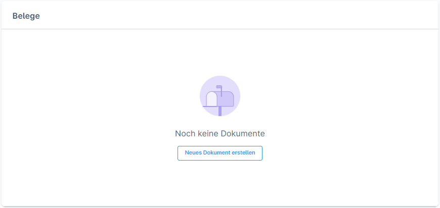
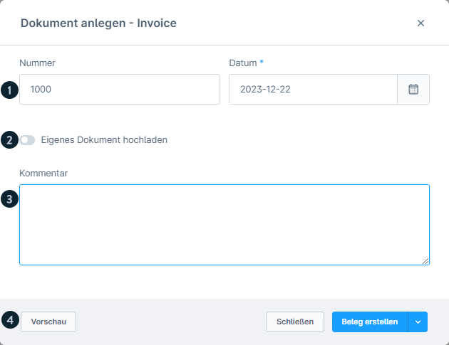
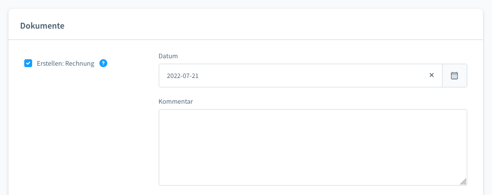
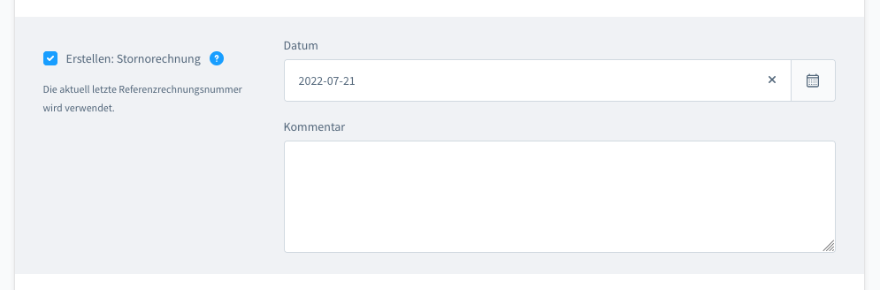
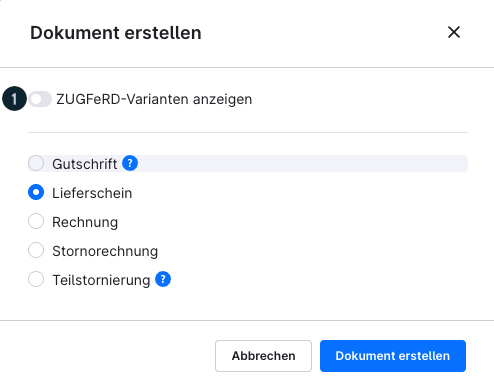
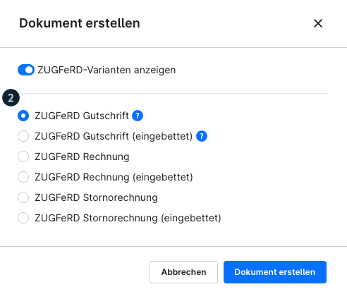
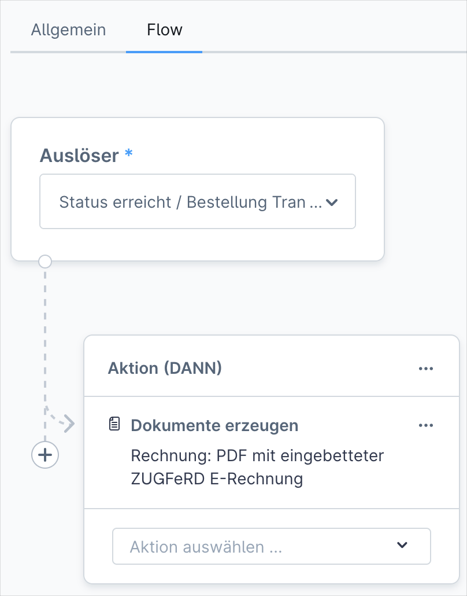

# Shopware 6 – Order documents: complete reference

## Contents

- [Document overview](#document-overview)
- [Creating a single document](#creating-a-single-document)
- [Document types in detail](#document-types-in-detail)
- [ZUGFeRD – electronic invoice (from version 6.6.10.0)](#zugferd-electronic-invoice-from-version-66100)
- [Sending a document by email](#sending-a-document-by-email)
- [Creating documents in bulk (bulk edit)](#creating-documents-in-bulk-bulk-edit)
- [Dependencies between documents](#dependencies-between-documents)
- [Source](#source)

## Document overview



Document management is located in the **"Allgemein"** (General) tab of an opened order, in the **"Dokumente"** (Documents) section.

---

## Creating a single document



Clicking **"Dokument hinzufügen"** (Add document) opens the creation dialogue.

### Common fields (all document types)

| Field | Description |
|---|---|
| Dokumentdatum (Document date) | Mandatory field; appears on the document |
| Kommentar (Comment) | Optional text that appears on the document |
| Nummernkreis (Number range) | Taken automatically from the configured number ranges |
| Vorschau (Preview) | View the document before creating it |

---

## Document types in detail

### Invoice (Rechnung)



- Base document for all orders
- Number assigned from the invoice number range
- Prerequisite for cancellation invoices and credit notes

### Stornorechnung (Cancellation invoice)



- Cancels an existing invoice
- **Prerequisite:** an invoice must exist for the order
- References the invoice number automatically
- Reverses the original invoice for accounting purposes

### Lieferschein (Delivery note)

- Accompanying document for the shipment
- Fields: date, comment
- No prerequisites

### Gutschrift (Credit note)

- Creates a credit note for the customer
- **Prerequisites:**
  1. an invoice must exist for the order
  2. the order must contain credit note line items
- Amounts are taken from the credit note line items

### Uploading your own PDF

- Option to attach an external PDF file as a document
- Appears like a regular document in the document list

---

## ZUGFeRD – electronic invoice (from version 6.6.10.0)



### Legal background

> From **1 January 2025**, issuing electronic invoices is **mandatory for domestic B2B transactions in Germany** (§ 14 UStG).

### What is ZUGFeRD?

ZUGFeRD (Zentraler User Guide des Forums elektronische Rechnung Deutschland) is a hybrid document format:
- **Machine-readable XML data** (CII standard, EU norm EN 16931)
- **Human-readable PDF view**
- Both combined in a single file

### ZUGFeRD variants



| Variant | Description |
|---|---|
| **XML eingebettet** (XML embedded) | The XML file is embedded in the PDF (standard ZUGFeRD) |
| **Reine XML-Datei** (XML file only) | XML only, without a PDF wrapper |

### Prerequisite: business address

To create ZUGFeRD invoices, the business address must be fully maintained.

### Automation with the Flow Builder



ZUGFeRD invoices can be created automatically via the **Flow Builder** on incoming payment or other triggers:

1. Einstellungen (Settings) > Flow Builder > "Flow hinzufügen" (Add flow)
2. Trigger: e.g. "Bestellung - Zahlungsstatus geändert" (Order - payment status changed) > condition: "Bezahlt" (Paid)
3. Action: "Dokument erstellen" (Create document) > type: "ZUGFeRD-Rechnung" (ZUGFeRD invoice)

---

## Sending a document by email

### On a status change

When changing a status, a document can be sent along directly as an attachment:

1. Open the status dropdown
2. Enable "E-Mail an Kunden senden" (Send email to customer)
3. Select the document from the dropdown list
4. Assign an email template

### HTML version via link

Documents are also available to the customer as an HTML version:
- Access via a secure link in the confirmation email
- The customer must be logged in to the customer account (or authenticate as a guest)
- The link is not publicly accessible

---

## Creating documents in bulk (bulk edit)

From the order overview, documents can be created for several orders at once:

| Action | Details |
|---|---|
| Create invoice | Date mandatory; the number sequence is incremented automatically |
| Create cancellation invoice | References the previous invoice number automatically |
| Create delivery note | Date + comment optional |
| Create credit note | Only if credit note line items exist |
| Bulk download | Download all generated PDFs as one merged PDF |

**Duplicate protection:** creation is skipped for orders that already have a document of the respective type. The **"Bereits versendete Dokumente überspringen"** (Skip documents already sent) checkbox additionally prevents duplicate sending.

---

## Dependencies between documents

```
Rechnung
  ├─→ Stornorechnung (requires Rechnung)
  └─→ Gutschrift (requires Rechnung + credit note line items)
```

> Partial cancellations, full cancellations and credit notes all require an **existing invoice** as their basis.

---

## Source
https://docs.shopware.com/de/shopware-6-de/bestellungen/uebersicht
