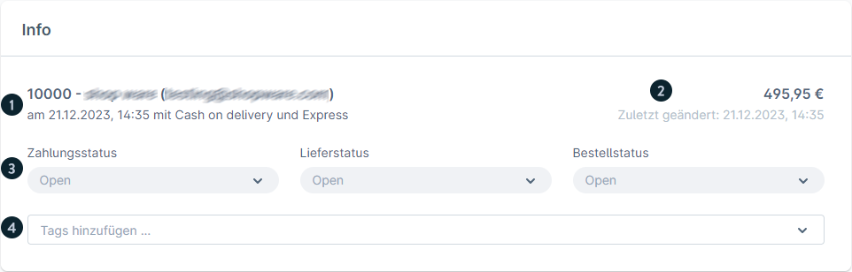
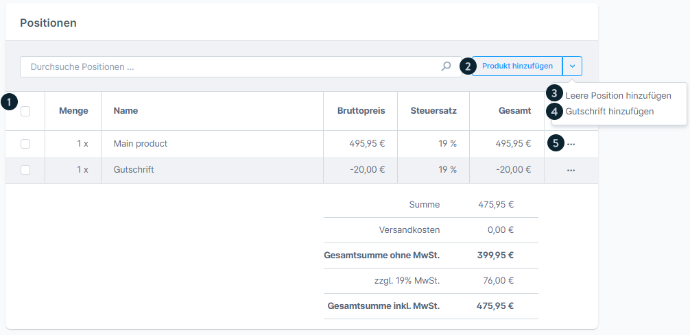
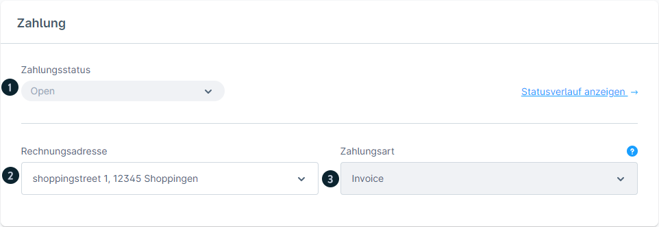
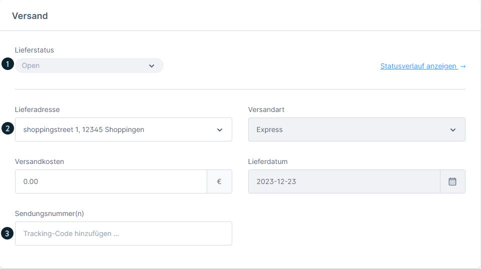
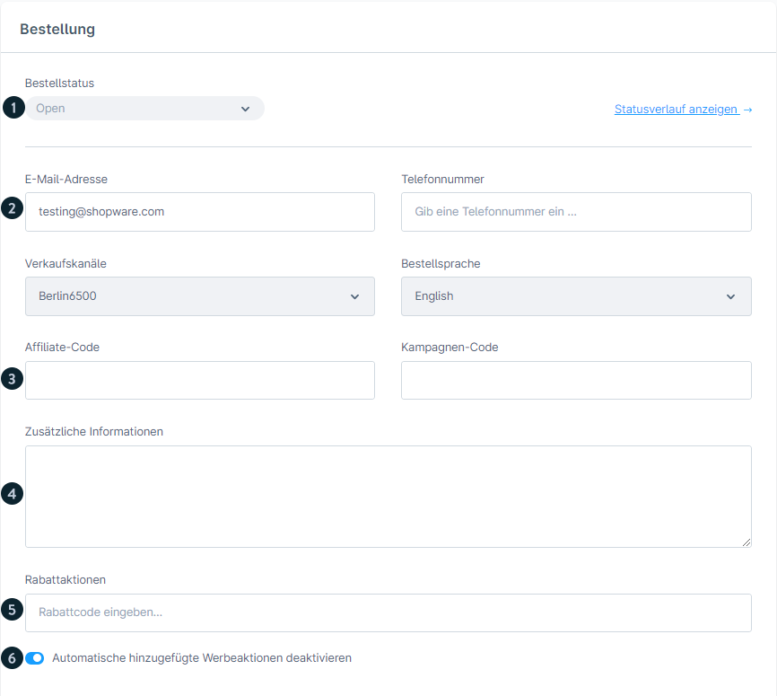

# Shopware 6 – Editing an order: complete reference

## Contents

- ["Allgemein" tab](#allgemein-tab)
- ["Details" tab](#details-tab)
- [Guest orders & customer account view](#guest-orders--customer-account-view)
- [Source](#source)

## "Allgemein" tab

### Info area

The info area at the top shows at a glance:

| Element | Description |
|---|---|
| Bestellnummer (Order number) | Unique ID of the order |
| Kunde (Customer) | Name + link to the customer profile |
| Bestellzeitpunkt (Order date/time) | Date and time of the order |
| Zahlungsart (Payment method) | Payment method used |
| Versandart (Shipping method) | Shipping method used |
| Bestellsumme (Order total) | Gross total amount |
| Letzte Änderung (Last change) | Timestamp of the last edit |
| **Bestellstatus** (Order status) | Dropdown for changing the status directly |
| **Zahlungsstatus** (Payment status) | Dropdown for changing the status directly |
| **Lieferstatus** (Delivery status) | Dropdown for changing the status directly |
| Tags | Free tagging of the order |

#### Updating a status – modal

Clicking a status dropdown opens a modal with:
- Select the target status
- Option: **E-Mail an Kunden senden** (Send email to customer) (toggle)
- If email is enabled: select a document (e.g. the invoice as an attachment)
- Assign an email template

---

### Positionen (Line items) (Allgemein tab)

The line items section lists all order line items. The following edits are possible:

#### Adding a product from the catalogue
- "Produkt hinzufügen" (Add product) button
- Select the product via search
- Price, quantity and tax rate can be adjusted

#### Adding an empty line item
- Dropdown next to "Produkt hinzufügen" > "Leere Position hinzufügen" (Add empty line item)
- Enter name, gross price, tax rate and quantity manually

#### Adding a credit note
- Dropdown > "Gutschrift hinzufügen" (Add credit note)
- Negative amount → deducted from the order total
- The tax rate is calculated from the product line items

#### Editing line items
- Double-click a row → edit inline
- Editable: price, quantity, tax rate
- The product page can be opened directly via an icon
- Mixed tax rates (different tax rates per line item) are supported

#### Deleting line items
- Tick the checkbox → the delete button appears

---

### Cancelling an order

> **Important:** stock is only released when the **Bestellstatus** is set to "Storniert" (Cancelled). Changing only the payment or delivery status to "Storniert" is **not** sufficient.

---

## "Details" tab

### Section: Zahlung (Payment)

| Element | Description |
|---|---|
| Current payment status | Display with a history link |
| Status history | All historical status changes |
| Rechnungsadresse (Billing address) | Can be changed via dropdown |
| Zahlungsart | Information about the method used |
| Status dependencies | Which transitions are possible from the current status |

### Section: Versand (Shipping)

| Element | Description |
|---|---|
| Current delivery status | Display with a history link |
| Status history | All historical status changes |
| Lieferadresse (Shipping address) | Complete shipping address |
| Versandart | Shipping method used |
| Versandkosten (Shipping costs) | Costs |
| Geplantes Lieferdatum (Planned delivery date) | Date (if stored) |
| **Tracking-Nummer** (Tracking number) | Input field for the carrier's shipment tracking |

### Section: Bestellung (Order)

| Element | Description |
|---|---|
| Bestellstatus | Display with a history link |
| Kunden-E-Mail (Customer email) | Editable |
| Kundentelefon (Customer phone) | Editable |
| Verkaufskanal (Sales channel) | Source of the order |
| Bestellsprache (Order language) | Customer's language during the ordering process |
| Affiliate-Code | Tracking code (if used) |
| Kampagnen-Code (Campaign code) | Marketing code (if used) |
| Kundenkommentar (Customer comment) | Free-text comment from the checkout |
| Aktive Rabattaktionen (Active discount promotions) | Applied promotions |
| Automatische Rabattaktionen (Automatic discount promotions) | Toggle to enable/disable |

---

## Guest orders & customer account view

### Registered customers
In their customer account under **Bestellungen** (Orders) they can:
- View orders
- Track the status
- Change the payment method (as long as it is not yet paid)
- Cancel the order (if enabled under Einstellungen (Settings) > Warenkorb (Cart))
- Repeat the order (creates a new cart with the same items)

### Guest orders
Guests receive no account credentials, but do get:
- A confirmation email with an access link to the order
- Authentication via **email address + postcode**

---

## Source
https://docs.shopware.com/de/shopware-6-de/bestellungen/uebersicht
