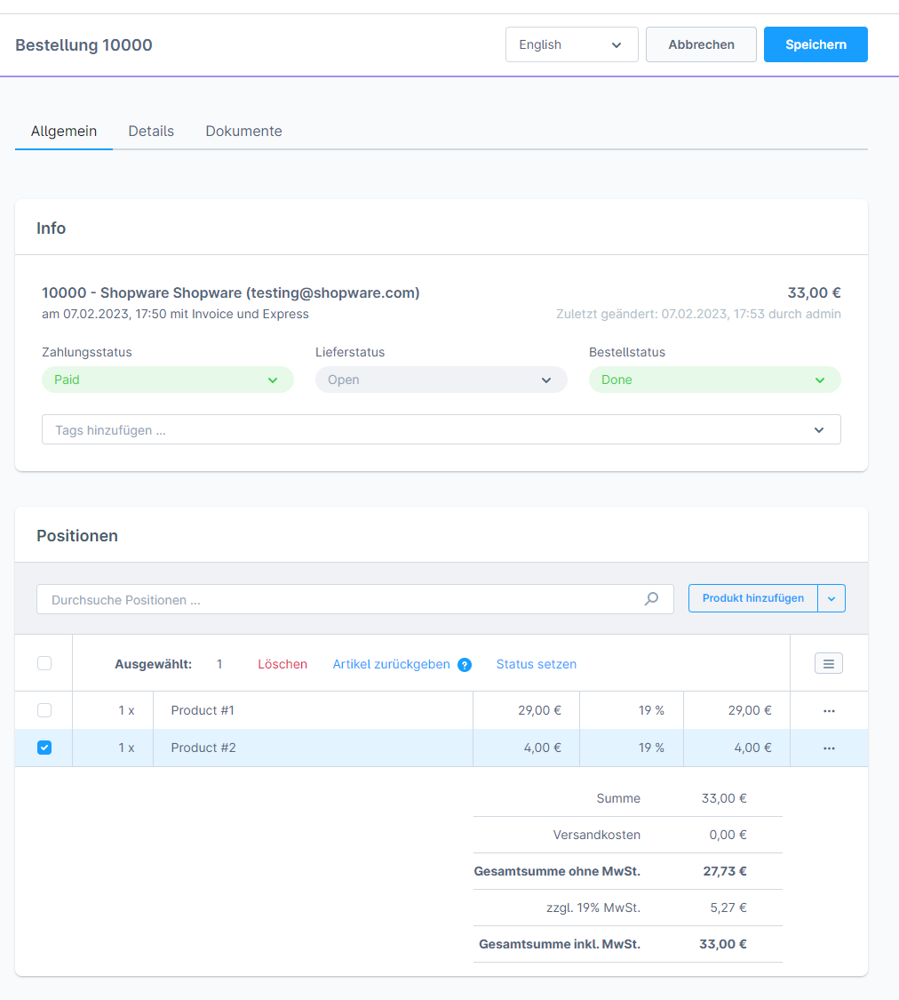
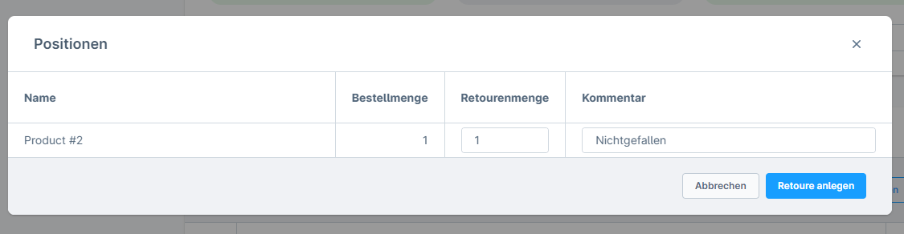
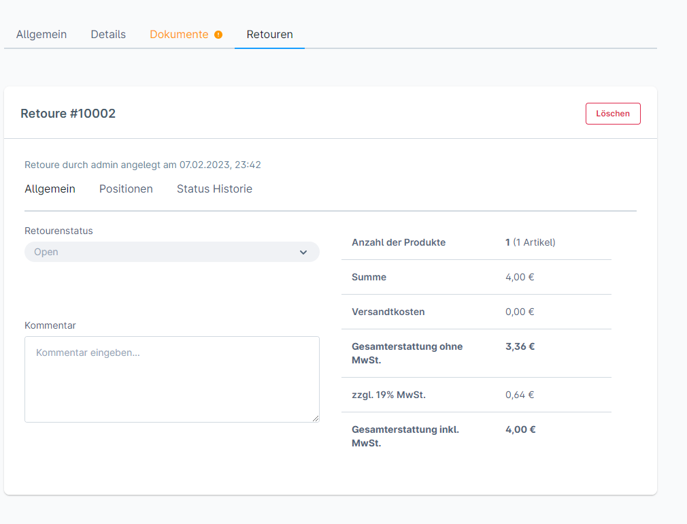
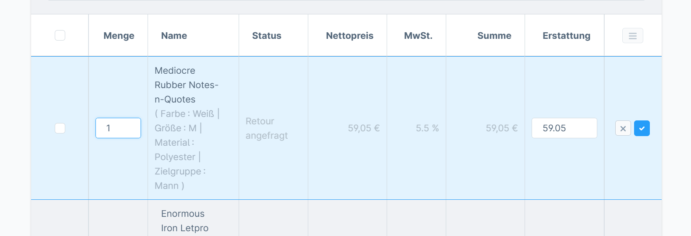
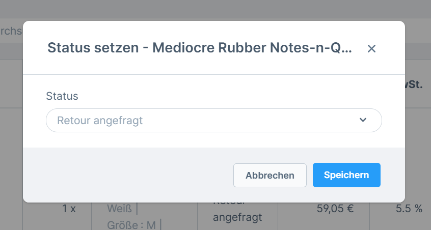
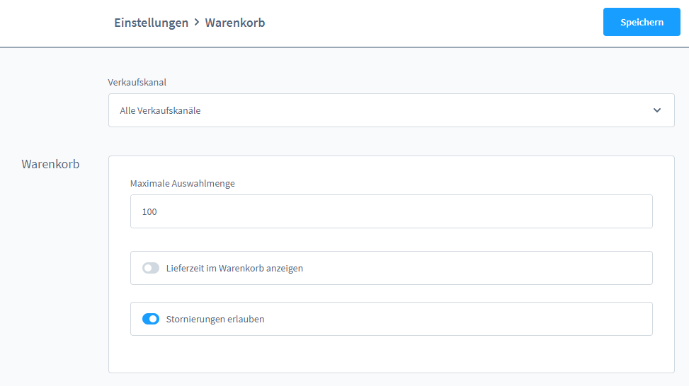

# Shopware 6 – Returns & refunds: complete reference

## Contents

- [Returns management](#returns-management)
- [Creating a return](#creating-a-return)
- [Editing a return](#editing-a-return)
- [Customer view: returns in the customer account](#customer-view-returns-in-the-customer-account)
- [Cancelling an order (aborted payment)](#cancelling-an-order-aborted-payment)
- [Refunding via the payment provider](#refunding-via-the-payment-provider)
- [Summary: return workflows](#summary-return-workflows)
- [Source](#source)

## Returns management

### Prerequisites

| Condition | Detail |
|---|---|
| Shopware plan | **Rise** or higher |
| Extension | The **Commercial** extension must be installed |
| Minimum version | Shopware **6.5.0.0** |

> Returns management is a commercial feature and is **not** included in the free Shopware plan.

---

## Creating a return

### Step 1: Open the order



Open an existing order in the administration (Bestellungen (Orders) > click the order).

### Step 2: Select line items



In the **"Allgemein"** (General) tab under **Positionen** (Line items):
1. Tick the item checkboxes for the returned line items
2. Click the **"Artikel zurückgeben"** (Return items) button

> **Limitation:** currently **only one return per order** can be created.

### Step 3: Fill in the return dialogue

In the dialogue:
- Set the **Rückgabemenge** (Return quantity) per line item
- Add a **Kommentar** (Comment) (optional)
- Confirm with "Retoure erstellen" (Create return)

---

## Editing a return



Once created, the **"Retouren"** (Returns) tab appears in the order view.

### "Allgemein" section in the Retouren tab

| Field | Description |
|---|---|
| Retouren-Nummer (Return number) | Unique number of the return |
| Status | Current return status |
| Kommentar | Internal comment on the return |



### Changing the status



The return status can be set directly in the tab. Customers see this status in their customer account.

### Adjusting line items

The **Positionen** section of the Retouren tab allows the following adjustments:

| Action | Description |
|---|---|
| Change return quantity | Adjust the quantity per line item |
| Status per line item | Set an individual status per return line item |
| Remove line items | Delete individual line items from the return |
| Adjust shipping costs | Double-click the shipping costs > change the amount |

### Creating a partial credit note

If an **invoice** already exists for the order, a **partial credit note** can be created from the return:

1. In the Retouren tab, click "Gutschrift erstellen" (Create credit note)
2. Line items and amounts are taken from the return
3. The credit note document appears in the order's document list

---

## Customer view: returns in the customer account

Registered customers can view the return in their account:
- **Path:** customer account > Bestellungen > [order] > Retouren tab
- Shown are: return status, returned line items
- Customers can track the status but cannot make any changes

---

## Cancelling an order (aborted payment)

### Enabling the cancellation setting

To let customers cancel orders themselves after an aborted payment:

**Admin path:** Einstellungen (Settings) > Warenkorb (Cart) > enable **"Stornierungen erlauben"** (Allow cancellations)



### Cancellation flow from the customer's perspective

1. The order has been placed, the payment has failed
2. In the customer account: Bestellungen > "..." menu > **"Bestellung stornieren"** (Cancel order)
3. Stock is released again when the order is cancelled via the customer account

> **Note:** cancelling is only possible as long as the payment status is **not** "Bezahlt" (Paid).

---

## Refunding via the payment provider

Shopware manages the **payment status**; the actual chargeback happens via the **payment provider** (e.g. PayPal, Stripe). The process:

1. Record the return in Shopware
2. Initiate the chargeback with the payment provider (automatically or manually, depending on the payment provider plugin)
3. Set the payment status in Shopware manually to "Erstattet" (Refunded) or "Teilweise erstattet" (Partially refunded)

---

## Summary: return workflows

```
Customer sends goods back
  └─→ Admin: create return (Artikel zurückgeben)
        ├─→ Edit return (status, quantities)
        ├─→ Create partial credit note (if an invoice exists)
        └─→ Trigger the refund with the payment provider
              └─→ Payment status → "Erstattet"
```

---

## Source
https://docs.shopware.com/de/shopware-6-de/bestellungen/retouren-management
https://docs.shopware.com/de/shopware-6-de/bestellungen/zahlungsvorgang-nach-bestellung
