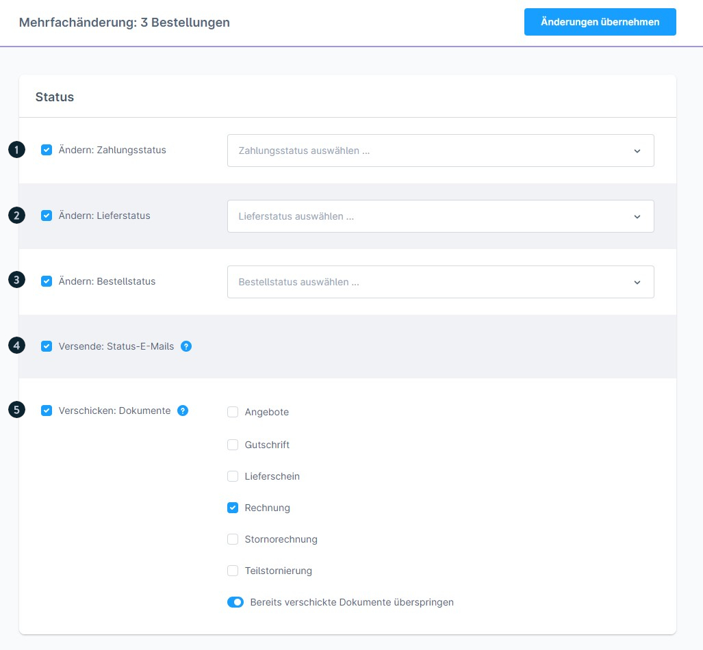
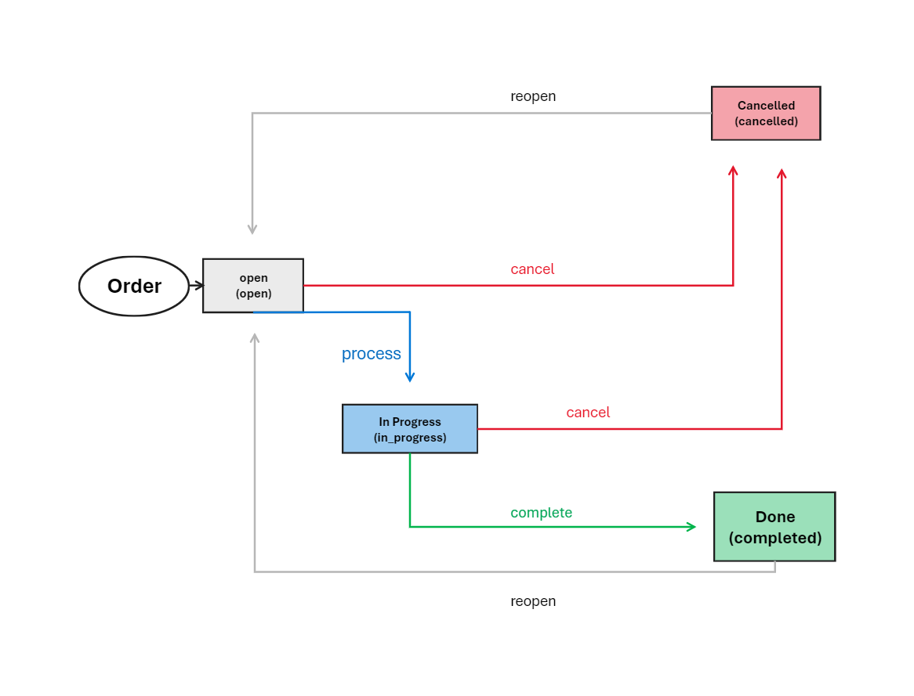
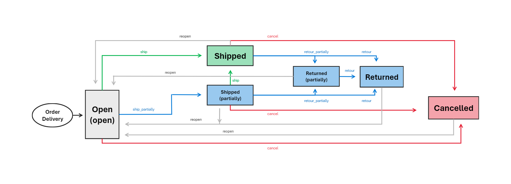
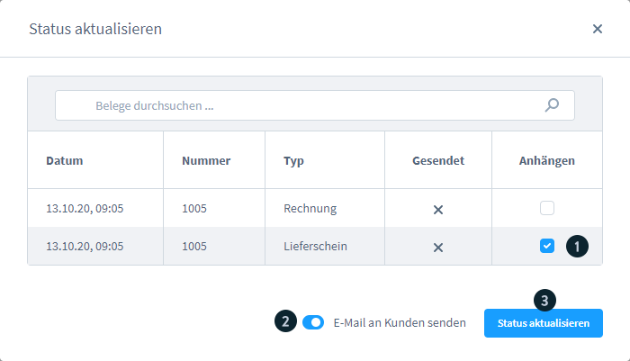
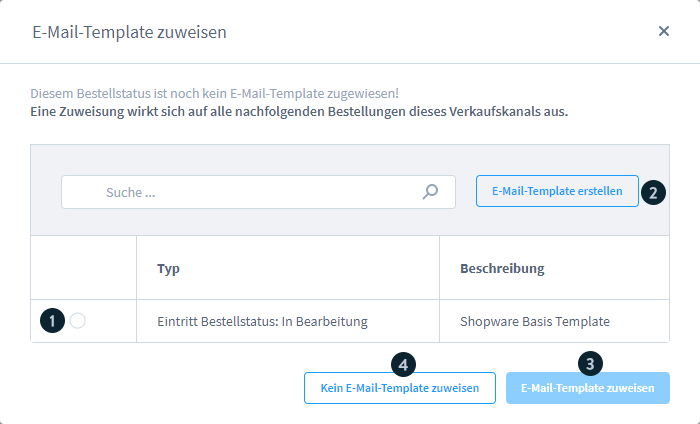

# Shopware 6 – Status management: complete reference

## Contents

- [Basic principle: order and payment are separate](#basic-principle-order-and-payment-are-separate)
- [The three status dimensions](#the-three-status-dimensions)
- [Changing a status – how it works](#changing-a-status--how-it-works)
- [After-order payment: completing payment after the order](#after-order-payment-completing-payment-after-the-order)
- [Flow Builder: automations on status changes](#flow-builder-automations-on-status-changes)
- [Guest orders: status display](#guest-orders-status-display)
- [Source](#source)

## Basic principle: order and payment are separate

> **Important:** in Shopware 6, payment and order are **completely decoupled** from each other.  
> Unlike in Shopware 5, an order is created immediately as soon as the customer clicks **"Zahlungspflichtig bestellen"** (Place binding order) – regardless of whether the payment succeeded.

---

## The three status dimensions

### 1. Bestellstatus (Order status)



| Status | Meaning |
|---|---|
| **Offen** (Open) | Order received, not yet processed |
| **In Bearbeitung** (In progress) | Order is being actively processed |
| **Abgeschlossen** (Done) | Order fully completed |
| **Storniert** (Cancelled) | Order cancelled; stock is **released** |
| **Abgelehnt** (Rejected) | Order was rejected |
| **Ausstehende Freigabe** (Pending approval) | Order is waiting for manual approval |

> **Cancellation logic:** only setting the **Bestellstatus** to "Storniert" releases reserved stock quantities again. Changing the payment or delivery status to "Storniert" alone is **not** sufficient.

#### Bestellstatus transitions



```
Offen
  └─→ In Bearbeitung
        ├─→ Abgeschlossen
        └─→ Storniert
  └─→ Storniert (directly)
```

---

### 2. Zahlungsstatus (Payment status)

| Status | Meaning |
|---|---|
| **Offen** | Payment not yet made (initial status) |
| **In Bearbeitung** | Payment is being processed |
| **Fehlgeschlagen** (Failed) | Payment aborted or failed |
| **Bezahlt** (Paid) | Payment received in full |
| **Teilweise bezahlt** (Partially paid) | Only part of the total has been paid |
| **Erstattet** (Refunded) | Full refund |
| **Teilweise erstattet** (Partially refunded) | Partial refund |
| **Genehmigt** (Authorised) | Payment authorised (e.g. prepayment) |
| **Erinnerung zugeschickt** (Reminded) | A payment reminder has been sent |
| **Beauftragt** (In progress/ordered) | Payment instructed (e.g. direct debit) |
| **Widerrufen** (Chargeback) | Payment revoked |
| **Storniert** | Payment cancelled |

---

### 3. Lieferstatus (Delivery status)



| Status | Meaning |
|---|---|
| **Offen** | Not yet shipped |
| **Geliefert** (Shipped) | Delivered in full |
| **Teilweise geliefert** (Partially shipped) | Only part of the order delivered |
| **Retoure** (Returned) | Full return |
| **Teilretoure** (Partially returned) | Partially sent back |
| **Storniert** | Shipment cancelled |

---

## Changing a status – how it works

### Single order



1. Open the order
2. In the info area ("Allgemein" (General) tab), click the desired status dropdown
3. Select the target status in the modal
4. Optional: enable **E-Mail an Kunden senden** (Send email to customer)
5. If email is enabled: choose a document as an attachment (e.g. the invoice)
6. Assign an email template



### Several orders (bulk)

Using the multi-selection in the order list, order status, payment status and delivery status can be changed for up to **1,000 orders** at once (see `sw-merchant-orders-overview`).

---

## After-order payment: completing payment after the order

### Process flow

1. The order is created (click on "Zahlungspflichtig bestellen")
2. Initial payment status: **Offen**
3. If the payment is completed: status changes to **Bezahlt**
4. If the payment is interrupted/fails: status becomes **Fehlgeschlagen**

### Customer options after a failed payment

Customers can complete the payment later via:

| Route | Action |
|---|---|
| Customer account | Bestellungen (Orders) > "Zahlung abschließen" (Complete payment) button |
| Customer account | "..." menu > "Zahlungsart ändern" (Change payment method) |
| Email | Use the link from the confirmation email |

**Payment change link:**
- Leads back into the checkout
- The customer selects a new or existing payment method
- The payment is executed again

> Once the payment status has reached **"Bezahlt"**, the customer can only cancel the order (no longer change the payment method).

### Setting: allow cancellation

To let customers cancel after an aborted payment:

**Admin path:** Einstellungen (Settings) > Warenkorb (Cart) > enable **"Stornierungen erlauben"** (Allow cancellations)

---

## Flow Builder: automations on status changes

Under **Einstellungen > Flow Builder** you can configure workflows that react to status changes:

### Flow configuration

| Element | Description |
|---|---|
| **Trigger** | Trigger event (e.g. order status changed, payment status changed) |
| **Bedingung** (Condition) | Rule from the Rule Builder (e.g. a specific payment method) |
| **Aktion (wenn wahr)** (Action if true) | e.g. send email, create document |
| **Aktion (wenn falsch)** (Action if false) | Alternative action |

### Email recipient options

| Option | Recipient |
|---|---|
| Standard (Default) | System-defined recipients |
| Administrator | All users flagged as administrators |
| Eigener Empfänger (Custom recipient) | User-defined email addresses |

### Flow table columns

1. Aktiv (Active) (on/off)
2. Name (mandatory field)
3. Trigger (mandatory field)
4. Beschreibung (Description) (optional)
5. Flow options (Bearbeiten (Edit) / Löschen (Delete))
6. "Flow hinzufügen" (Add flow) button

---

## Guest orders: status display

Guests without a customer account receive a confirmation email containing a link. After authenticating with **email + postcode** they can view the order and delivery status.

---

## Source
https://docs.shopware.com/de/shopware-6-de/bestellungen/uebersicht
https://docs.shopware.com/de/shopware-6-de/bestellungen/zahlungsvorgang-nach-bestellung
