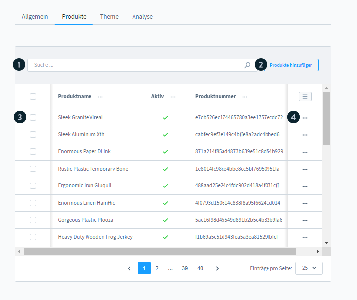
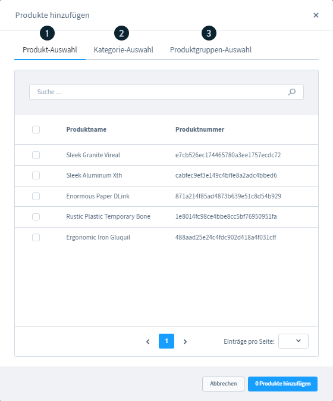

# Shopware 6 – Verkaufskanal: Produktzuweisung (vollständig)

> Quelle: https://docs.shopware.com/de/shopware-6-de/einstellungen/Verkaufskanaele
> Version: 6.7.7.0+

---

## 1. Produkte-Reiter

Der Reiter **Produkte** in der Verkaufskanal-Konfiguration ermöglicht die Zuweisung von Produkten, ohne jedes Produkt einzeln öffnen und bearbeiten zu müssen.

### Bedienelemente

| Nr. | Element | Funktion |
|---|---|---|
| 1 | **Suche** | Bereits zugewiesene Produkte durchsuchen (für Entfernung) |
| 2 | **Produkte hinzufügen** | Öffnet den Zuweisungs-Dialog |
| 3 | **Linke Checkboxen** | Ein oder mehrere Produkte markieren zur Entfernung |
| 4 | **Kontextmenü** (rechts) | Einzelnes Produkt entfernen oder Produktdetails aufrufen |

---

## 2. Produkte hinzufügen – Dialog

Der Dialog bietet drei Registerkarten:

### 2.1 Produkt-Auswahl

- Zeigt nur Produkte an, die dem Kanal **noch nicht** zugewiesen sind
- Mehrfachauswahl per Checkbox möglich
- Volltext-Suche nach Produktname oder Produktnummer

### 2.2 Kategorie-Auswahl

- Zeigt den vollständigen Kategorienbaum
- Durch Auswahl einer Kategorie werden **alle darin enthaltenen Produkte** dem Kanal zugewiesen
- Unterkategorien sind ebenfalls in der Zuweisung enthalten (rekursiv)

### 2.3 Produktgruppen-Auswahl

- Listet alle unter **Kataloge > Dynamische Produktgruppen** angelegten Gruppen
- Durch Auswahl einer Gruppe werden alle regelbasiert enthaltenen Produkte zugewiesen
- Zuweisung ist statisch zum Zeitpunkt der Auswahl (nicht dynamisch aktualisiert beim Kanal-Reiter)

---

## 3. Produkte entfernen

### Variante 1: Mehrfachauswahl

1. Checkboxen links neben den gewünschten Produkten aktivieren
2. "Entfernen"-Schaltfläche erscheint in der Aktionsleiste
3. Bestätigen → Produkte werden aus dem Kanal entfernt

### Variante 2: Einzelnes Produkt über Kontextmenü

1. In der Produktzeile auf das Kontextmenü-Icon (drei Punkte) klicken
2. "Produkt entfernen" wählen
3. Alternativ: "Produkt anzeigen" öffnet die vollständige Produktbearbeitung

---

## 4. Alternativweg: Produkt direkt zuweisen

Produkte können auch direkt aus der Produktbearbeitung Kanälen zugewiesen werden:

**Kataloge > Produkte > Produkt öffnen > Reiter "Verkaufskanäle"**

Dort können beliebige Kanäle ausgewählt und dem Produkt zugewiesen werden – dies entspricht genau der umgekehrten Richtung der hier beschriebenen Zuweisung.

---

## 5. Sichtbarkeit und Suchbarkeit

Damit ein Produkt im Kanal sichtbar ist, müssen folgende Bedingungen erfüllt sein:

1. Produkt ist dem Kanal zugewiesen (hier oder im Produkt-Reiter)
2. Produkt ist einer Kategorie zugeordnet, die in der Navigation des Kanals liegt
3. Produkt ist als "Aktiv" markiert
4. Preis für die Kundengruppe des Kanals ist hinterlegt

---

## Quelle

https://docs.shopware.com/de/shopware-6-de/einstellungen/Verkaufskanaele
