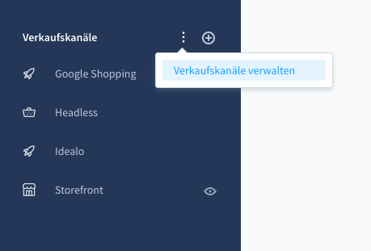
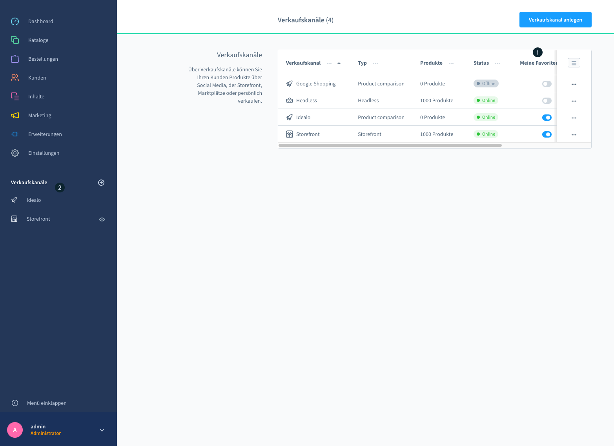
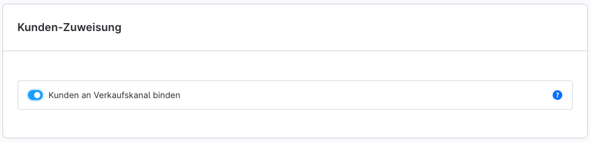
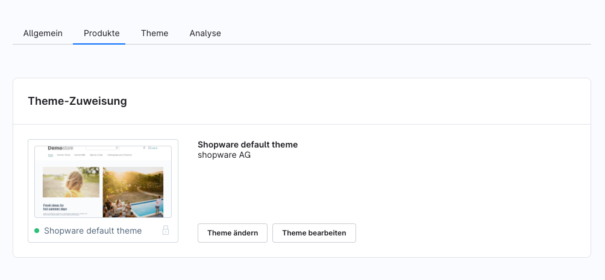
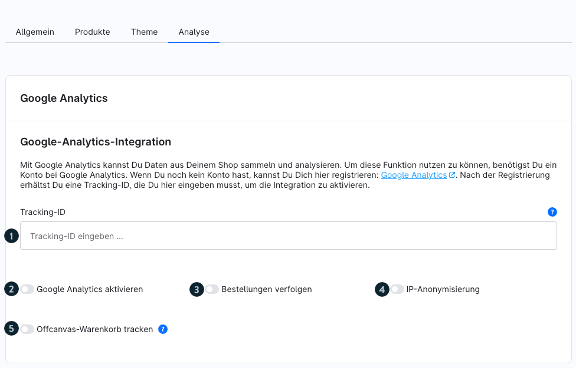

# Shopware 6 – Verkaufskanäle: Vollständige Dokumentation

> Quelle: https://docs.shopware.com/de/shopware-6-de/einstellungen/Verkaufskanaele
> Version: 6.7.7.0+

---

## 1. Was sind Verkaufskanäle?

Verkaufskanäle bieten die Möglichkeit, verschiedene Absatzwege über ein Shopsystem anzubinden. Sie stellen die Schnittstelle von der Administration zur Storefront dar. Mögliche Kanäle sind:

- Klassische HTML-Storefronts
- Headless-APIs für Fremdsysteme
- Vergleichsportale wie billiger.de oder Google Shopping
- Social-Shopping-Integrationen (Facebook, Instagram, Pinterest)
- KI-Plattformen (Agentic Commerce)

**Admin-Pfad:** Hauptmenü > Verkaufskanäle

---

## 2. Kanal-Typen im Überblick

| Typ | Beschreibung | Besonderheit |
|---|---|---|
| **Storefront (HTML)** | Vollständiger Online-Shop mit Frontend | Theme-Zuweisung möglich |
| **Headless** | Nur API-Schnittstelle, kein Frontend | Vorinstalliert, nie löschen! |
| **Produktvergleich** | XML/CSV-Feed für Preisportale | Template-basiert (Twig) |
| **Social Shopping** | Feeds für Social-Media-Plattformen | Teil von Shopware Rise+ |
| **Agentic Commerce** | JSONL-Feed für KI-Plattformen | Ab 6.7.10.0 |

---

## 3. Verkaufskanäle verwalten

### 3.1 Übersicht

Im Admin-Menü werden alle Verkaufskanäle aufgelistet. Das **+** Symbol neben dem Menüpunkt öffnet den Dialog zum Anlegen neuer Kanäle. Bestehende Kanäle können durch Anklicken geöffnet und bearbeitet werden.

### 3.2 Favoriten

Über **Verkaufskanäle verwalten** können Kanäle als Favoriten markiert werden:

- Favorisierte Kanäle erscheinen direkt in der Sidebar
- Nicht-favorisierte werden ausgeblendet (aber im dedizierten Menü erreichbar)
- Mehrere Kanäle können gleichzeitig favorisiert werden

---

## 4. Kunden-Zuweisung

Die Funktion **Kunden an Verkaufskanal binden** befindet sich unter:
**Einstellungen > System > Anmeldung/Registrierung**

### Verhalten bei aktivierter Bindung

- Kunden können sich nur in dem Kanal anmelden, in dem sie sich registriert haben
- Registriert sich ein Kunde mit derselben E-Mail-Adresse in zwei Kanälen → wird er als zwei verschiedene Kunden behandelt
- Die Bindung bleibt auch nach Deaktivierung der Funktion für bestehende Kunden bestehen

### Verhalten bei deaktivierter Bindung

- Alle neu registrierten Kunden können sich in allen Kanälen anmelden

### Verkaufskanal-Spalte in Kundenübersicht

In **Kunden > Übersicht** kann die Verkaufskanal-Spalte via Listeneinstellungen aktiviert werden:

1. Listeneinstellungen (Zahnrad-Symbol) öffnen
2. Option "Verkaufskanal" aktivieren
3. Spalte erscheint in der Tabelle

---

## 5. Theme-Zuweisung

Im Reiter **Theme** eines Storefront-Kanals:

- Aktuell zugeordnetes Theme wird angezeigt
- Klick auf Vorschaubild oder "Theme ändern" → Liste installierter Themes
- "Themes bearbeiten" → Theme-Konfiguration

---

## 6. Analyse (Google Analytics)

Im Reiter **Analyse** kann ein Google-Analytics-Account verbunden werden.

### Konfigurationsfelder

| Feld | Beschreibung |
|---|---|
| **Tracking-ID** | Aus Google Analytics: Verwaltung > Tracking-Informationen > Tracking-Code |
| **Google Analytics aktivieren** | Aktivierungsschalter |
| **Bestellungen verfolgen** | Bestellungen in Analysen einbeziehen |
| **IP-Anonymisierung** | Letzte zwei Zifferngruppen der IP werden genullt (z.B. 94.31.0.0) – in EU gesetzlich empfohlen |
| **Offcanvas-Warenkorb tracken** | `view_cart`-Event auch beim Offcanvas-Öffnen auslösen |

### Getrackte Events (Standard)

- add-to-cart, add-to-cart-by-number
- begin-checkout, begin-checkout-on-cart
- checkout-progress
- login, sign-up
- purchase
- remove-from-cart
- search-ajax
- view-item, view-item-list, view-search-results

### Google Tag Manager

Analytics läuft via Google Tag Manager. Benutzerdefinierte Events/Skripte erfordern Erweiterungen aus dem Shopware Store.

### Erweiterte E-Commerce-Daten (gtag.js)

Folgende Berichte via gtag.js verfügbar:
- Impressionsdaten
- Produktdaten
- Angebotsdaten
- Aktionsdaten

---

## 7. Headless-Kanal: Wichtige Hinweise

- Der vorinstallierte Headless-Verkaufskanal **darf nie gelöscht werden**
- Viele Erweiterungen (z.B. B2B-Suite) nutzen diesen Kanal intern
- Zum "Verstecken": Andere Kanäle als Favoriten markieren; Headless-Kanal wird dann aus der Sidebar ausgeblendet, bleibt aber im Menü erreichbar

---

## Quelle

https://docs.shopware.com/de/shopware-6-de/einstellungen/Verkaufskanaele
