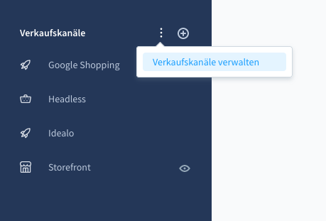
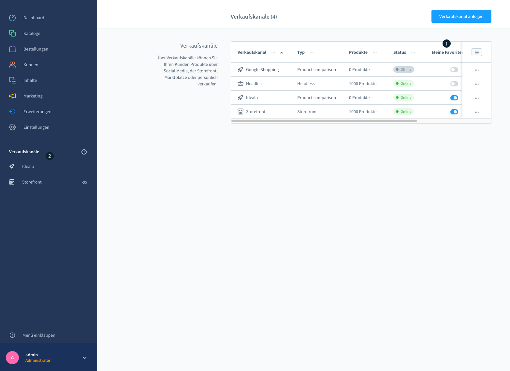
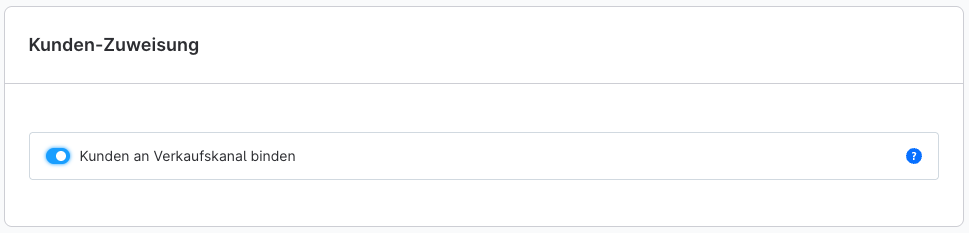
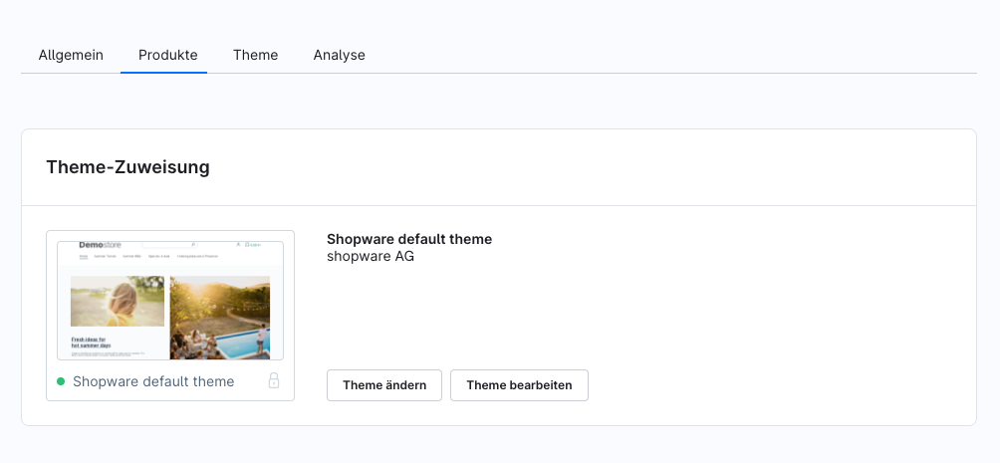
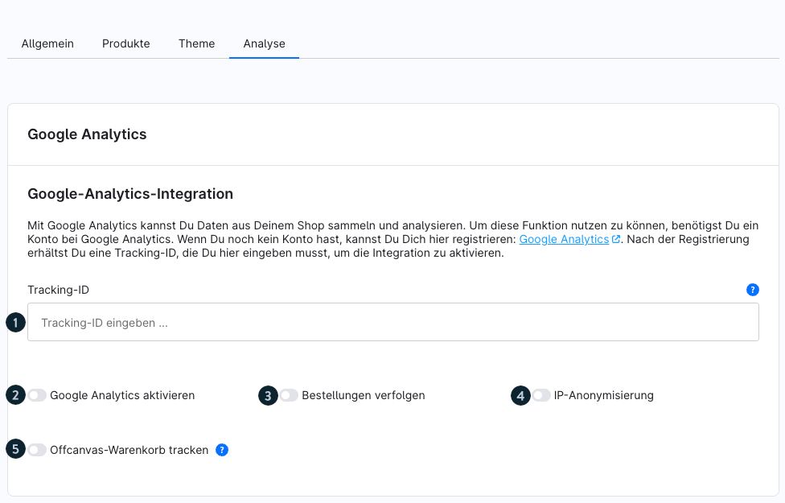

# Shopware 6 – Verkaufskanäle (Sales channels): complete documentation

> Source: https://docs.shopware.com/de/shopware-6-de/einstellungen/Verkaufskanaele
> Version: 6.7.7.0+

---

## Contents

- [1. What are Verkaufskanäle?](#1-what-are-verkaufskanäle)
- [2. Channel types at a glance](#2-channel-types-at-a-glance)
- [3. Managing Verkaufskanäle](#3-managing-verkaufskanäle)
- [4. Customer assignment](#4-customer-assignment)
- [5. Theme assignment](#5-theme-assignment)
- [6. Analyse (Analytics) (Google Analytics)](#6-analyse-analytics-google-analytics)
- [7. Headless channel: important notes](#7-headless-channel-important-notes)
- [Source](#source)

## 1. What are Verkaufskanäle?

Verkaufskanäle offer the possibility of connecting different sales routes through one shop system. They form the interface from the administration to the storefront. Possible channels are:

- Classic HTML storefronts
- Headless APIs for third-party systems
- Comparison portals such as billiger.de or Google Shopping
- Social shopping integrations (Facebook, Instagram, Pinterest)
- AI platforms (Agentic Commerce)

**Admin path:** Main menu > Verkaufskanäle

---

## 2. Channel types at a glance

| Type | Description | Particularity |
|---|---|---|
| **Storefront (HTML)** | Complete online shop with frontend | Theme assignment possible |
| **Headless** | API interface only, no frontend | Pre-installed, never delete! |
| **Produktvergleich** (Product comparison) | XML/CSV feed for price portals | Template-based (Twig) |
| **Social Shopping** | Feeds for social media platforms | Part of Shopware Rise+ |
| **Agentic Commerce** | JSONL feed for AI platforms | As of 6.7.10.0 |

---

## 3. Managing Verkaufskanäle

### 3.1 Übersicht (Overview)

All Verkaufskanäle are listed in the admin menu. The **+** icon next to the menu item opens the dialogue for creating new channels. Existing channels can be opened and edited by clicking on them.

### 3.2 Favourites

Channels can be marked as favourites via **Verkaufskanäle verwalten** (Manage sales channels):

- Favourited channels appear directly in the sidebar
- Non-favourited ones are hidden (but reachable in the dedicated menu)
- Several channels can be favourited at the same time

---

## 4. Customer assignment

The function **Kunden an Verkaufskanal binden** (Bind customers to sales channel) is located under:
**Einstellungen (Settings) > System > Anmeldung/Registrierung** (Login/registration)

### Behaviour when binding is enabled

- Customers can only log in to the channel in which they registered
- If a customer registers with the same email address in two channels → they are treated as two different customers
- The binding persists for existing customers even after the function is deactivated

### Behaviour when binding is disabled

- All newly registered customers can log in to all channels

### Verkaufskanal column in the customer overview

In **Kunden** (Customers) **> Übersicht**, the Verkaufskanal column can be enabled via the list settings:

1. Open the list settings (cog icon)
2. Enable the "Verkaufskanal" option
3. The column appears in the table

---

## 5. Theme assignment

In the **Theme** tab of a storefront channel:

- The currently assigned theme is displayed
- Click on the preview image or "Theme ändern" (Change theme) → list of installed themes
- "Themes bearbeiten" (Edit themes) → theme configuration

---

## 6. Analyse (Analytics) (Google Analytics)

A Google Analytics account can be connected in the **Analyse** tab.

### Configuration fields

| Field | Description |
|---|---|
| **Tracking-ID** (Tracking ID) | From Google Analytics: Administration > Tracking information > Tracking code |
| **Google Analytics aktivieren** (Enable Google Analytics) | Activation switch |
| **Bestellungen verfolgen** (Track orders) | Include orders in analytics |
| **IP-Anonymisierung** (IP anonymisation) | The last two digit groups of the IP are zeroed (e.g. 94.31.0.0) – legally recommended in the EU |
| **Offcanvas-Warenkorb tracken** (Track offcanvas cart) | Also trigger the `view_cart` event when the offcanvas opens |

### Tracked events (default)

- add-to-cart, add-to-cart-by-number
- begin-checkout, begin-checkout-on-cart
- checkout-progress
- login, sign-up
- purchase
- remove-from-cart
- search-ajax
- view-item, view-item-list, view-search-results

### Google Tag Manager

Analytics runs via Google Tag Manager. Custom events/scripts require extensions from the Shopware Store.

### Enhanced e-commerce data (gtag.js)

The following reports are available via gtag.js:
- Impression data
- Product data
- Offer data
- Promotion data

---

## 7. Headless channel: important notes

- The pre-installed headless Verkaufskanal **must never be deleted**
- Many extensions (e.g. B2B Suite) use this channel internally
- To "hide" it: mark other channels as favourites; the headless channel is then hidden from the sidebar but remains reachable in the menu

---

## Source

https://docs.shopware.com/de/shopware-6-de/einstellungen/Verkaufskanaele
