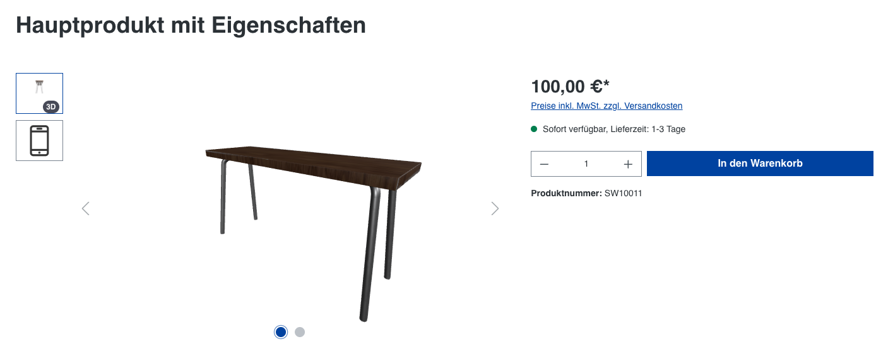

# Shopware 3D Preview Generator — Vollständige Referenz

Quelle: https://docs.shopware.com/de/shopware-6-de/erweiterungen/3d-preview-generator

---

## Screenshots

## Was ist der 3D Preview Generator?

Der 3D Preview Generator ist ein Shopware-Service, der **automatisch Vorschaubilder** für
3D-Dateien im GLB-Format erstellt. Diese Vorschaubilder werden in der Mediathek,
auf Produktdetailseiten und in Produktlistings angezeigt.

## Voraussetzungen

- **Shopware Intelligence+**-Abonnement (kein kostenloses Kontingent)
- Shopware **6.7.1.0** oder neuer

## Funktionsweise (automatisch)

### Prozessablauf
1. .glb-Datei über den Medien-Bereich oder die Produktoberfläche hochladen
2. Service generiert Vorschau **automatisch im Hintergrund**
3. Benutzer erhält **Benachrichtigung**, wenn Vorschau fertig ist
4. Vorschaubild wird in der Mediathek gespeichert
5. Bild erscheint automatisch an allen relevanten Stellen im Shop

### Kein manueller Eingriff nötig
„No configuration needed" — der Service aktiviert sich automatisch beim Upload von .glb-Dateien.

## Anzeigeorte der generierten Vorschaubilder

- **Mediathek** (Media Manager) — als Thumbnail
- **Produktdetailseite** — in der Produktgalerie
- **Produktlistings** — als Vorschaubild

## Technische Infrastruktur

Die 3D-Datei wird temporär an einen **sicheren, von Shopware betriebenen Rendering-Service**
auf AWS übertragen:
- End-to-End-Verschlüsselung
- Strikte Zugriffsbeschränkungen
- Service rendert 2D-Vorschau und gibt sie zurück

**Datenschutz:** Shopware verarbeitet 3D-Dateien ausschließlich für die Vorschau-Erstellung.

## Nutzungshinweise

### Datenverarbeitung genehmigen
Für die Nutzung kann eine Genehmigung über die **Service-Registry** erforderlich sein.
Diese wird bei der ersten Nutzung angefragt.

### Bestehende GLB-Dateien
Beim Update der Shopware-Installation werden für **bereits vorhandene .glb-Dateien
keine Vorschauen automatisch nachgeneriert**.

**Lösungen:**
- Dateien erneut hochladen (Trigger für Neugenerierung)
- Generierung per benutzerdefiniertem Script/Plugin anstoßen

## Freikontingente & Abonnement

| Status | Verfügbarkeit |
|---|---|
| Ohne Intelligence+ | Nicht verfügbar |
| Mit Intelligence+ | Vollständige Nutzung |

## Verwandte Services

- **CAD to 3D File Conversion** — Erstellt .glb-Dateien aus CAD-Dateien (.STEP)
  → Skill: `sw-merchant-services-cad-3d`
- **Shopware Intelligence+** — Abonnement-Voraussetzung
  → Skill: `sw-merchant-services-intelligence-plus`

---

Quelle: https://docs.shopware.com/de/shopware-6-de/erweiterungen/3d-preview-generator
(abgerufen 2025-06-11)
