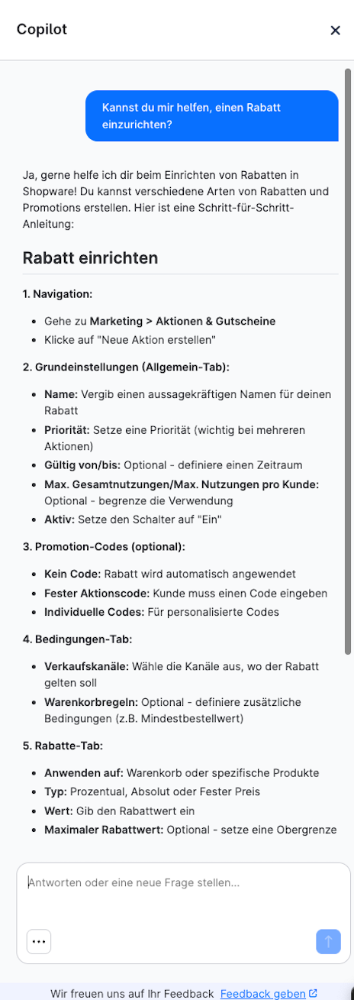
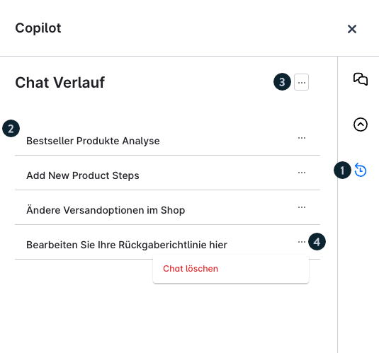
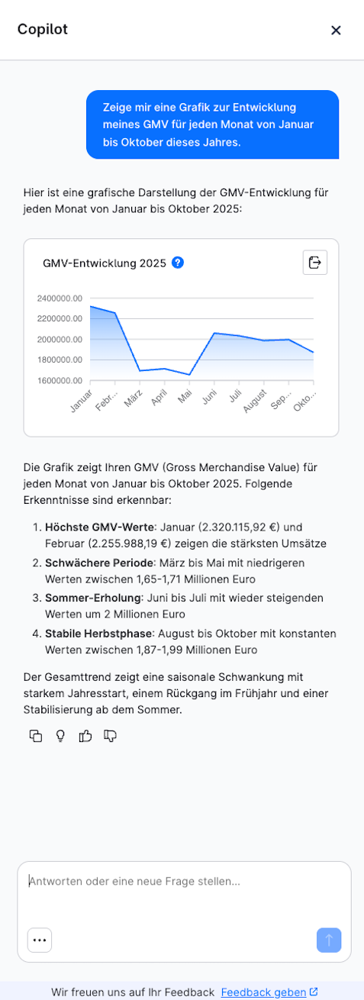
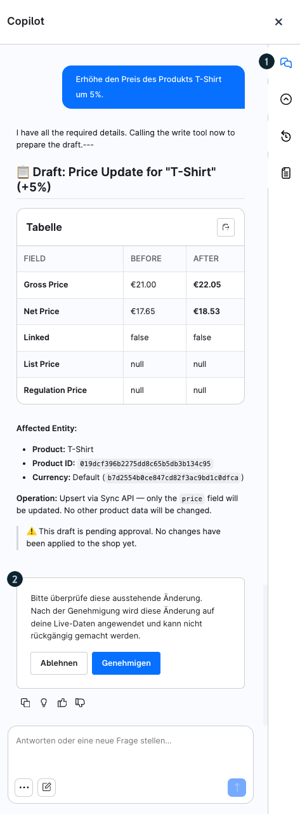
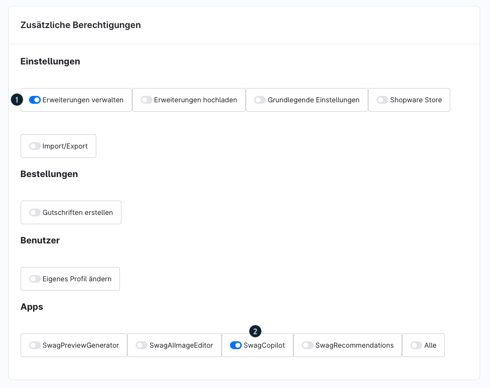

# Shopware Copilot — Vollständige Referenz

Quelle: https://docs.shopware.com/de/shopware-6-de/erweiterungen/copilot

---

## Screenshots

## Was ist der Shopware Copilot?

Der Copilot ist ein **chat-basierter KI-Assistent**, der Shop-Betreiber bei der Verwaltung ihres
Shops unterstützt. Er bietet shopware-spezifische Führung zu Konfiguration, Plugin-Entwicklung
und Best Practices.

## Mindestvoraussetzungen

- Shopware **6.7.8.0** oder neuer
- Aktives Shopware Intelligence+-Abonnement für erweiterte Data Insights / Agentic-Nutzung

## Grundlegende Bedienung

### Zugang
- Klick auf den **Drei-Sterne-Button** im Admin-Dashboard

### Anfragen stellen
- Vorgeschlagene Fragen auswählen **oder** eigene Fragen eingeben
- Antworten erscheinen im Chat-Format mit konkreter Führung

### Chat-Verlauf
- Klick auf das Uhren-/Kreispfeil-Symbol zeigt frühere Gespräche chronologisch an
- Einzelne Chats oder gesamten Verlauf per Kontextmenü löschen

## Funktionen im Detail

### 1. Basis-Copilot (kostenlos)
- Shopware-spezifische Konfigurationsfragen
- Allgemeine Best-Practice-Empfehlungen
- Plugin-Entwicklungsunterstützung
- **Freikontingent:** 10 Anfragen/Monat

### 2. Data Insights (Intelligence+ erforderlich)
Ermöglicht datenbasierte Fragen zu:
- Kunden-Daten und -Verhalten
- Bestellungen und Umsatz
- Shop-Performance-Kennzahlen

**Ausgabeformate:**
- Text
- Tabellen
- Grafiken/Charts
- CSV-Export

**Wichtige Einschränkung:** Verarbeitet **keine personenbezogenen Daten (PII)**!

### 3. Copilot Agentic (Beta, Intelligence+ erforderlich)
Führt wiederkehrende Admin-Aufgaben **autonom** aus:
- Rabattaktionen erstellen
- Workflows/Flows anlegen
- Produkte in der Massenverarbeitung anpassen

**Sicherheit:** Änderungen erfordern **explizite Benutzer-Bestätigung** vor der Ausführung.
**Transparenz:** Aktivitätsprotokoll verfolgt alle ausgeführten Aktionen chronologisch.

## Zugang & Berechtigungen

### Ersteinrichtung
- Initialer Zugang: **Nur Administratoren**

### Erweiterter Zugang für weitere Nutzer
1. **Einstellungen > System > Benutzer & Rollen** aufrufen
2. Berechtigung **„Erweiterungen verwalten"** aktivieren
3. Benutzer muss SwagCopilot in der Apps-Sektion aktivieren

## Datensicherheit & Datenschutz

| Aspekt | Details |
|---|---|
| KI-Anbieter | EU-ansässig, erhält keinen Shop-Zugriff |
| Modell-Training | Nutzereingaben werden NICHT für Training verwendet |
| Shopware-Datenerhebung | Anfragen werden für Produktverbesserung gesammelt |
| Empfehlung | Keine sensiblen Daten eingeben |

## Freikontingente & Abonnement

| Funktion | Freikontingent/Monat | Mit Intelligence+ |
|---|---|---|
| Basis-Copilot | 10 Anfragen | Erweitert |
| Data Insights | (in 10 enthalten) | Erweitert |
| Copilot Agentic | (in 10 enthalten) | Erweitert |

## Verwandte Links

- Shopware Intelligence+: `sw-merchant-services-intelligence-plus`
- Shopware AI Produkte: https://www.shopware.com/de/produkte/shopware-ai/

---

Quelle: https://docs.shopware.com/de/shopware-6-de/erweiterungen/copilot
(abgerufen 2025-06-11)
