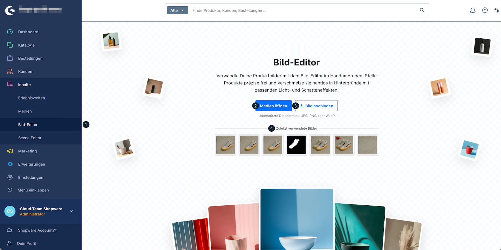
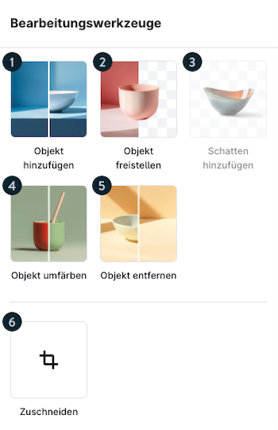
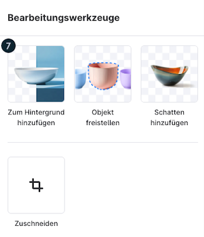
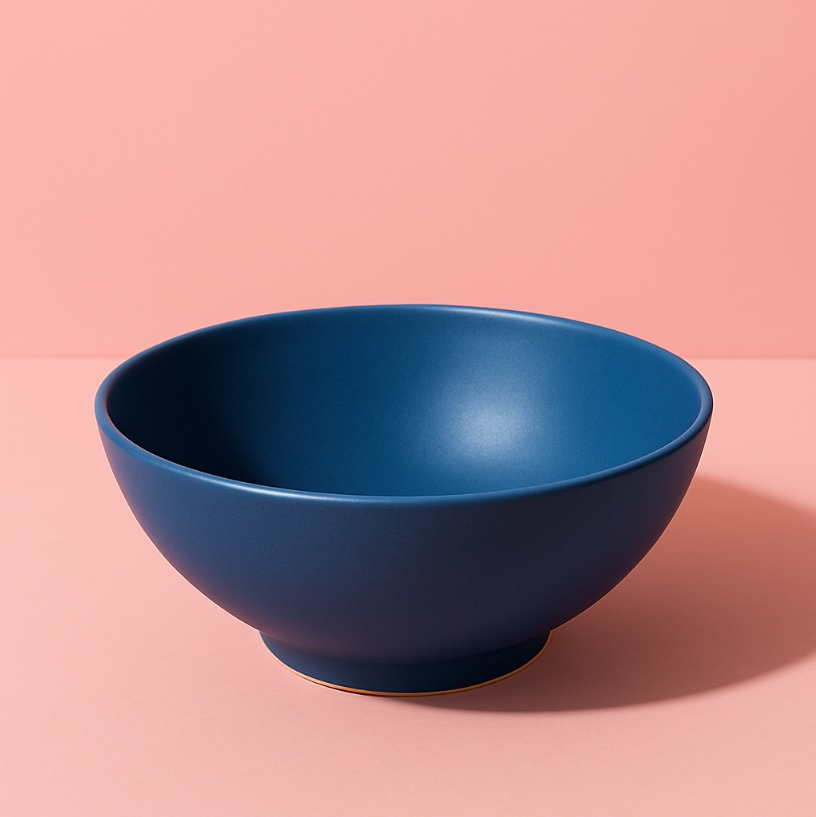
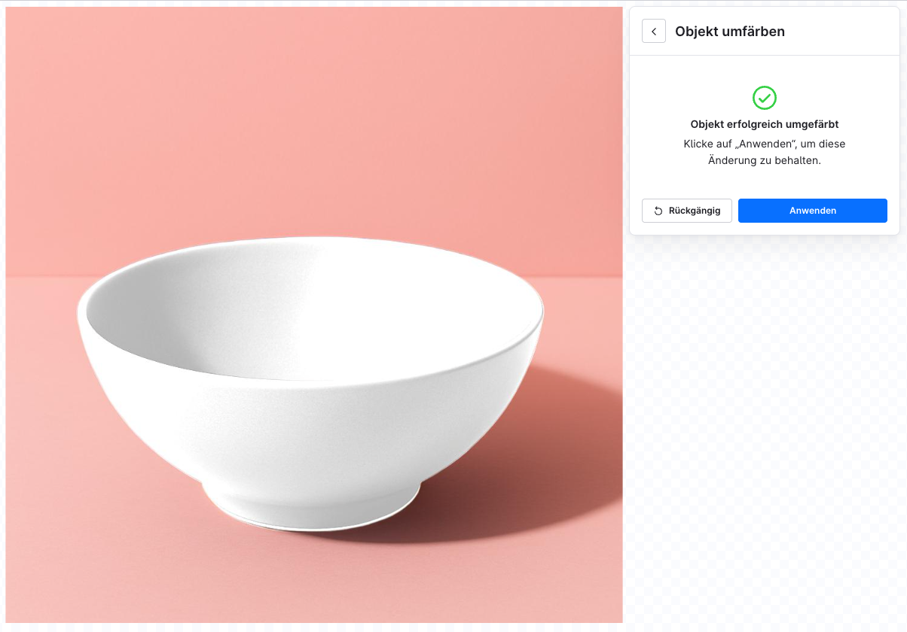

# Shopware Bild-Editor — Vollständige Referenz

Quelle: https://docs.shopware.com/de/shopware-6-de/erweiterungen/bild-editor

---

## Screenshots

## Was ist der Bild-Editor?

Der Bild-Editor ist ein KI-gestützter Service, der es Händlern ermöglicht, Produktbilder
direkt in der Shopware-Administration zu transformieren. Objekte werden freigestellt und
in Hintergründe mit realistischen Licht- und Schatteneffekten eingebettet.

## Mindestvoraussetzungen

- Shopware **6.7.1.0** oder neuer
- Kostenloses Monatskontingent: **20 Anfragen**
- Über das Kontingent hinaus: **Shopware Intelligence+**-Abonnement erforderlich

## Unterstützte Dateiformate

- JPG
- PNG
- WebP

## Zugang

**Pfad:** Administration → **Inhalte > Bild-Editor**

## Bearbeitungswerkzeuge (7 Werkzeuge)

### 1. Objekt hinzufügen (Add Object)
Freigestellte Objekte auf Hintergründe legen/schichten.

### 2. Objekt isolieren (Isolate Object)
Hintergrund aus Bild entfernen. Ausgabe als **PNG mit Transparenz**.

### 3. Schatten hinzufügen (Add Shadow)
Natürliche Schatten auf freigestellte Objekte anwenden.

### 4. Objekt neufärben (Recolor Object)
Farbe eines Objekts ändern — nützlich für Farbvarianten-Bilder.

### 5. Objekt entfernen (Remove Object)
Elemente aus Bildern entfernen (z.B. störende Hintergrundobjekte).

### 6. Zuschneiden (Crop)
Bild auf spezifische Abmessungen oder Seitenverhältnisse zuschneiden.

### 7. Zu Hintergrund hinzufügen (Add to Background)
Objekt in einen Hintergrund einbetten — entweder als Volltonfarbe oder als Bild.
**Voraussetzung:** Eingabedatei muss einen Alphakanal haben (PNG mit Transparenz).

## Interface-Funktionen

| Funktion | Beschreibung |
|---|---|
| Zoom-Steuerung | Bildansicht vergrößern/verkleinern |
| Pixel-Anzeige | Aktuelle Auflösung einblenden |
| Letzte Bilder | Schnellzugriff auf zuletzt bearbeitete Bilder |
| Upload-Optionen | Aus Mediathek wählen oder neue Datei hochladen |

## Workflow-Beispiel: Produktbild freistellen und in Hintergrund einbetten

1. **Bild-Editor** über Inhalte öffnen
2. Produktbild aus Mediathek auswählen oder hochladen
3. Werkzeug **„Objekt isolieren"** wählen → PNG mit Transparenz erhalten
4. Werkzeug **„Zu Hintergrund hinzufügen"** wählen
5. Hintergrundbild oder -farbe auswählen
6. Ergebnis in Mediathek speichern
7. Bild dem Produkt zuweisen

## Technische Hinweise

### KI-Implementierung
- Verwendet die **Finegrain API** mit künstlicher Intelligenz
- Ergebnisse werden **nicht manuell geprüft**
- **Empfehlung:** Ergebnisse vor Veröffentlichung prüfen

### Bildqualität
- Höhere Ausgangsqualität → bessere KI-Ergebnisse
- Freistell-Ergebnisse bei klaren Objektkanten besser als bei komplex strukturierten Objekten

## Freikontingente & Abonnement

| Status | Kontingent |
|---|---|
| Ohne Intelligence+ | 20 Anfragen/Monat |
| Mit Intelligence+ | Erhöhte Nutzung (während Launch-Phase unbegrenzt) |

---

Quelle: https://docs.shopware.com/de/shopware-6-de/erweiterungen/bild-editor
(abgerufen 2025-06-11)
