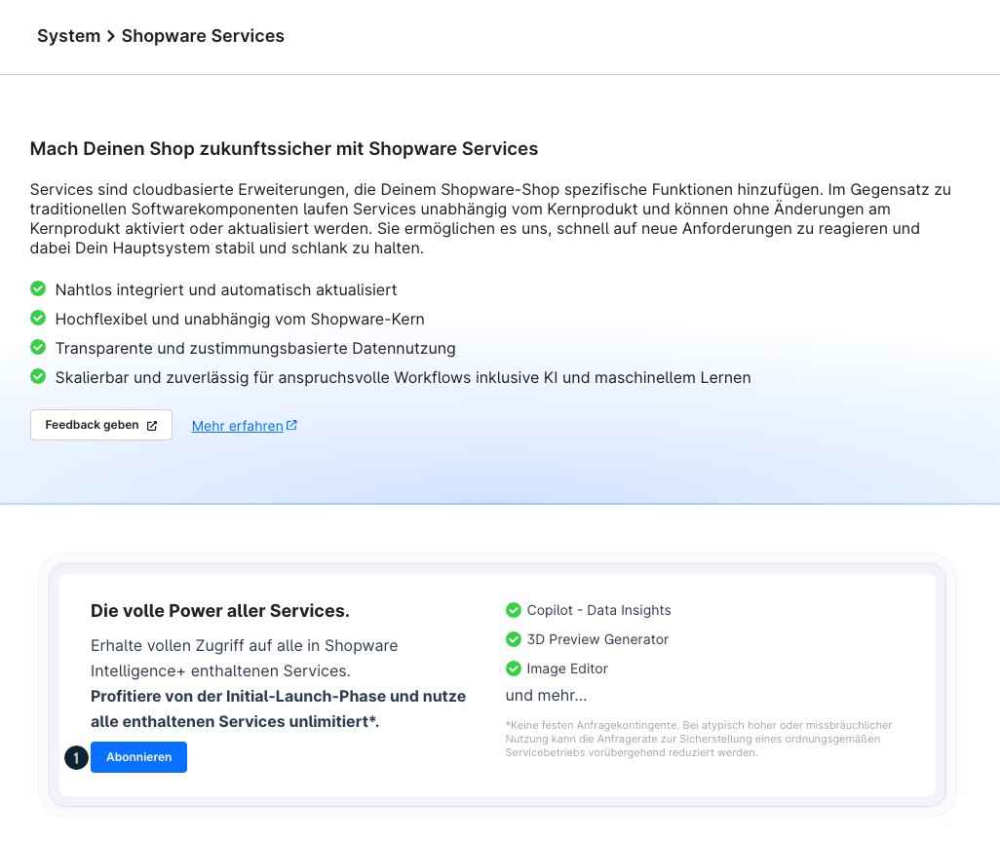

# Shopware Intelligence+ — Vollständige Referenz

Quelle: https://docs.shopware.com/de/shopware-6-de/shopware-services/shopware-intelligence-plus

---

## Screenshots

## Was ist Shopware Intelligence+?

Shopware Intelligence+ ist ein **Abonnement-Service**, der erweiterte Funktionen und
erhöhte Nutzungskontingente für Shopware AI-Services freischaltet.

**Warum kostenpflichtig?**
Services unterscheiden sich von Standard-Produktfunktionen, da sie als unabhängige Anwendungen
laufende Zusatzkosten verursachen — insbesondere für Infrastruktur und nutzungsabhängige
Leistungen von Drittanbietern (z.B. KI-Modelle).

## Im Abonnement enthaltene Services

### 1. Copilot Data Insights
- Stellt Copilot datenbezogene Fragen zu Kunden, Bestellungen und Shop-Performance
- Freikontingent: 10 Anfragen/Monat
- Mit Intelligence+: erweiterte Nutzung

### 2. Copilot Agentic (Beta)
- Copilot führt Aufgaben autonom aus
- Beispiele: Rabattaktionen erstellen, Flows anlegen, Produkte in der Massenverarbeitung anpassen
- Freikontingent: 10 Anfragen/Monat (gemeinsam mit Data Insights)
- Mit Intelligence+: erweiterte Nutzung

### 3. Bild-Editor (Image Editor)
- KI-gestützte Produktbild-Bearbeitung
- Freikontingent: 20 Anfragen/Monat
- Mit Intelligence+: erhöhte Nutzung während Launch-Phase unbegrenzt

### 4. 3D Preview Generator
- Erstellt automatisch Vorschaubilder für .glb-3D-Dateien
- Freikontingent: nicht verfügbar (nur mit Abonnement nutzbar)
- Mit Intelligence+: vollständige Nutzung

### 5. CAD to 3D File Conversion
- Konvertiert CAD-Dateien (.STEP) in GLB-Format
- Freikontingent: 1 Konvertierung/Monat
- Mit Intelligence+: erhöhte Nutzung

## Monatliche Freikontingente (ohne Abonnement)

| Service | Freies Monatskontingent |
|---|---|
| Copilot (Data Insights + Agentic) | 10 Anfragen |
| Bild-Editor | 20 Anfragen |
| CAD to 3D Conversion | 1 Konvertierung |
| 3D Preview Generator | Nicht verfügbar |

## Aktivierung

### Option 1: Über Einstellungen
1. **Einstellungen > System > Shopware Services** aufrufen
2. Schaltfläche **„Abonnieren"** klicken
3. Abonnement-Prozess durchlaufen

### Option 2: Direkt aus dem Service heraus
- Wird das Freikontingent eines Services aufgebraucht, erscheint ein direkter Hinweis zum Abonnement
- Über diesen Hinweis kann das Abonnement direkt abgeschlossen werden

## Verfügbarkeit

- Alle Händler (Community Edition bis Beyond) können Intelligence+ abonnieren
- Nutzung ist optional — kein Pflichtabo für den Shopware-Betrieb

## Nutzungslimits & Fair Use

Bei atypisch hoher oder missbräuchlicher Nutzung kann die Anfragerate reduziert werden,
auch wenn das Abonnement aktiv ist. Dies gilt insbesondere für automatisierte Massenanfragen.

## Enthaltene Services im Detail

→ Copilot: [`../../sw-merchant-services-copilot/references/deep/copilot.md`](../../../sw-merchant-services-copilot/references/deep/copilot.md)
→ Bild-Editor: [`../../sw-merchant-services-image-editor/references/deep/image-editor.md`](../../../sw-merchant-services-image-editor/references/deep/image-editor.md)
→ 3D Preview: [`../../sw-merchant-services-3d-preview/references/deep/3d-preview.md`](../../../sw-merchant-services-3d-preview/references/deep/3d-preview.md)
→ CAD to 3D: [`../../sw-merchant-services-cad-3d/references/deep/cad-3d.md`](../../../sw-merchant-services-cad-3d/references/deep/cad-3d.md)

---

Quelle: https://docs.shopware.com/de/shopware-6-de/shopware-services/shopware-intelligence-plus
Abonnement-Details: https://docs.shopware.com/de/shopware-6-de/shopware-services/shopware-intelligence-plus-abonnement
(abgerufen 2025-06-11)
