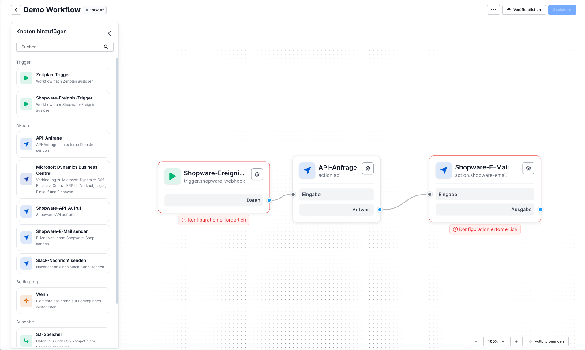
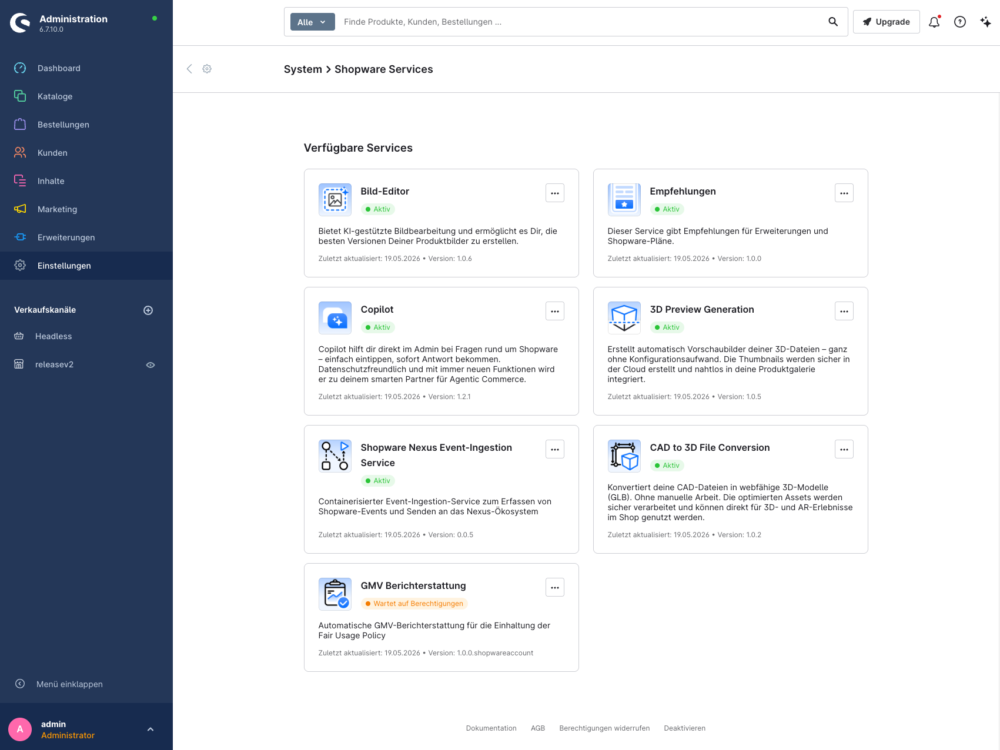
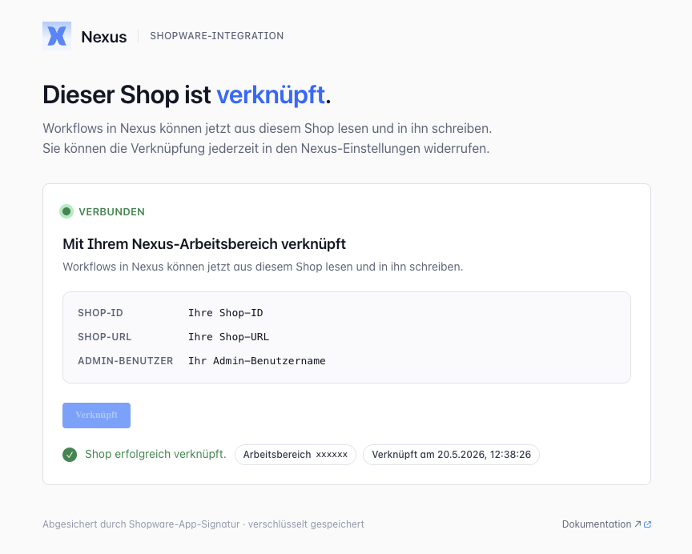
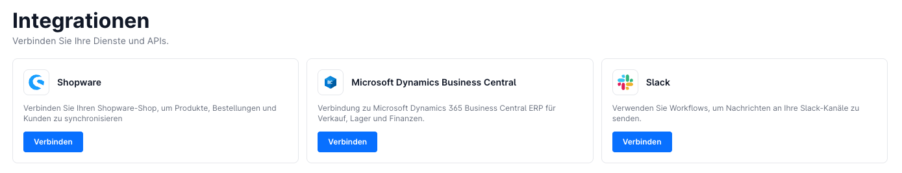

# Shopware Nexus — Vollständige Referenz

Quelle: https://docs.shopware.com/de/shopware-6-de/shopware-services/shopware-nexus

---

## Screenshots

## Was ist Shopware Nexus?

Nexus ist ein **visuelles Automatisierungstool**, mit dem Shopware-Shops mit anderen Systemen und
Services verbunden werden können. Workflows werden auf einem Canvas durch Ziehen von Knoten und
Verbinden per Linie erstellt — ohne eigenen Code schreiben zu müssen.

**Status:** Early Access — eingeschränkter Funktionsumfang, Änderungen vorbehalten.

## Voraussetzungen

- Shopware **6.7.1.0** oder neuer
- Aktives Shopware-Konto, das mit einem Unternehmen verknüpft ist
- Administrator-Zugriff auf den Shop

## Einrichtung

### Schritt 1: Nexus Event-Ingestion Service aktivieren
1. **Einstellungen > Shopware Services** öffnen
2. Toggle für **„Shopware Nexus Event-Ingestion Service"** aktivieren

### Schritt 2: Bei Nexus anmelden
1. [nexus.shopware.com](https://nexus.shopware.com) aufrufen
2. Mit Shopware-Zugangsdaten (SSO) anmelden
3. Korrekte Organisation/Unternehmen auswählen

### Schritt 3: Shop mit Nexus verknüpfen
1. In Shopware-Administration: **Einstellungen > Nexus** aufrufen
2. Verbindung über den bereitgestellten Button initiieren

### Schritt 4: Verbindung prüfen
- Test-Workflow mit einem Shopware-Event-Trigger erstellen
- Shop-Domain sollte unter „Shopware Shops" erscheinen

## Workflow-Konzepte

### Workflow-Status

| Status | Bedeutung | Verfügbare Aktionen |
|---|---|---|
| Entwurf (Draft) | Bearbeitungsmodus | Speichern, Veröffentlichen |
| Veröffentlicht (Published) | Bereit | Starten |
| Aktiv (Active) | Verarbeitet Daten | Zurückziehen |
| Wird erstellt (Deploying) | Wird aufgebaut | — |

### Knotentypen

#### Trigger-Knoten
- **Shopware Event Trigger:** Reagiert auf Shopware-Ereignisse (z.B. `order.placed`)
- **Schedule Trigger:** Zeitgesteuert per Cron-Syntax

#### Aktions-Knoten
- **Microsoft Dynamics Business Central:** CRUD-Operationen
- **Shopware API Call:** Shopware-API direkt ansprechen
- **Slack Message:** Benachrichtigung senden
- **Shopware E-Mail:** E-Mail über Shopware versenden
- **API Request:** Beliebige externe API ansprechen

#### Logik-Knoten
- **If/Else:** Bedingte Verzweigung

#### Ausgabe-Knoten
- **S3 Storage:** Daten in S3 speichern

#### Steuerungs-Knoten
- **Delay:** Verzögerung einbauen

## Workflow erstellen (Schritt für Schritt)

1. **Workflow erstellen:** Schaltfläche „Create Workflow" klicken, Namen vergeben, bestätigen
2. **Trigger hinzufügen:** Shopware Event Trigger per Drag-and-Drop platzieren, Shop und Event auswählen
3. **Aktion hinzufügen:** Gewünschte Aktion (z.B. Slack) platzieren
4. **Verbinden:** Trigger-Ausgang mit Aktions-Eingang verbinden
5. **Konfigurieren:** Aktions-Parameter eintragen
6. **Speichern → Veröffentlichen → Starten**

## Ausdrücke und Platzhalter

In Textfeldern können Eigenschaften vorheriger Knoten referenziert werden:
- `@` tippen → verfügbare Eigenschaften erscheinen
- Datenzugriff per `{{ }}` Syntax, z.B. `{{payload.order.orderNumber}}`

## Integrations-Setup

Vor der Nutzung externer Konnektoren müssen Services authentifiziert werden:
1. **Integrations** im Hauptmenü öffnen
2. Gewünschten Service wählen (Slack, Business Central)
3. Authentifizierungsprozess abschließen

Zugangsdaten werden **verschlüsselt** gespeichert.

## Anwendungsbeispiele

### Beispiel 1: Bestellsynchronisation mit Business Central
1. Trigger: `order.placed`
2. Business Central nach Kundenmailing abfragen
3. Bedingung: Neuer oder bestehender Kunde?
4. Sales Order in Business Central anlegen
5. Shopware-Bestellung mit Referenz aktualisieren
6. Slack-Benachrichtigung senden

### Beispiel 2: Niedrig-Bestand-Alarme
- **Variante A:** Täglich geplanter Check (Schedule Trigger)
- **Variante B:** Ereignisbasiert — Lagerbestandsänderungen überwachen

## Monitoring

Nexus bietet:
- Workflow-Verarbeitungshistorie einsehen
- Verarbeitungsmetriken anzeigen

## Troubleshooting

| Problem | Lösung |
|---|---|
| Workflow bleibt im „Deploying"-Status | Workflow neu veröffentlichen |
| Unauthorized-Fehler | Per SSO neu authentifizieren |
| Event-Daten fehlen | Logging-Knoten hinzufügen, Payload prüfen |
| Business Central Filter leer | OData-Filtersyntax prüfen |
| Slack-Nachricht wird nicht gesendet | Slack-Zugangsdaten neu autorisieren |
| Shop nicht in Nexus sichtbar | Event-Ingestion Service aktiviert? Richtige Organisation? |

## Entwickler-Dokumentation

Weitere technische Details: https://developer.shopware.com/docs/products/Nexus/

---

Quelle: https://docs.shopware.com/de/shopware-6-de/shopware-services/shopware-nexus
(abgerufen 2025-06-11)
