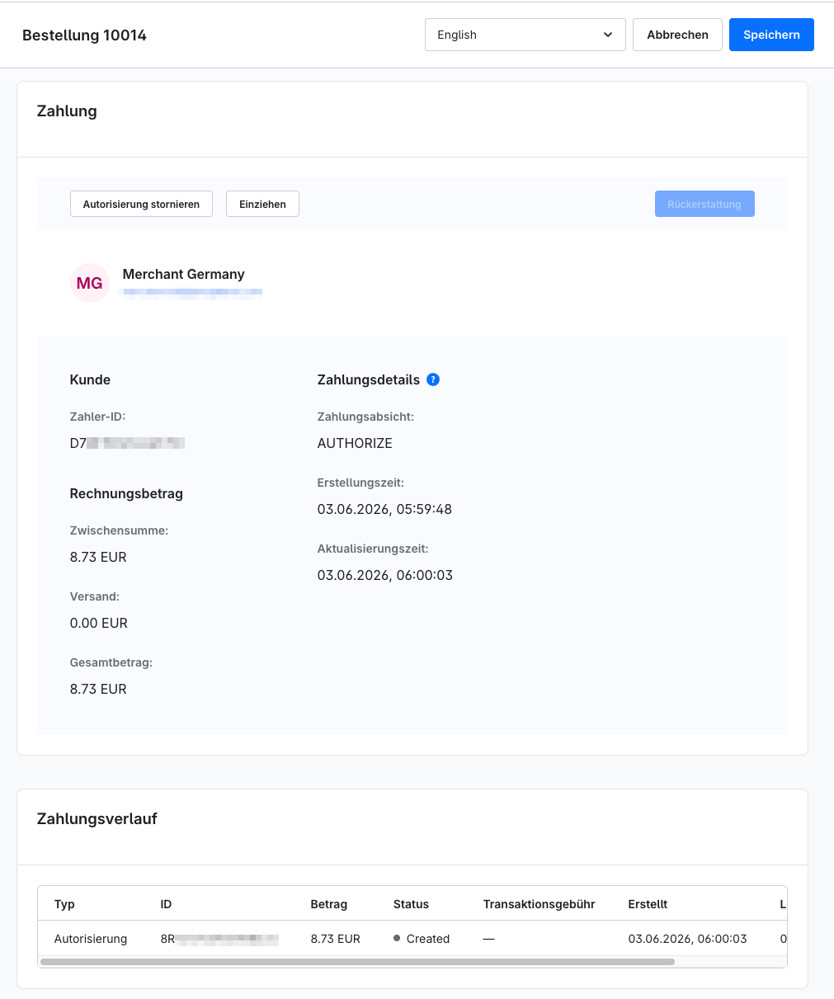
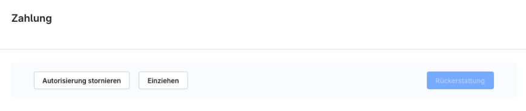
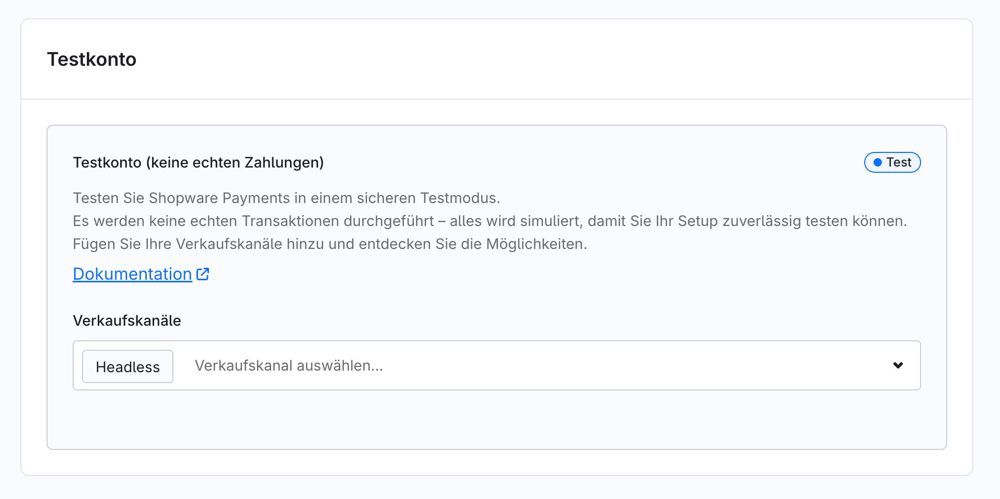

# Shopware Payments — Vollständige Referenz

Quelle: https://docs.shopware.com/de/shopware-6-de/shopware-services/shopware-payments

---

## Screenshots

## Was ist Shopware Payments?

Shopware Payments ist ein **eigenständiges Shopware-Produkt** auf Basis der globalen
PayPal-Infrastruktur. Es ist vollständig in die Administration integriert und ermöglicht
das Verwalten von Zahlungsmethoden ohne externe Systeme.

**Kernprinzip:** „Die Lösung basiert auf der globalen Infrastruktur von PayPal" — zuverlässige
Zahlungsverarbeitung, integrierte Compliance und skalierbare Architektur.

## Voraussetzungen

### Unterstützte Shopware-Versionen
| Version | Ab Patch-Version |
|---|---|
| Shopware 6.5 | 6.5.7.0 |
| Shopware 6.6 | 6.6.3.0 |
| Shopware 6.7 | 6.7.1.0 (nativ, ohne App-Installation) |

### Händler-Voraussetzungen
- Gültige Shopware-Installation
- PayPal Business Services in unterstützter Region
- Ggf. zusätzliche Verifikation je nach Geschäftsmodell

### Regionale Verfügbarkeit
- Aktuell: **Deutschland** und **Österreich**
- Geplant: EU und USA

## Aktivierung

### Ab Shopware 6.7.1.0 (nativ)
1. **Einstellungen > System > Shopware Services** öffnen
2. Shopware Payments aktivieren
3. Verwaltung erscheint im linken Admin-Menü

### Vor Shopware 6.7.1.0
1. Shopware Payments als App installieren (Erweiterungen > Apps)
2. Danach wie oben aktivieren

## Funktionen

### Zahlungsmethoden
Folgende Methoden stehen zur Verfügung (Verfügbarkeit nach Region und Konfiguration):
- PayPal
- Klarna
- Apple Pay
- Google Pay
- Kreditkarten (Visa, Mastercard, etc.)
- SEPA-Lastschrift
- Bancontact
- BLIK
- EPS
- Venmo
- Pay Later (Ratenzahlung)

### Zahlungsverarbeitung
- **Autorisierung** (reservieren) oder **sofortiger Einzug** (Capture) wählbar
- **Vaulting:** Zahlungsmethoden für wiederkehrende Zahlungen speichern
- **3D Secure:** Optionale Blockierung von Transaktionen ohne 3DS-Prüfung
- Express Checkout auf Produktseiten, Warenkorb und Checkout-Seite

## Einstellungen

### Allgemeine Einstellungen
| Einstellung | Beschreibung |
|---|---|
| Verkaufskanalauswahl | Alle oder einzelne Verkaufskanäle |
| Zahlungseinzugszeitpunkt | Sofort oder manuell (Autorisierung) |
| Vaulting | Für wiederkehrende Zahlungen aktivieren |
| 3D Secure erzwingen | Transaktionen ohne 3DS blockieren |
| Textanpassung | Markenname und Kundenservice-Hinweise |
| Express Checkout Position | Position auf Produktseite/Warenkorb/Checkout |
| Pay Later Banner | Platzierung von Ratenkauf-Bannern |

### Zahlungsmethoden-Einstellungen
- Einzelne Methoden pro Verkaufskanal aktivieren/deaktivieren
- Status-Überwachung: `Weitere Daten erforderlich`, `Gesperrt`, `Aktiv`, `In Prüfung`
- Länder- und währungsspezifische Konfigurationen

### Apple Pay
- Domain-Registrierung und -Verifizierung erforderlich
- Domain-Assoziationsdatei unter `.well-known`-Pfad einrichten
- **Hinweis:** Nur Produktionskonten (kein Test-Account-Support)

### Konten-Verwaltung
- Mehrere Händlerkonten hinzufügen
- Konten Verkaufskanälen zuweisen
- Integriertes Testkonto für Konfigurationsprüfung vorhanden

### PayPal-Schaltflächen-Design
- Farbe, Form und Sprache der PayPal-Schaltfläche konfigurierbar

## Übersicht (Dashboard)

### Einrichtungsassistent
Führt durch die initiale Konfiguration.

### Kontoauswahl
Zwischen mehreren konfigurierten Händlerkonten wechseln.

### Verfügbares Guthaben
Aktuelles Guthaben einsehen.

### Schnellzugriffe
Direktzugang zu häufig genutzten Funktionen.

## Bestell-Management

### Zahlungsinformationen (je Bestellung)
- Zahler-Details und Transaktions-ID
- Betrag, Versandkosten, Gesamtbetrag
- Zahlungsabsicht (`AUTHORIZE` oder `CAPTURE`)
- Zeitstempel für Transaktionserstellung und -aktualisierung

### Manuelle Zahlungsaktionen

| Aktion | Voraussetzung | Wirkung |
|---|---|---|
| Einziehen (Capture) | Status: Autorisiert | Autorisierung finalisieren, Geld einziehen |
| Autorisierung stornieren | Status: Autorisiert | Reservierte Mittel freigeben |
| Rückerstattung | Status: Eingezogen | Rückerstattung veranlassen |

### Zahlungsverlauf
Vollständige Transaktionshistorie je Bestellung einsehbar.

### Flow Builder Integration
- **„Zahlung einziehen"**-Aktion: Automatische Finalisierung autorisierter Zahlungen
- **„Mittel freigeben"**-Aktion: Für Stornierungen und Erstattungen

## Migration von PayPal Plugin zu Shopware Payments

### Empfohlene Reihenfolge
1. Shopware Payments aktivieren und vollständig konfigurieren
2. Shopware-Payments-Methoden zunächst **deaktiviert** lassen
3. Methoden Verkaufskanälen zuweisen (wie beim alten Setup)
4. Shopware-Payments-Methoden **gleichzeitig aktivieren**
5. Entsprechende PayPal-Plugin-Methoden **gleichzeitig deaktivieren**
6. PayPal-Plugin **aktiv lassen** während der Abrechnungsperiode
7. Plugin erst deaktivieren/deinstallieren, wenn alle laufenden Transaktionen abgeschlossen sind

**Wichtig:** Neue Bestellungen werden ab diesem Zeitpunkt **ausschließlich über Shopware Payments** verarbeitet. Ältere Transaktionen bleiben über das PayPal-Plugin unterstützt.

## Troubleshooting

### Zahlungsstatus wird nicht aktualisiert
- Prüfen, ob Shop öffentlich erreichbar ist
- Shopware Payments muss mit der Shop-API kommunizieren können
- Statusaktualisierungen erfolgen automatisch sobald Erreichbarkeit wiederhergestellt

## Support & SLAs

Shopware Payments ist in allen Plänen verfügbar:
- **Community Edition:** 5 Werktage Reaktionszeit, Mo–Fr 09:00–17:00 Uhr MEZ (ohne dt. Bankfeiertage)
- **Rise / Evolve / Beyond:** Planspezifische SLAs gemäß Shopware-Pläne

---

Quelle: https://docs.shopware.com/de/shopware-6-de/shopware-services/shopware-payments
(abgerufen 2025-06-11)
