# Shopware 6 – Immersive Elements App: Vollständige Referenz

> Quelle: https://docs.shopware.com/de/shopware-6-de/erweiterungen/immersive-elements
> Store: https://store.shopware.com/de/insto94276218562m/immersive-elements.html
> Plan: Rise (oder höher) / alternativ €49/Monat

---

## 1. Überblick

**Immersive Elements** ist eine App, die in Zusammenarbeit zwischen Shopware und
**Instorier** (norwegische Experten für digitales Storytelling) entwickelt wurde.
Sie transformiert Online-Shops in dynamische Markenerlebnisse durch sechs spezialisierte
3D-Blöcke, die in Erlebniswelten eingesetzt werden können.

Die App ist optimiert für **Mobile, Desktop und Spatial Devices**.

### Ziele

- Kunden stärker einbinden und die Markenbindung stärken
- Konversionsraten erhöhen durch immersivere Produktpräsentation
- Produkte erlebbar machen, bevor sie gekauft werden

---

## 2. Installation

### 2.1 Voraussetzungen

- **Shopware-Plan**: Mindestens **Rise** (für die Shop-Domain registriert)
- **Shopware-Account**: Im Admin unter dem Shopware-Account-Tab eingeloggt

### 2.2 Installationsweg (über Plan)

1. **Erweiterungen > Meine Erweiterungen** im Admin öffnen
2. Sicherstellen, dass der Shopware-Account-Tab aktiv und eingeloggt ist
3. **Immersive Elements** aus den verfügbaren Erweiterungen installieren
4. Nach der Installation den **Aktivierungsschalter** umlegen

### 2.3 Installationsweg (ohne Plan, über Store)

- Erwerb über den **Shopware Store** für **€49/Monat** (Mietlizenz)
- URL: https://store.shopware.com/de/insto94276218562m/immersive-elements.html

---

## 3. Nutzung der Elemente

Alle sechs Elemente befinden sich in den **Erlebniswelten** unter:
**Blöcke > Commerce**

### Allgemeine Konfigurationsempfehlungen

- **Größenmodus**: "Full Width (1)" für optimale Darstellung wählen
- **Platzierung**: Immersive Elements sollten **aufeinanderfolgend** ohne zwischenliegende
  andere Blöcke platziert werden, um ein nahtloses visuelles Erlebnis zu schaffen
- **Community Hub**: Interaktiver Lernpfad verfügbar unter
  https://hub.shopware.com/learn/unit/user-immersive-elements

---

## 4. Die sechs Elemente im Detail

### 4.1 Cylinder Gallery

**Funktion**: Interaktiver Bildslider in 360°-Zylinderform

**Wie es funktioniert**:
- Bilder werden in einem rotierenden Zylinder angeordnet
- In der Storefront läuft die Animation automatisch
- Besucher können Geschwindigkeit und Richtung durch Klicken und Mausbewegung steuern

**Einsatzbereich**: Kollektion-Präsentation, Lookbooks, Bildergalerien mit vielen Motiven

---

### 4.2 Depth Gallery

**Funktion**: Parallax-Tiefeneffekt durch Maus- und Scroll-Interaktion

**Wie es funktioniert**:
- Bilder reagieren auf die Mausbewegung des Besuchers und erzeugen einen
  dreidimensionalen Tiefeneindruck
- Scrollen aktiviert weitere Tiefenebenen
- Erzeugt "mehr Tiefe und Interaktivität im Layout"

**Einsatzbereich**: Hero-Bilder, Lifestyle-Aufnahmen, atmosphärische Produktdarstellungen

---

### 4.3 Exploded View

**Funktion**: Interaktive Produktzerlegung in Einzelkomponenten (mit Animation)

**Preis**: **€49/Monat** als In-App-Kauf (zusätzlich zum Grundplan)

**Wie es funktioniert**:
- 3D-Modell des Produkts wird in seine Einzelteile "zerlegt" (Explosion View)
- Besucher können einzelne Komponenten auf verschiedenen Detailebenen erkunden
- Animationen zeigen die Zusammensetzung des Produkts

**Konfiguration**:
1. `.glb`-Datei des Produkts hochladen
2. Mehrere Animationsschritte ("Views") erstellen
3. Komponenten hierarchisch gruppieren (übergeordnete und untergeordnete Teile)
4. **Annotationen hinzufügen**: Produktteile mit Titeln, Beschreibungen und
   optionalen Links zu anderen Produktdetailseiten versehen
5. **Explosion-Intensität** einstellen: Wie weit Teile auseinandergezogen werden
6. **Beleuchtung konfigurieren**: Lichtart, Intensität, Presets
7. **Interaktivität**: Benutzer können durch die Views navigieren (vor/zurück)
8. **Auto-Play**: Animation läuft automatisch durch alle Views
9. Im Bereich **Szene**: Gruppierung von Komponenten verwalten
10. **Import/Export**: Konfigurationen als JSON exportieren und importieren

**Navigation für Besucher**:
- Vor/Zurück-Buttons
- Views-Übersicht für direkten Sprung zu bestimmten Explosionsstufen

---

### 4.4 3D Model Journey

**Funktion**: Animierte 360°-Produkttour mit Hotspots und Audio

**Wie es funktioniert**:
- 3D-Modell des Produkts wird in einer animierten Tour präsentiert
- Kamera umkreist das Produkt automatisch oder auf Benutzersteuerung
- Interaktive Hotspots zeigen Produktdetails und -informationen an

**Konfiguration**:
1. `.glb`-Datei hochladen (3D-Modell des Produkts)
2. `.mp3`-Audiodatei hochladen (optionaler Audio-Track für die Tour)
3. **Hintergrundfarbe** konfigurieren
4. Optionales **Hintergrundbild** hinzufügen
5. **Mehrere Abschnitte** erstellen mit unterschiedlichen:
   - Kamerapositionen
   - Beleuchtungseffekten (Presets und Intensitätsregler)
6. **Hotspots hinzufügen**:
   - Titel des Hotspots
   - Beschreibungstext
   - Positionierung im 3D-Raum
7. **360°-Interaktivität** aktivieren: Besucher können das Modell selbst drehen

**Einsatzbereich**: Premium-Produkte, technische Produkte mit erklärungsbedürftigen
Details, Schmuck, Elektronik

---

### 4.5 Slide Behind Gallery

**Funktion**: Horizontaler Inhaltswechsel mit Tiefeneffekt

**Wie es funktioniert**:
- Inhalte wechseln horizontal (ähnlich einem Slider)
- Im Gegensatz zu klassischen Slidern entsteht ein Tiefeneffekt durch die
  Slide-Behind-Mechanik
- Erzeugt "mehr Tiefe im Layout als herkömmliche Slider"

**Einsatzbereich**: Vorher-Nachher-Vergleiche, Feature-Präsentationen, Varianten-Showcase

---

### 4.6 VR Cinema

**Funktion**: 3D- und Virtual-Reality-Erlebnis für Produkte und Markengeschichten

**Wie es funktioniert**:
- Besucher werden in ein 3D/VR-Kino-Erlebnis eingetaucht
- Unterstützt das **webp-Videoformat** für optimale Performance
- Geeignet für Produkt-Narrativen und Marken-Storytelling

**Einsatzbereich**: Immersive Markenpräsentation, Produktvideos in VR, Storytelling-Kampagnen

---

## 5. Vergleichstabelle der Elemente

| Element | Technologie | Preis | Haupteinsatz | Interaktivität |
|---|---|---|---|---|
| Cylinder Gallery | 360°-Bilder | Inklusive | Galerien | Maussteuerung |
| Depth Gallery | Parallax | Inklusive | Hero-Bereiche | Maus + Scroll |
| Exploded View | 3D GLB | +€49/Monat | Technik-Produkte | Animation + Navigation |
| 3D Model Journey | 3D GLB + MP3 | Inklusive | Premium-Produkte | 360° + Hotspots |
| Slide Behind Gallery | CSS | Inklusive | Vergleiche | Horizontal-Slide |
| VR Cinema | WebP-Video | Inklusive | Marken-Erlebnisse | VR-Immersion |

---

## 6. Screenshots

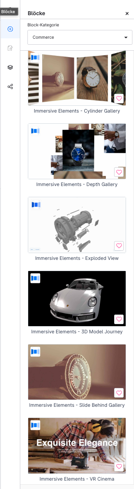
*Alle Immersive Elements Blöcke in der Erlebniswelten-Blockbibliothek unter „Commerce"*

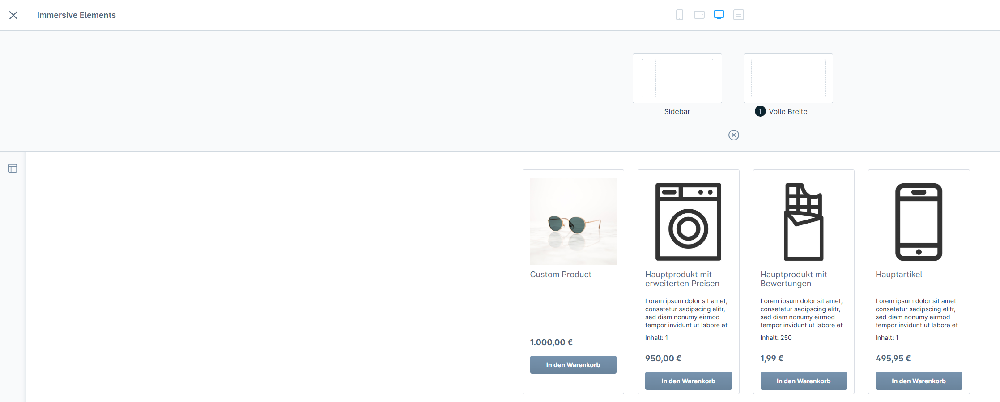
*Optimale Darstellung mit Vollbild-Modus (Full Width)*

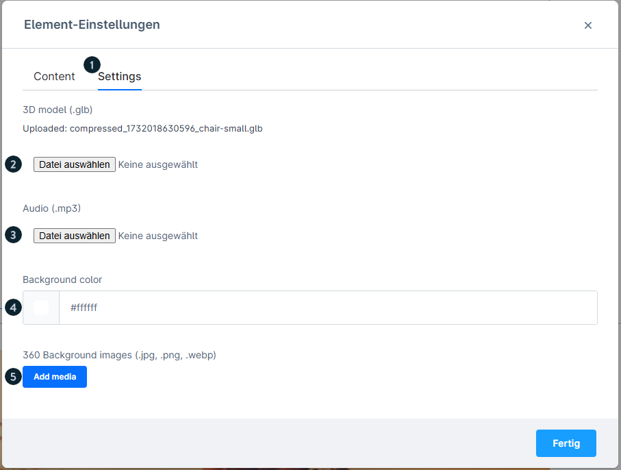
*Einstellungen für den 3D Model Journey Block*

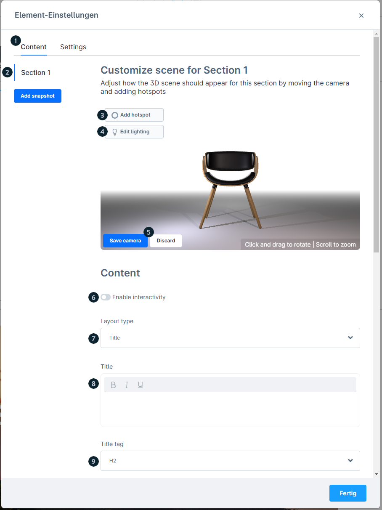
*Content-Konfiguration: GLB-Datei und Audio hochladen, Abschnitte erstellen*

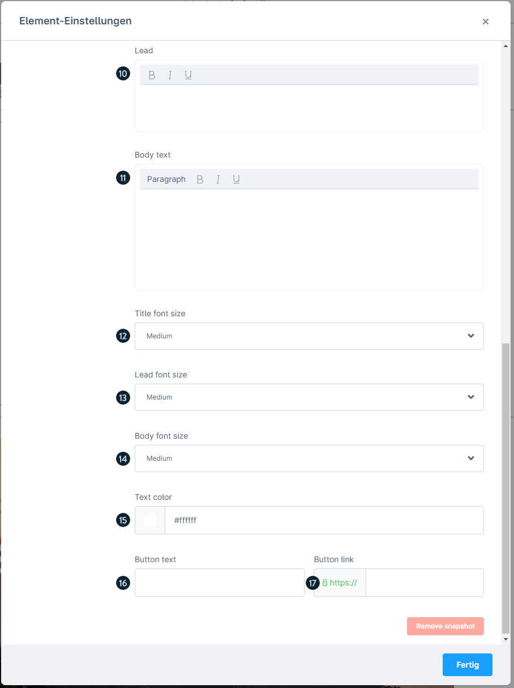
*Weitere Content-Einstellungen: Hintergrundfarbe, Beleuchtung*

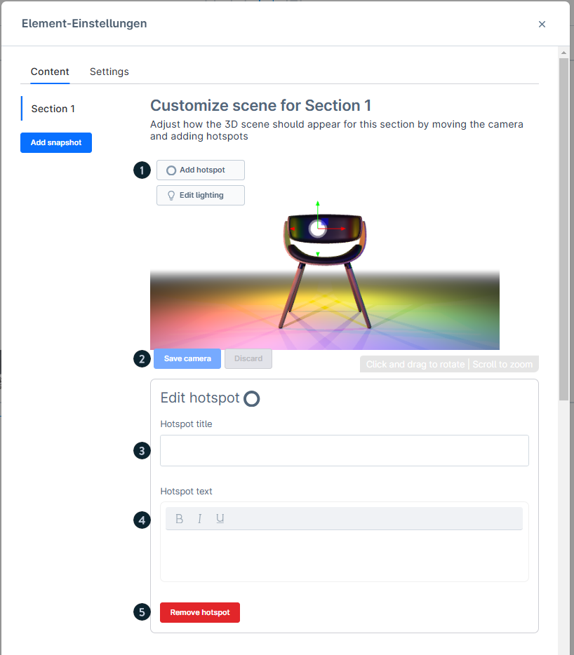
*Hotspot hinzufügen und im 3D-Raum positionieren*

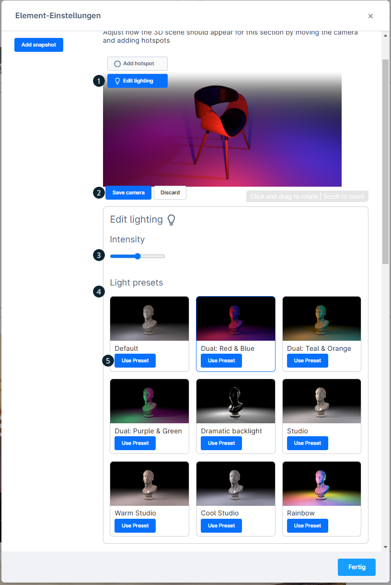
*Beleuchtungsoptionen mit Preset-Auswahl und Intensitätsregler*

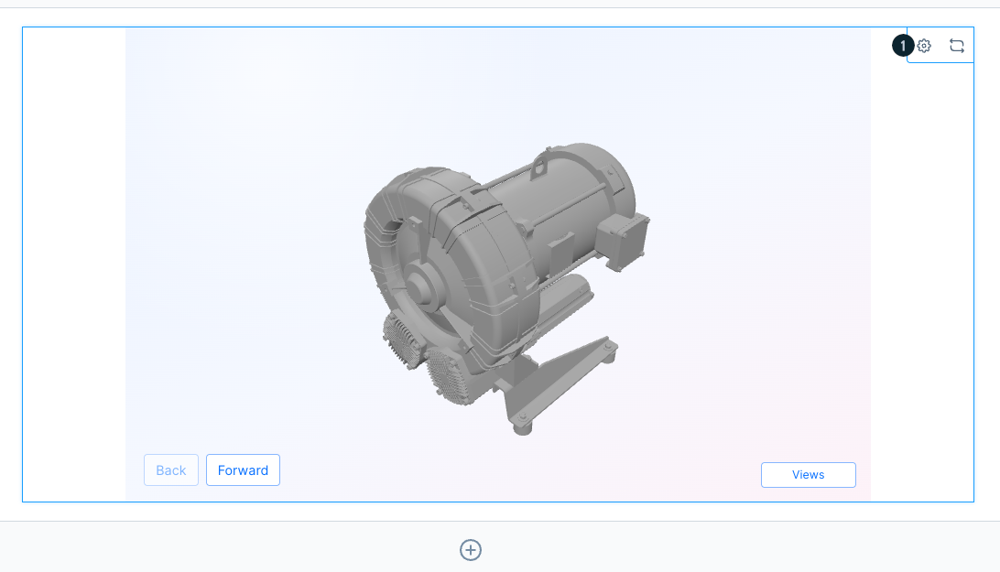
*Vorschau eines Elements in der Erlebniswelten-Bearbeitungsansicht*

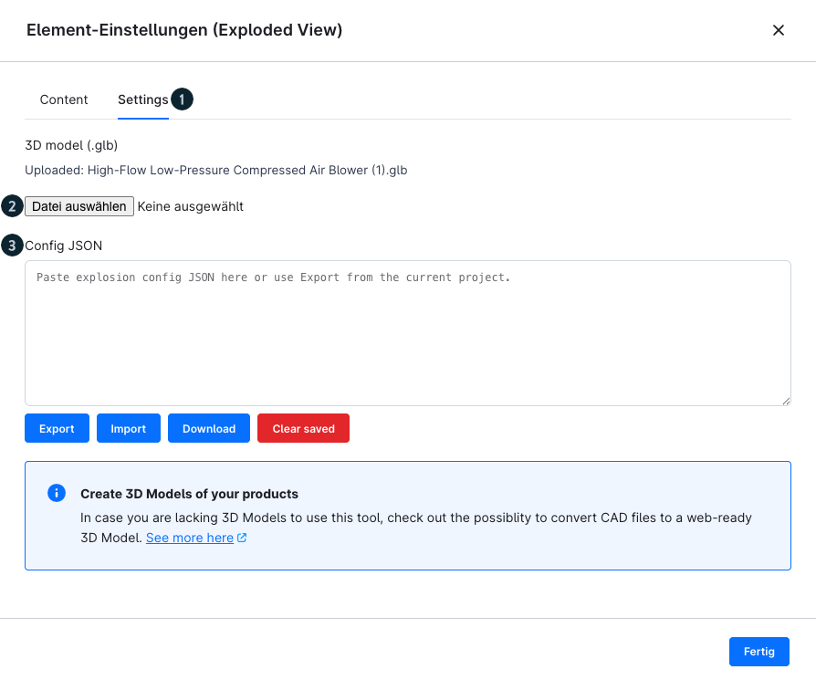
*Settings-Tab eines Immersive Elements mit Darstellungsoptionen*

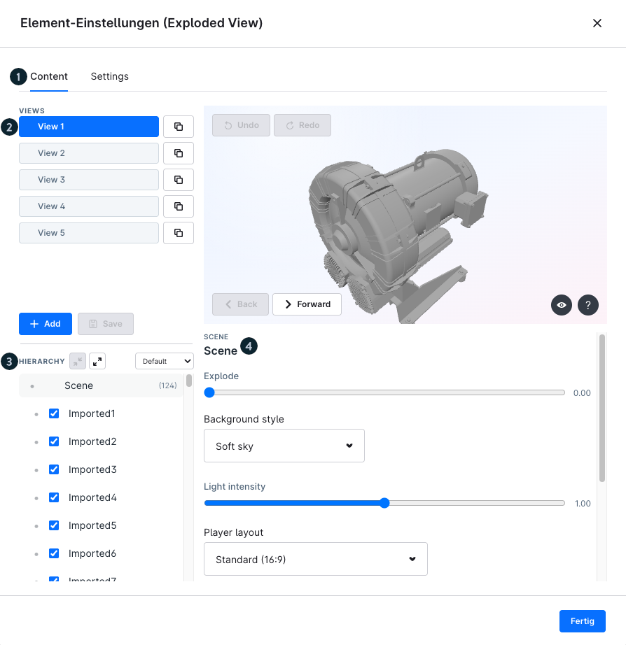
*Content-Tab: Medien und inhaltliche Konfiguration*

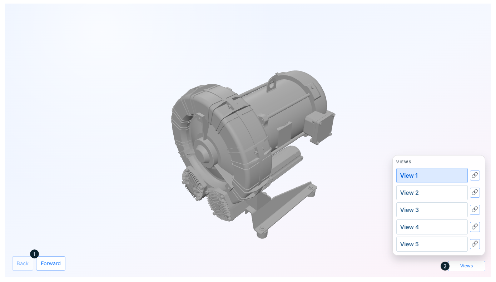
*Darstellung eines Immersive Elements in der Storefront*

---

## 8. Best Practices

1. **Dateigröße optimieren**: Besonders .glb-Dateien vor dem Upload optimieren
2. **Elemente gruppieren**: Mehrere Immersive Elements hintereinander platzieren für
   maximale Wirkung
3. **Full Width**: Immer den Vollbild-Modus für optimale Wirkung nutzen
4. **Mobile testen**: Alle Elemente auf verschiedenen Geräten testen
5. **Community Hub**: Interaktiven Lernpfad durchlaufen für praktisches Wissen

---

## Quelle
https://docs.shopware.com/de/shopware-6-de/erweiterungen/immersive-elements
https://store.shopware.com/de/insto94276218562m/immersive-elements.html
https://hub.shopware.com/learn/unit/user-immersive-elements
