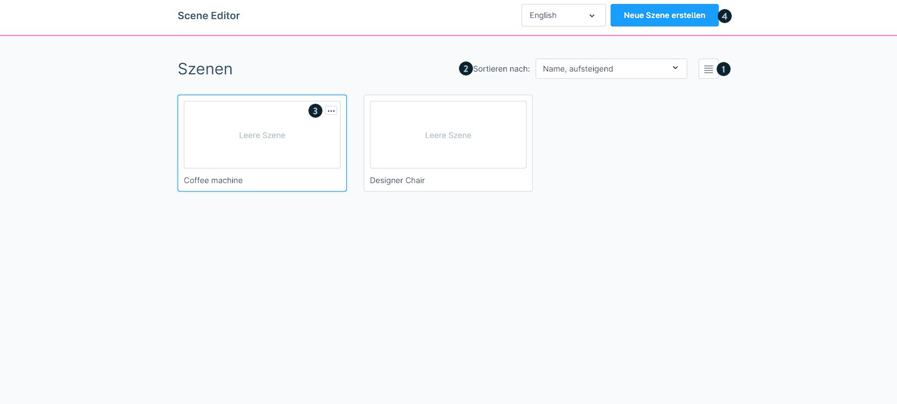
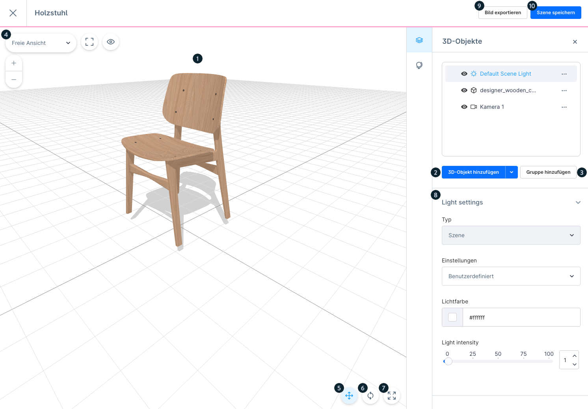
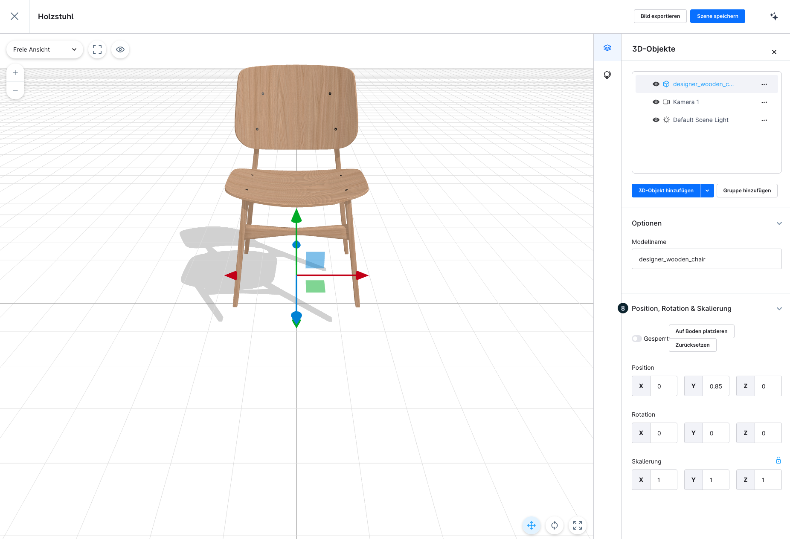
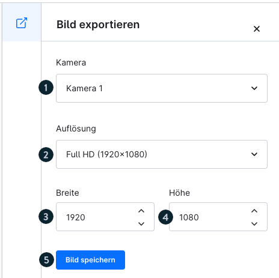
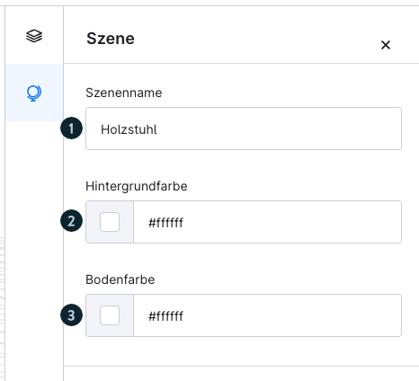
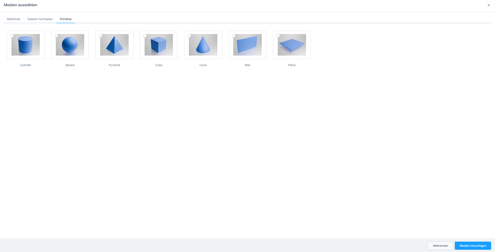

# Shopware 6 – Scene Editor: Vollständige Referenz

> Quelle: https://docs.shopware.com/de/shopware-6-de/commercial-features/scene-editor
> Plan: Rise (oder höher)
> Mindestversion: 6.6.8.1
> Status: Beta

---

## 1. Überblick

Der **Scene Editor** ermöglicht es, das volle Potenzial von 3D-Modellen für die Erstellung
von Produktbildern zu nutzen. Händler können:

- Verschiedenste 3D-Szenen aufbauen
- Produkte in der Szene platzieren und anordnen
- Unbegrenzt Bilder aus den Szenen generieren
- Exportierte Bilder direkt für Produktlisting und Marketing nutzen

**Pfad**: Inhalte > Scene Editor

### Status und Verfügbarkeit

| Eigenschaft | Detail |
|---|---|
| Status | **Beta** – eingeschränkter Funktionsumfang, wird erweitert |
| Mindestplan | Rise oder höher |
| Mindestversion | 6.6.8.1 |
| Aktivierung (6.6.8.1–6.6.10.5) | Muss zunächst unter **Insider Previews** aktiviert werden |
| Ab 6.6.10.6 | Direkt verfügbar ohne Aktivierungsschritt |

> ⚠ Das Feature befindet sich im Beta-Status. Verhalten und Umfang können sich
> in zukünftigen Updates ändern. Feedback ist erwünscht.

---

## 2. Szenenübersicht

Die Startseite des Scene Editors zeigt alle bereits angelegten Szenen.

### Bedienelemente der Übersicht

| Element | Funktion |
|---|---|
| **(1) Listenansicht** | Wechsel zwischen Kachelansicht und Listenansicht |
| **(2) Sortieren nach** | Dropdown: Erstelldatum, Bearbeitungsdatum, Name |
| **(3) Kontextmenü** | Pro Szene: Löschen, Duplizieren, Bearbeiten |
| **(4) Neue Szene erstellen** | Öffnet den Erstellungsdialog |

**Direkter Zugriff**: Klick auf einen Szenen-Eintrag öffnet die Bearbeitung direkt.

---

## 3. Neue Szene erstellen

1. Schaltfläche **„Neue Szene erstellen"** anklicken
2. **Namen für die Szene** vergeben (Pflichtfeld)
3. Nach der Namensvergabe wird automatisch in die **Bearbeitungsansicht** gewechselt

---

## 4. Bedienelemente im Scene Editor

Der Scene Editor ist in verschiedene Werkzeugbereiche gegliedert.

### 4.1 Hauptbereich – 3D-Arbeitsbereich

| Element | Funktion |
|---|---|
| **Objekt im Arbeitsbereich (1)** | Hauptfenster; zeigt das ausgewählte 3D-Objekt auf einem Gitternetz zur Orientierung. Das Gitternetz ist frei drehbar. |

---

### 4.2 Werkzeuge für 3D-Objekte

#### 3D-Objekt hinzufügen (2)

- Über **„3D-Objekt hinzufügen"** → Dropdown-Menü öffnet sich
- Verschiedene Objektarten zur Auswahl (eigene Modelle, Primitive)

#### Gruppe hinzufügen (3)

- Mehrere Objekte zu einer **Gruppe** zusammenfassen
- Gruppen lassen sich gemeinsam bewegen, transformieren und mit Effekten versehen

#### Ansichtsauswahl (4)

- Wechsel zwischen verschiedenen **Kamera- und Ansichtseinstellungen**
- Beispiel: „Freie Ansicht"
- Schneller Wechsel zwischen vorgegebenen Perspektiven

---

### 4.3 Verschieben-Werkzeug (5)

Aktiviert das **Move-Tool** zum Positionieren von Objekten im 3D-Raum.

| Achsensteuerung | Beschreibung |
|---|---|
| **Blauer Pfeil** | Z-Achse (vorwärts/rückwärts) |
| **Grüner Pfeil** | Y-Achse (aufwärts/abwärts) |
| **Roter Pfeil** | X-Achse (links/rechts) |
| **Farbige Quadrate** | Kombinierte Ebenen-Bewegung (z. B. XY-Ebene) |
| **Mittleres Quadrat** | Freie Bewegung in alle Richtungen |

---

### 4.4 Drehen-Werkzeug (6)

Aktiviert das **Rotate-Tool** zum Drehen von Objekten um die drei Raumachsen.

| Ring | Achse | Bewegung |
|---|---|---|
| **Roter Ring** | X-Achse | Nach vorne/nach hinten kippen |
| **Blauer Ring** | Z-Achse | Nach links/nach rechts kippen |
| **Grüner Ring** | Y-Achse | Um die eigene Achse drehen (Yaw) |
| **Gelber Außenring** | Kamera | Drehung aus der Kameraperspektive |

---

### 4.5 Skalieren-Werkzeug (7)

Hiermit wird die **Größe von Objekten** verändert.

| Einstellung | Beschreibung |
|---|---|
| **Standard (gleichmäßig)** | Proportionen bleiben erhalten; alle Achsen skalieren gleichzeitig |
| **Achsenspezifisch** | Option deaktivieren → einzelne Achse strecken oder stauchen |
| **Grünes Quadrat** | Höhe (Y-Achse) |
| **Rotes Quadrat** | Breite (X-Achse) |
| **Blaues Quadrat** | Tiefe (Z-Achse) |

---

### 4.6 Light Settings – Lichteinstellungen (8)

Konfiguration der Beleuchtung der Szene oder einzelner Objekte.

| Parameter | Optionen |
|---|---|
| **Typ** | Licht für die gesamte Szene **oder** nur für ein bestimmtes Objekt |
| **Einstellungen** | Vordefinierte **Presets** oder vollständig benutzerdefiniert |
| **Lichtfarbe** | Farbauswahl per Hex-Code (Beispiel: `#ffffff` für Weißlicht) |
| **Light Intensity** | Stärke des Lichts: Schieberegler **0–100 %** |

> ⚠ Die Ansicht der Lichtoptionen kann sich je nach ausgewähltem Objekt unterscheiden.

---

### 4.7 Bild exportieren (9)

Exportiert die aktuelle Szene als Bilddatei.

**Schritte**:
1. Schaltfläche **„Bild exportieren"** oben rechts anklicken
2. **Vorlage oder benutzerdefinierte Größe** auswählen
3. **Kamera** auswählen (oder „Orbit-Ansicht" für dynamische Perspektive)
4. Schaltfläche **„Bild speichern"** anklicken
5. Das exportierte Bild wird im Medienordner **„Scene Editor Media"** gespeichert

---

### 4.8 Szene speichern (10)

- Speichert die **komplette 3D-Szene** inklusive:
  - Aller platzierten Objekte und deren Positionen
  - Alle Lichteinstellungen
  - Alle konfigurierten Kameraperspektiven
- Gespeicherte Szenen können jederzeit wieder geöffnet und bearbeitet werden

---

## 5. Bereich: Szene (Szenenkonfiguration)

In diesem Bereich werden globale Einstellungen für die Szene vorgenommen.

| Einstellung | Beschreibung |
|---|---|
| **(1) Szenenname** | Name der Szene bearbeiten (erscheint in der Übersicht) |
| **(2) Hintergrundfarbe** | Farbe des Szenenhintergrundes konfigurieren |
| **(3) Bodenfarbe** | Farbe des Szenenbodens konfigurieren |

---

## 6. Bild exportieren – Detailansicht

Die Export-Ansicht bietet folgende Konfigurationsoptionen:

| Element | Beschreibung |
|---|---|
| **(1) Kamera** | Auswahl der gewünschten Kamera für den Bildexport |
| **(2) Auflösung** | Auswahl einer vordefinierten Vorlage oder benutzerdefinierte Eingabe |
| **(3) Breite** | Bildbreite in Pixeln |
| **(4) Höhe** | Bildhöhe in Pixeln |
| **(5) Bild speichern** | Exportiert das Bild in den Medienordner „Scene Editor Media" |

---

## 7. Formen (Primitive)

Neben eigenen 3D-Produktmodellen können auch geometrische **Grundformen** (Primitive)
als Plattformen, Wände oder dekorative Elemente eingesetzt werden.

### Formen hinzufügen

1. **„3D-Objekt hinzufügen"** anklicken
2. In dem sich öffnenden Fenster **„Medien auswählen"** den Tab **„Primitive"** wählen
3. Gewünschte Form auswählen und zur Szene hinzufügen

### Formen konfigurieren

Nach dem Hinzufügen können folgende Eigenschaften angepasst werden:
- **Materialbeschaffenheit** (Oberfläche, Reflexion etc.)
- **Farbe** der Form

**Typische Einsatzfälle für Primitive**:
- Podest/Plattform für das Produkt
- Hintergrundwand
- Dekorative geometrische Elemente in der Szene

---

## 8. Workflow: Von der Szene zum Produktbild

```
1. Inhalte > Scene Editor → "Neue Szene erstellen"
2. Szenenname vergeben → Bearbeitungsansicht öffnet sich
3. "3D-Objekt hinzufügen" → Produkt-GLB hochladen oder auswählen
4. Primitive als Podest/Hintergrund hinzufügen (optional)
5. Produkt mit Verschieben/Drehen/Skalieren positionieren
6. Beleuchtung über "Light Settings" konfigurieren
7. Hintergrundfarbe und Bodenfarbe in "Szene" einstellen
8. "Szene speichern" → Arbeit sichern
9. "Bild exportieren" → Kamera & Auflösung wählen → "Bild speichern"
10. Exportiertes Bild erscheint in "Scene Editor Media"
11. Bild an Produkt zuweisen oder in Erlebniswelten nutzen
```

---

## 9. Screenshots


*Übersicht aller angelegten Szenen mit Kontextmenü und Sortierfunktion*


*Bearbeitungsansicht: 3D-Arbeitsbereich mit vollständiger Werkzeugpalette*


*Rotate-Tool mit farbkodierten Rotationsringen (rot/blau/grün/gelb)*


*Export-Dialog: Kamera auswählen, Auflösung festlegen, Bild speichern*


*Szenenkonfiguration: Szenenname, Hintergrundfarbe, Bodenfarbe*


*Primitive-Tab mit verfügbaren geometrischen Grundformen*

---

## 10. Weitere Ressourcen

- **Community Hub Lernpfad**: Interaktiver Lernpfad zu diesem Thema verfügbar
  https://hub.shopware.com (Suche nach "Scene Editor")
- **Feedback-Portal**: Feedback zu fehlenden Funktionen und Verbesserungsvorschlägen
  direkt über den in der Doku verlinkten Feedback-Forum

---

## Quelle
https://docs.shopware.com/de/shopware-6-de/commercial-features/scene-editor
https://docs.shopware.com/de/shopware-6-de/insider-previews
