# Shopware 6 – Immersive Elements app: full reference

> Source: https://docs.shopware.com/de/shopware-6-de/erweiterungen/immersive-elements
> Store: https://store.shopware.com/de/insto94276218562m/immersive-elements.html
> Plan: Rise (or higher) / alternatively €49/month

---

## Contents

- [1. Overview](#1-overview)
- [2. Installation](#2-installation)
- [3. Using the elements](#3-using-the-elements)
- [4. The six elements in detail](#4-the-six-elements-in-detail)
- [5. Comparison table of the elements](#5-comparison-table-of-the-elements)
- [6. Screenshots](#6-screenshots)
- [8. Best practices](#8-best-practices)
- [Source](#source)

## 1. Overview

**Immersive Elements** is an app that was developed in collaboration between Shopware and
**Instorier** (Norwegian experts for digital storytelling).
It transforms online shops into dynamic brand experiences through six specialised
3D blocks that can be used in the **Erlebniswelten** (Shopping Experiences).

The app is optimised for **mobile, desktop and spatial devices**.

### Goals

- Involve customers more strongly and strengthen brand loyalty
- Increase conversion rates through a more immersive product presentation
- Make products experienceable before they are bought

---

## 2. Installation

### 2.1 Prerequisites

- **Shopware plan**: at least **Rise** (registered for the shop domain)
- **Shopware account**: logged in under the Shopware account tab in the admin

### 2.2 Installation route (via the plan)

1. Open **Erweiterungen > Meine Erweiterungen** (Extensions > My extensions) in the admin
2. Make sure the Shopware account tab is active and logged in
3. Install **Immersive Elements** from the available extensions
4. After the installation flip the **activation toggle**

### 2.3 Installation route (without a plan, via the Store)

- Purchase via the **Shopware Store** for **€49/month** (rental licence)
- URL: https://store.shopware.com/de/insto94276218562m/immersive-elements.html

---

## 3. Using the elements

All six elements are located in the **Erlebniswelten** under:
**Blöcke > Commerce** (Blocks > Commerce)

### General configuration recommendations

- **Size mode**: choose "Full Width (1)" for optimal presentation
- **Placement**: Immersive Elements should be placed **consecutively** without other
  blocks in between, in order to create a seamless visual experience
- **Community Hub**: an interactive learning path is available at
  https://hub.shopware.com/learn/unit/user-immersive-elements

---

## 4. The six elements in detail

### 4.1 Cylinder Gallery

**Function**: interactive image slider in a 360° cylinder shape

**How it works**:
- Images are arranged in a rotating cylinder
- In the storefront the animation runs automatically
- Visitors can control the speed and direction by clicking and moving the mouse

**Area of use**: collection presentation, lookbooks, image galleries with many motifs

---

### 4.2 Depth Gallery

**Function**: parallax depth effect through mouse and scroll interaction

**How it works**:
- Images react to the visitor's mouse movement and create a
  three-dimensional impression of depth
- Scrolling activates further depth levels
- Creates "more depth and interactivity in the layout"

**Area of use**: hero images, lifestyle shots, atmospheric product presentations

---

### 4.3 Exploded View

**Function**: interactive breakdown of the product into individual components (with animation)

**Price**: **€49/month** as an in-app purchase (in addition to the base plan)

**How it works**:
- The 3D model of the product is "taken apart" into its individual parts (exploded view)
- Visitors can explore individual components at various levels of detail
- Animations show how the product is composed

**Configuration**:
1. Upload the `.glb` file of the product
2. Create several animation steps ("views")
3. Group the components hierarchically (parent and child parts)
4. **Add annotations**: give the product parts titles, descriptions and
   optional links to other product detail pages
5. Set the **explosion intensity**: how far apart the parts are pulled
6. **Configure the lighting**: light type, intensity, presets
7. **Interactivity**: users can navigate through the views (forward/back)
8. **Auto-play**: the animation runs automatically through all views
9. In the **Szene** (Scene) area: manage the grouping of components
10. **Import/export**: export and import the configurations as JSON

**Navigation for visitors**:
- Forward/back buttons
- A views overview for jumping directly to particular explosion levels

---

### 4.4 3D Model Journey

**Function**: animated 360° product tour with hotspots and audio

**How it works**:
- The 3D model of the product is presented in an animated tour
- The camera orbits the product automatically or under user control
- Interactive hotspots show product details and information

**Configuration**:
1. Upload the `.glb` file (3D model of the product)
2. Upload an `.mp3` audio file (optional audio track for the tour)
3. Configure the **background colour**
4. Add an optional **background image**
5. Create **several sections** with different:
   - camera positions
   - lighting effects (presets and an intensity slider)
6. **Add hotspots**:
   - title of the hotspot
   - description text
   - positioning in 3D space
7. Enable **360° interactivity**: visitors can rotate the model themselves

**Area of use**: premium products, technical products with details that need
explanation, jewellery, electronics

---

### 4.5 Slide Behind Gallery

**Function**: horizontal content change with a depth effect

**How it works**:
- The content changes horizontally (similar to a slider)
- In contrast to classic sliders a depth effect is created by the
  slide-behind mechanism
- Creates "more depth in the layout than conventional sliders"

**Area of use**: before/after comparisons, feature presentations, variant showcases

---

### 4.6 VR Cinema

**Function**: 3D and virtual reality experience for products and brand stories

**How it works**:
- Visitors are immersed in a 3D/VR cinema experience
- Supports the **webp video format** for optimal performance
- Suitable for product narratives and brand storytelling

**Area of use**: immersive brand presentation, product videos in VR, storytelling campaigns

---

## 5. Comparison table of the elements

| Element | Technology | Price | Main use | Interactivity |
|---|---|---|---|---|
| Cylinder Gallery | 360° images | Included | Galleries | Mouse control |
| Depth Gallery | Parallax | Included | Hero areas | Mouse + scroll |
| Exploded View | 3D GLB | +€49/month | Technical products | Animation + navigation |
| 3D Model Journey | 3D GLB + MP3 | Included | Premium products | 360° + hotspots |
| Slide Behind Gallery | CSS | Included | Comparisons | Horizontal slide |
| VR Cinema | WebP video | Included | Brand experiences | VR immersion |

---

## 6. Screenshots

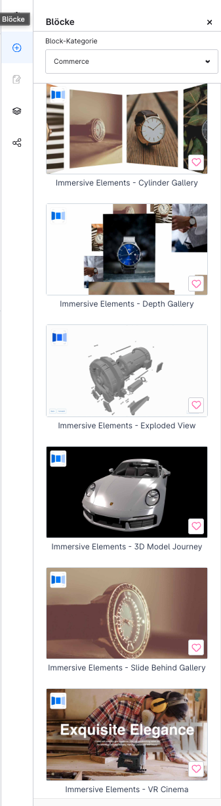
*All Immersive Elements blocks in the Erlebniswelten block library under "Commerce"*

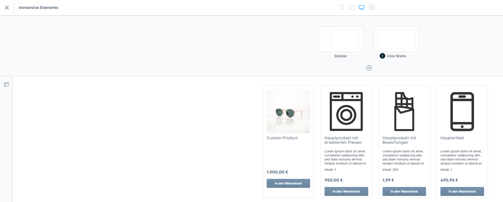
*Optimal presentation with full-screen mode (Full Width)*

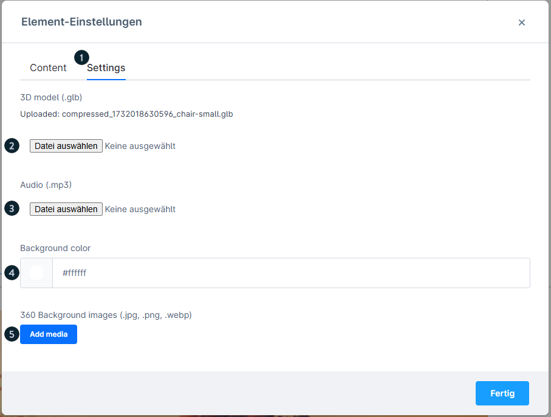
*Settings for the 3D Model Journey block*

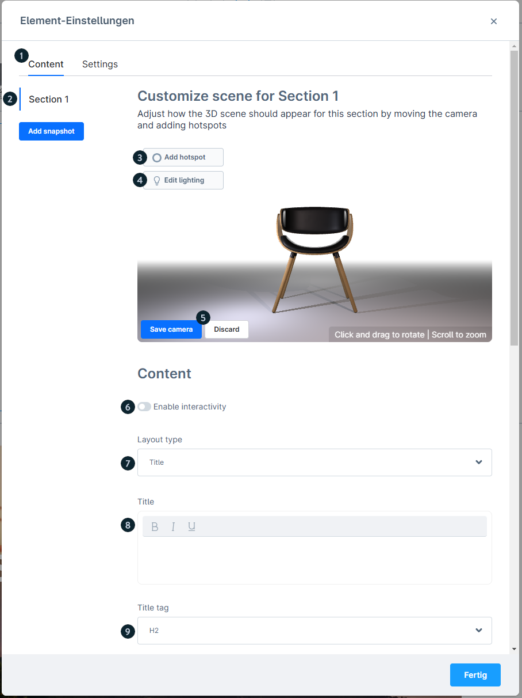
*Content configuration: upload the GLB file and audio, create sections*

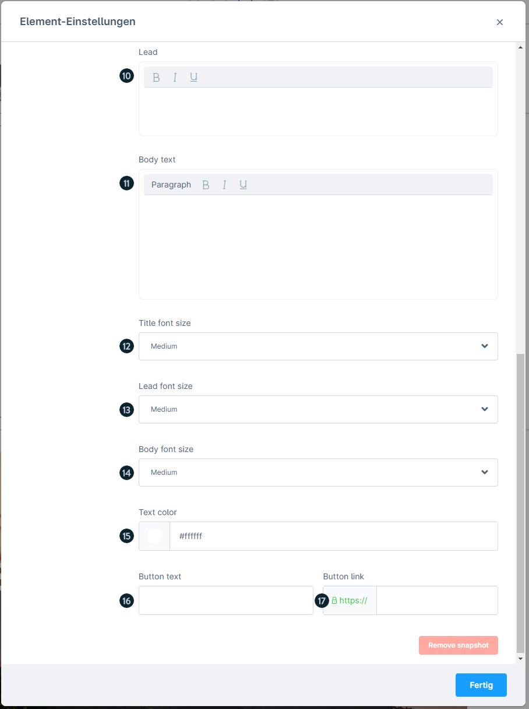
*Further content settings: background colour, lighting*

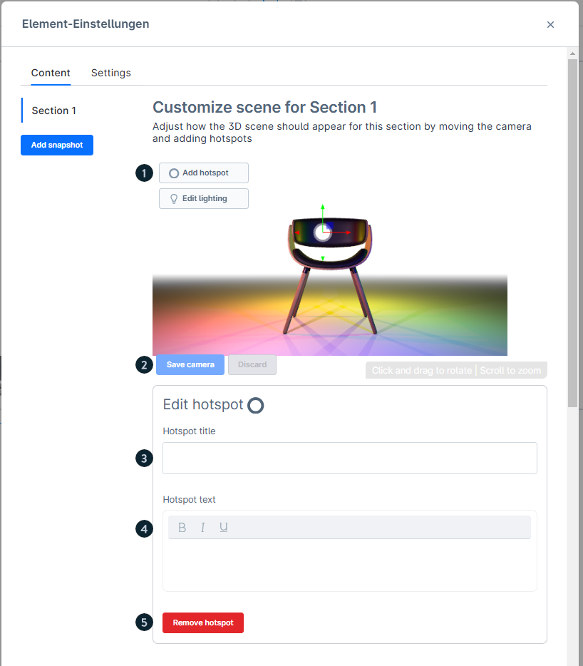
*Add a hotspot and position it in 3D space*

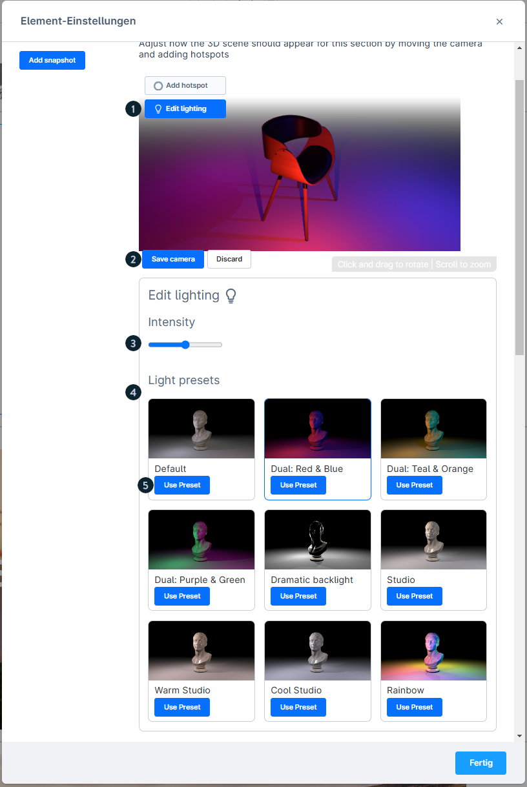
*Lighting options with preset selection and an intensity slider*

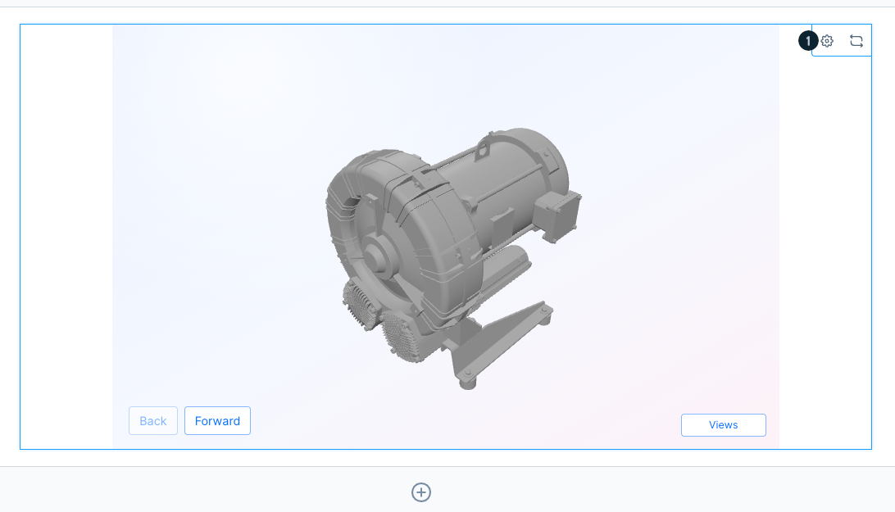
*Preview of an element in the Erlebniswelten editing view*

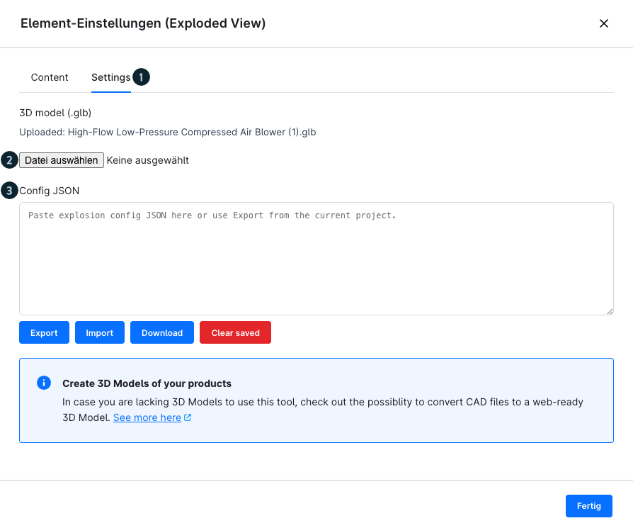
*Settings tab of an Immersive Element with presentation options*

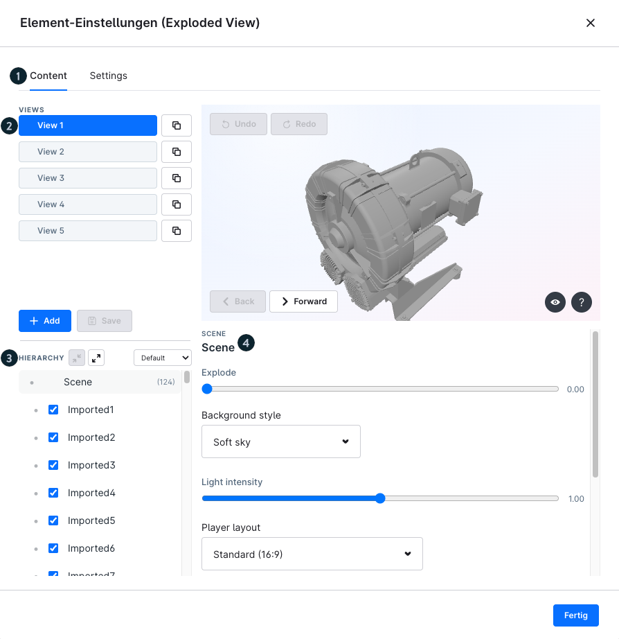
*Content tab: media and content configuration*

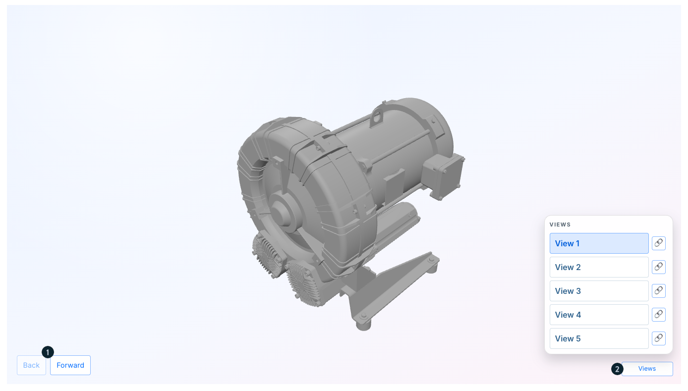
*Presentation of an Immersive Element in the storefront*

---

## 8. Best practices

1. **Optimise the file size**: optimise .glb files in particular before uploading
2. **Group the elements**: place several Immersive Elements one after another for
   maximum effect
3. **Full Width**: always use full-screen mode for optimal effect
4. **Test on mobile**: test all elements on various devices
5. **Community Hub**: work through the interactive learning path for practical knowledge

---

## Source
https://docs.shopware.com/de/shopware-6-de/erweiterungen/immersive-elements
https://store.shopware.com/de/insto94276218562m/immersive-elements.html
https://hub.shopware.com/learn/unit/user-immersive-elements
