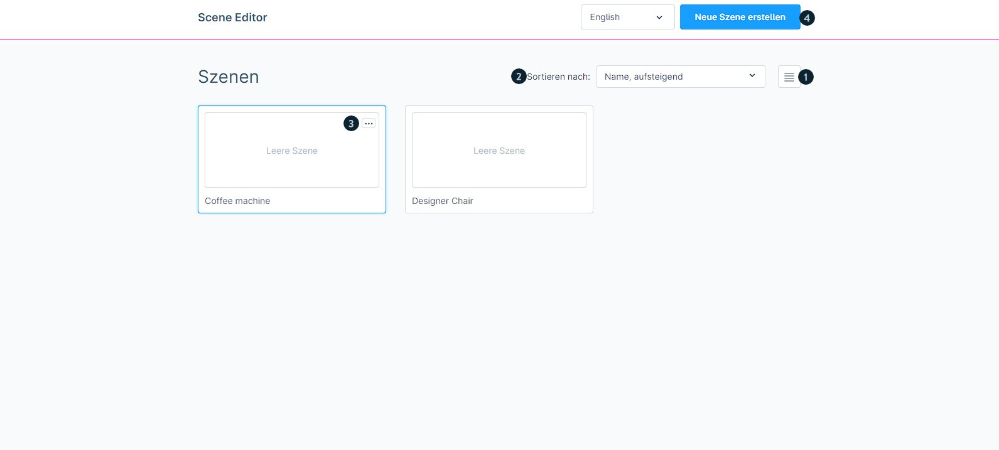
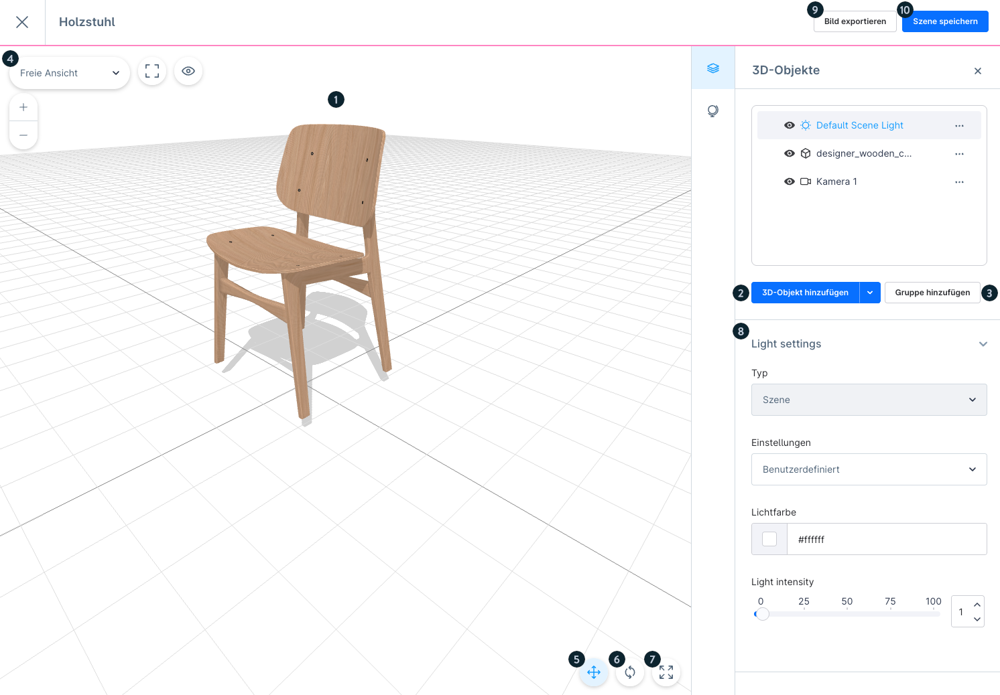
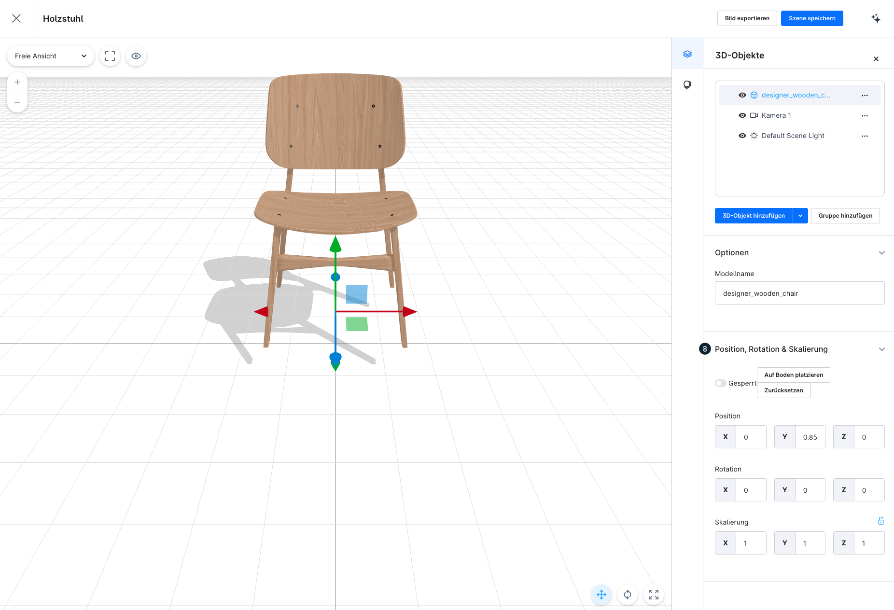
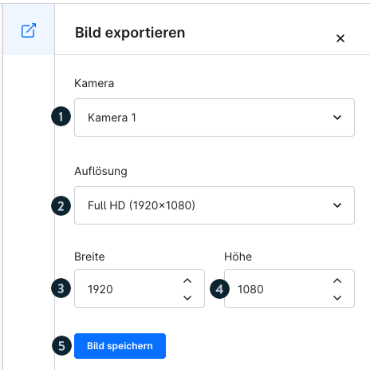
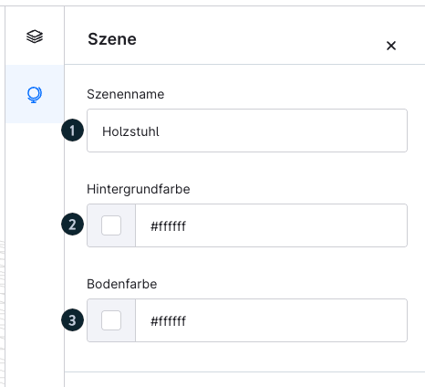
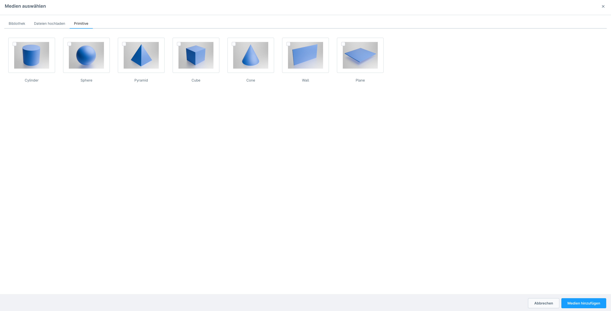

# Shopware 6 – Scene Editor: full reference

> Source: https://docs.shopware.com/de/shopware-6-de/commercial-features/scene-editor
> Plan: Rise (or higher)
> Minimum version: 6.6.8.1
> Status: Beta

---

## Contents

- [1. Overview](#1-overview)
- [2. Scene overview](#2-scene-overview)
- [3. Creating a new scene](#3-creating-a-new-scene)
- [4. Controls in the Scene Editor](#4-controls-in-the-scene-editor)
- [5. Area: Szene (scene configuration)](#5-area-szene-scene-configuration)
- [6. Exporting an image – detail view](#6-exporting-an-image-detail-view)
- [7. Shapes (primitives)](#7-shapes-primitives)
- [8. Workflow: from the scene to the product image](#8-workflow-from-the-scene-to-the-product-image)
- [9. Screenshots](#9-screenshots)
- [10. Further resources](#10-further-resources)
- [Source](#source)

## 1. Overview

The **Scene Editor** makes it possible to use the full potential of 3D models for creating
product images. Merchants can:

- Build a wide variety of 3D scenes
- Place and arrange products in the scene
- Generate unlimited images from the scenes
- Use the exported images directly for the product listing and marketing

**Path**: **Inhalte > Scene Editor** (Content > Scene Editor)

### Status and availability

| Property | Detail |
|---|---|
| Status | **Beta** – limited feature scope, being expanded |
| Minimum plan | Rise or higher |
| Minimum version | 6.6.8.1 |
| Activation (6.6.8.1–6.6.10.5) | Must first be enabled under **Insider Previews** |
| From 6.6.10.6 | Available directly, without an activation step |

> ⚠ The feature is in beta status. Its behaviour and scope can change
> in future updates. Feedback is welcome.

---

## 2. Scene overview

The Scene Editor start page shows all scenes that have already been created.

### Controls of the overview

| Element | Function |
|---|---|
| **(1) Listenansicht** (List view) | Switch between tile view and list view |
| **(2) Sortieren nach** (Sort by) | Dropdown: creation date, modification date, name |
| **(3) Kontextmenü** (Context menu) | Per scene: delete, duplicate, edit |
| **(4) Neue Szene erstellen** (Create new scene) | Opens the creation dialog |

**Direct access**: clicking a scene entry opens editing directly.

---

## 3. Creating a new scene

1. Click the **"Neue Szene erstellen"** button
2. Assign a **name for the scene** (mandatory field)
3. After the name has been assigned it switches automatically to the **editing view**

---

## 4. Controls in the Scene Editor

The Scene Editor is divided into different tool areas.

### 4.1 Main area – 3D workspace

| Element | Function |
|---|---|
| **Object in the workspace (1)** | Main window; shows the selected 3D object on a grid for orientation. The grid can be rotated freely. |

---

### 4.2 Tools for 3D objects

#### 3D-Objekt hinzufügen (Add 3D object) (2)

- Via **"3D-Objekt hinzufügen"** → a dropdown menu opens
- Various object types to choose from (your own models, primitives)

#### Gruppe hinzufügen (Add group) (3)

- Combine several objects into one **group**
- Groups can be moved, transformed and given effects together

#### Ansichtsauswahl (View selection) (4)

- Switch between different **camera and view settings**
- Example: "Freie Ansicht" (free view)
- Fast switching between predefined perspectives

---

### 4.3 Verschieben-Werkzeug (Move tool) (5)

Activates the **move tool** for positioning objects in 3D space.

| Axis control | Description |
|---|---|
| **Blue arrow** | Z axis (forward/backward) |
| **Green arrow** | Y axis (up/down) |
| **Red arrow** | X axis (left/right) |
| **Coloured squares** | Combined plane movement (e.g. the XY plane) |
| **Centre square** | Free movement in all directions |

---

### 4.4 Drehen-Werkzeug (Rotate tool) (6)

Activates the **rotate tool** for rotating objects around the three spatial axes.

| Ring | Axis | Movement |
|---|---|---|
| **Red ring** | X axis | Tilt forward/backward |
| **Blue ring** | Z axis | Tilt left/right |
| **Green ring** | Y axis | Rotate around its own axis (yaw) |
| **Yellow outer ring** | Camera | Rotation from the camera perspective |

---

### 4.5 Skalieren-Werkzeug (Scale tool) (7)

This is used to change the **size of objects**.

| Setting | Description |
|---|---|
| **Default (uniform)** | Proportions are preserved; all axes scale simultaneously |
| **Axis-specific** | Disable the option → stretch or squash a single axis |
| **Green square** | Height (Y axis) |
| **Red square** | Width (X axis) |
| **Blue square** | Depth (Z axis) |

---

### 4.6 Light Settings – lighting settings (8)

Configuration of the lighting of the scene or of individual objects.

| Parameter | Options |
|---|---|
| **Typ** (Type) | Light for the entire scene **or** only for one particular object |
| **Einstellungen** (Settings) | Predefined **presets** or fully custom |
| **Lichtfarbe** (Light colour) | Colour selection via hex code (example: `#ffffff` for white light) |
| **Light Intensity** | Strength of the light: slider **0–100 %** |

> ⚠ The view of the light options can differ depending on the selected object.

---

### 4.7 Bild exportieren (Export image) (9)

Exports the current scene as an image file.

**Steps**:
1. Click the **"Bild exportieren"** button at the top right
2. Select a **template or a custom size**
3. Select the **camera** (or "Orbit-Ansicht" – orbit view – for a dynamic perspective)
4. Click the **"Bild speichern"** (Save image) button
5. The exported image is saved in the media folder **"Scene Editor Media"**

---

### 4.8 Szene speichern (Save scene) (10)

- Saves the **complete 3D scene** including:
  - All placed objects and their positions
  - All lighting settings
  - All configured camera perspectives
- Saved scenes can be reopened and edited at any time

---

## 5. Area: Szene (scene configuration)

Global settings for the scene are made in this area.

| Setting | Description |
|---|---|
| **(1) Szenenname** (Scene name) | Edit the name of the scene (appears in the overview) |
| **(2) Hintergrundfarbe** (Background colour) | Configure the colour of the scene background |
| **(3) Bodenfarbe** (Floor colour) | Configure the colour of the scene floor |

---

## 6. Exporting an image – detail view

The export view offers the following configuration options:

| Element | Description |
|---|---|
| **(1) Kamera** (Camera) | Selection of the desired camera for the image export |
| **(2) Auflösung** (Resolution) | Selection of a predefined template or a custom entry |
| **(3) Breite** (Width) | Image width in pixels |
| **(4) Höhe** (Height) | Image height in pixels |
| **(5) Bild speichern** (Save image) | Exports the image into the media folder "Scene Editor Media" |

---

## 7. Shapes (primitives)

Besides your own 3D product models, geometric **basic shapes** (primitives) can also be
used as platforms, walls or decorative elements.

### Adding shapes

1. Click **"3D-Objekt hinzufügen"**
2. In the window that opens, **"Medien auswählen"** (Select media), choose the tab **"Primitive"**
3. Select the desired shape and add it to the scene

### Configuring shapes

After adding, the following properties can be adjusted:
- **Material properties** (surface, reflection etc.)
- **Colour** of the shape

**Typical use cases for primitives**:
- Pedestal/platform for the product
- Background wall
- Decorative geometric elements in the scene

---

## 8. Workflow: from the scene to the product image

```
1. Inhalte > Scene Editor → "Neue Szene erstellen"
2. Assign a scene name → the editing view opens
3. "3D-Objekt hinzufügen" → upload or select the product GLB
4. Add primitives as a pedestal/background (optional)
5. Position the product with move/rotate/scale
6. Configure the lighting via "Light Settings"
7. Set the background colour and floor colour in "Szene"
8. "Szene speichern" → secure your work
9. "Bild exportieren" → choose the camera & resolution → "Bild speichern"
10. The exported image appears in "Scene Editor Media"
11. Assign the image to a product or use it in the Erlebniswelten
```

---

## 9. Screenshots


*Overview of all created scenes with the context menu and the sorting function*


*Editing view: 3D workspace with the complete tool palette*


*Rotate tool with colour-coded rotation rings (red/blue/green/yellow)*


*Export dialog: select the camera, set the resolution, save the image*


*Scene configuration: scene name, background colour, floor colour*


*Primitive tab with the available basic geometric shapes*

---

## 10. Further resources

- **Community Hub learning path**: an interactive learning path on this topic is available
  https://hub.shopware.com (search for "Scene Editor")
- **Feedback portal**: feedback on missing functions and suggestions for improvement
  directly via the feedback forum linked in the docs

---

## Source
https://docs.shopware.com/de/shopware-6-de/commercial-features/scene-editor
https://docs.shopware.com/de/shopware-6-de/insider-previews
