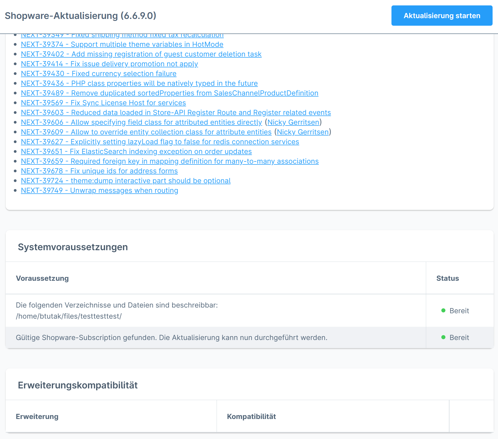
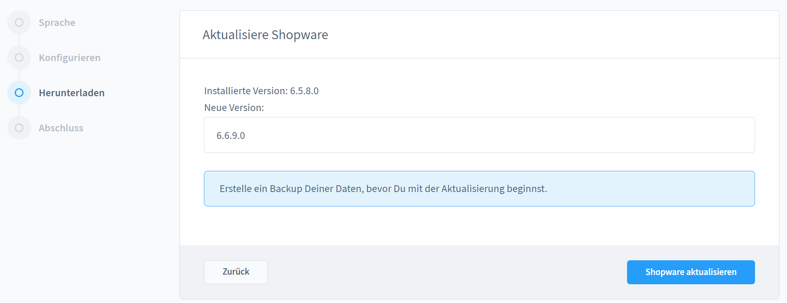
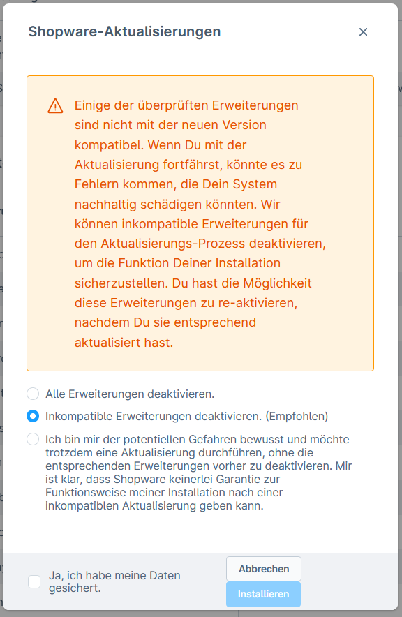
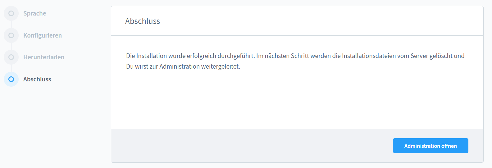
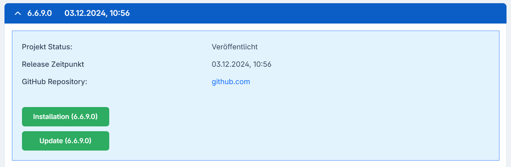

# Shopware 6 — Backup & update preparation: complete reference

## Contents

- [Backup: a mandatory step before every update](#backup-a-mandatory-step-before-every-update)
- [Backup methods](#backup-methods)
- [Backup strategy for updates](#backup-strategy-for-updates)
- [Extensions: compatibility check](#extensions-compatibility-check)
- [Checking the system requirements before the update](#checking-the-system-requirements-before-the-update)
- [Screenshots: the update process](#screenshots-the-update-process)

## Backup: a mandatory step before every update

> **CRITICAL:** Shopware does not create an automatic backup. Without a backup, no safe rollback is possible.

### What has to be backed up?

| Component | Content | Method |
|---|---|---|
| Database | All shop data | mysqldump / hosting panel |
| public/media/ | Uploaded images, documents | rsync / hosting backup |
| config/ | Configuration files | rsync / Git |
| .env | Environment variables | rsync (separately, not in Git!) |
| var/log/ | Logs (optional) | rsync |

### No need to back up (regenerable)

| Directory | Reason |
|---|---|
| var/cache/ | Is cleared during the update |
| vendor/ | Restorable via `composer install` |
| node_modules/ | Restorable via `npm install` |

---

## Backup methods

### Method 1: database backup via mysqldump

```bash
# Vollständiges Backup
mysqldump -u db_user -p db_name > shopware-backup-$(date +%Y%m%d-%H%M%S).sql

# Mit Kompression (empfohlen bei großen Datenbanken)
mysqldump -u db_user -p db_name | gzip > shopware-backup-$(date +%Y%m%d).sql.gz

# Mit Single-Transaction (kein Table-Lock bei InnoDB)
mysqldump -u db_user -p --single-transaction db_name > shopware-backup.sql
```

### Method 2: shopware-cli dump (the cleaner alternative)

```bash
# Clean Dump (ohne Cart-Session-Daten, Logs)
shopware-cli project dump \
  --clean \
  --host localhost \
  --username db_user \
  --password db_pass \
  --output shopware-backup-$(date +%Y%m%d).sql \
  db_name

# Mit Anonymisierung (DSGVO für externe Staging-Umgebungen)
shopware-cli project dump \
  --clean \
  --anonymize \
  --host localhost \
  --username db_user \
  --password db_pass \
  --output shopware-backup-anon.sql \
  db_name
```

### Method 3: hosting panel (for shared hosting)
Most hosting providers offer automatic or manual backup functions in their control panel (cPanel, Plesk, Hetzner):
- cPanel: Backups > Full Backup / Partial Backup
- Plesk: Websites & Domains > Backup Manager
- Hetzner: Server Backups (automatic, paid)

### Method 4: file backup via rsync

```bash
# Gesamtes Shop-Verzeichnis sichern
rsync -avz --exclude='vendor/' --exclude='var/cache/' --exclude='node_modules/' \
  /pfad/zum/shop/ \
  /pfad/zum/backup/shopware-$(date +%Y%m%d)/

# Remote-Backup auf anderen Server
rsync -avz --exclude='vendor/' \
  /pfad/zum/shop/ \
  backup-user@backup-server:/backups/shopware/$(date +%Y%m%d)/
```

---

## Backup strategy for updates

### Recommended procedure

1. **3-2-1 rule:**
   - 3 copies of the data
   - 2 different media (local + cloud/remote)
   - 1 copy off site (a different location)

2. **Timing:**
   - Back up directly before the update (not hours in advance)
   - Put the shop into maintenance mode → backup → update

3. **Verification:**
   - Check the backup file for integrity
   - Test restore on the staging environment

### Backup checklist before the update

- [ ] Database backed up (local copy)
- [ ] Database backup available on external storage
- [ ] public/media/ backed up
- [ ] config/ + .env backed up
- [ ] Backup integrity checked (file size plausible)
- [ ] Shopware version noted down (for a rollback)
- [ ] Composer version in composer.lock noted down

---

## Extensions: compatibility check

### Check before the update

**Method 1: admin panel**
- Einstellungen (Settings) > System > Shopware-Update (Shopware update)
- Shows the compatibility status of all extensions

**Method 2: Shopware Store**
- store.shopware.com > Mein Account (My account) > Lizenzen (Licences)
- Compatibility filter by target Shopware version

**Method 3: shopware-cli**
```bash
shopware-cli project upgrade-check
```

### The three compatibility statuses

| Status | Meaning | Action before the update |
|---|---|---|
| Bereits kompatibel (Already compatible) | The current version runs with the new SW version | Do nothing |
| Mit neuer SW-Version kompatibel (Compatible with the new SW version) | A new extension version is available after the SW update | Update after the update |
| Nicht kompatibel (Not compatible) | No compatible version planned | Deactivate/delete BEFORE the update |

### Extensions during a major update (6.4→6.5 or 6.5→6.6)

**ALL extensions must be deactivated:**

1. **Set the theme to the default:**
   Admin > Einstellungen > Design > Theme > activate the Storefront theme

2. **Deactivate the theme extension:**
   Admin > Erweiterungen (Extensions) > Meine Erweiterungen (My extensions) > deactivate the theme

3. **Deactivate all further extensions:**
   Admin > Erweiterungen > Meine Erweiterungen > deactivate all of them

4. **Run the update**

5. **After the update:**
   - Update the extensions in the Store to compatible versions
   - Reactivate the extensions
   - Reactivate the theme

---

## Checking the system requirements before the update

### Admin system check
Admin > Einstellungen > System > Shopware-Update > Systemvoraussetzungen (System requirements)

Green indicators = OK
Red indicators = must be fixed

### Manual CLI check

```bash
# PHP-Version prüfen
php -v

# PHP-Extensions prüfen
php -m | grep -E 'curl|json|zip|gd|pdo|intl|mbstring|openssl|ctype|dom'

# MySQL/MariaDB-Version prüfen
mysql --version

# Node.js-Version prüfen
node --version

# Composer-Version prüfen
composer --version

# Freier Festplattenplatz
df -h /pfad/zum/shop
```

### Typical PHP extensions that Shopware requires

| Extension | Purpose |
|---|---|
| curl | HTTP requests |
| json | JSON processing |
| zip | Archive handling |
| gd / imagick | Image processing |
| pdo_mysql | Database |
| intl | Internationalisation |
| mbstring | Multi-byte strings |
| openssl | SSL/TLS |
| ctype | Character type checks |
| dom | DOM manipulation |
| simplexml | XML parsing |
| sodium | Encryption |
| xml | XML processing |
| xmlreader | XML streaming |
| xmlwriter | XML creation |

---

## Screenshots: the update process


*Admin panel: Einstellungen > System > Shopware-Update — checking the system requirements*


*The available update versions are displayed*


*Extension compatibility status and deactivation options*


*Successful completion of the update*


*Browser installer: downloading the Shopware installer from the changelog*

---

*Source: https://docs.shopware.com/de/shopware-6-de/update-guides/shopware-aktualisieren-updaten*
