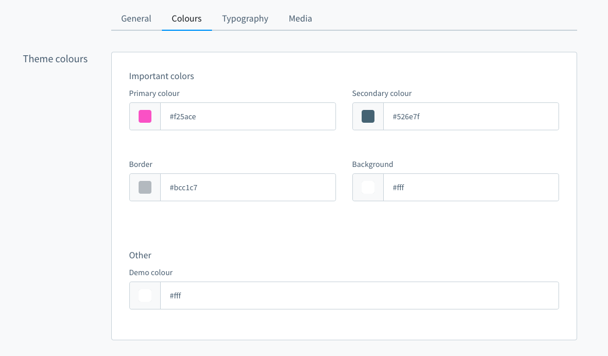
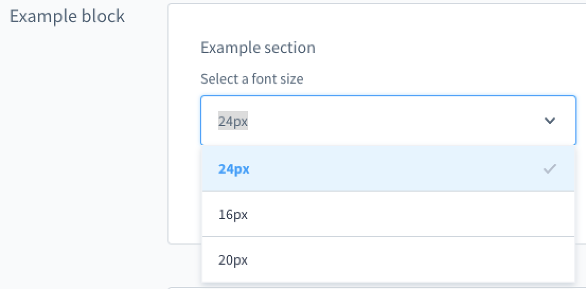
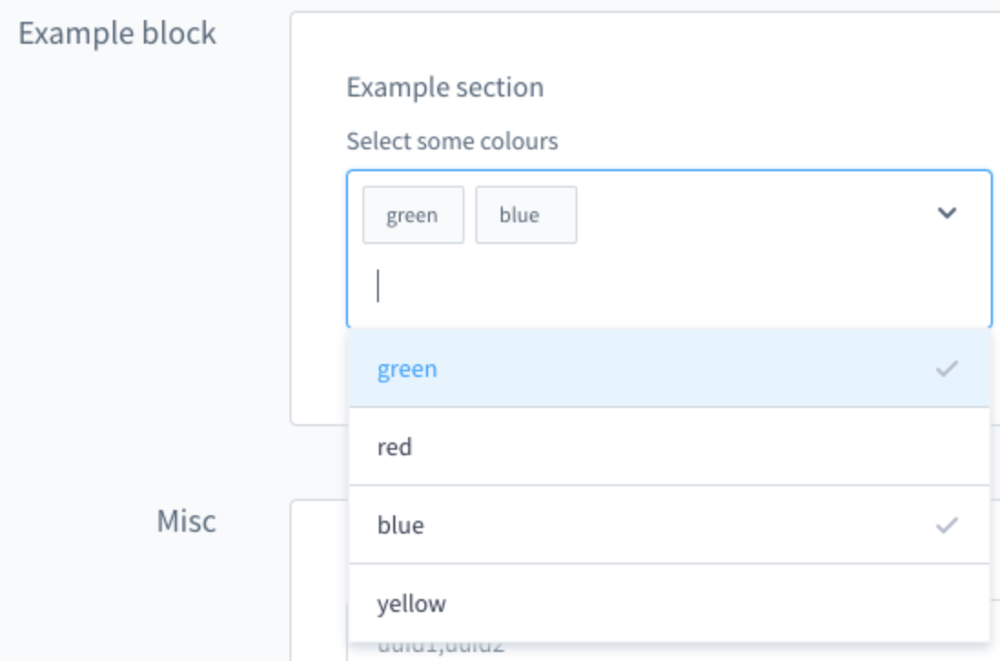

# Shopware 6 — Mehrere Themes & SalesChannel-Zuweisung: Vollständige Referenz

Quellen: `guides/plugins/themes/configuration/theme-inheritance-configuration.md`,
`guides/plugins/themes/inheritance/add-theme-inheritance.md`,
`guides/plugins/themes/configuration/theme-configuration.md`

---

## Konzept: Basis-Theme + Channel-spezifische Themes

**Anwendungsfall:** Ein Corporate-Design-Theme für alle SalesChannels, mit speziellen Themes für
besondere Zeiträume oder Zielgruppen (z.B. Weihnachten, Sales-Wochen, verschiedene Länder).

```
SwagBasicExampleTheme  (Basis: Corporate Design)
├── definiert Grundfarben, Logo, Typografie
└── SwagHolidayTheme   (erbt von Basis, nur für Advent)
    ├── überschreibt Primärfarbe
    └── fügt neue Felder hinzu (Adventskalender-Farbe)
```

---

## Theme einem SalesChannel zuweisen

```bash
bin/console theme:change
```

Interaktiver Ablauf:
```
Please select a sales channel:
[0] Storefront | 64bbbe810d824c339a6c191779b2c205
[1] Headless | 98432def39fc4624b33213a56b8c944d
> 0

Please select a theme:
[0] Storefront
[1] SwagBasicExampleTheme
[2] SwagHolidayTheme
> 2
```

Jeder SalesChannel kann ein **anderes** Theme verwenden. Themes sind nicht global aktiv
(Unterschied zu normalen Plugins).

---

## configInheritance: Konfiguration vererben

`configInheritance` in `theme.json` legt fest, welche Themes als Konfigurations-Quellen genutzt werden.

```json
{
  "configInheritance": [
    "@Storefront",
    "@SwagBasicExampleTheme"
  ]
}
```

**Funktionsweise:**
- Alle Konfigurations-Felder der genannten Themes stehen im aktuellen Theme zur Verfügung
- Werte werden vererbt (Eltern-Wert erscheint mit Vererbungs-Anker im Admin)
- Felder können explizit überschrieben werden
- Snippets werden ebenfalls vererbt
- Beziehung wird bei `plugin:install` gesetzt; Update: `bin/console theme:refresh`

> **Hinweis:** `@Storefront` wird **immer** vererbt, auch ohne explizite `configInheritance`.

> **Seit Shopware 6.4.8.0** verfügbar.

---

## Praxisbeispiel: Basis-Theme + Holiday-Theme

### Basis-Theme (`SwagBasicExampleTheme/src/Resources/theme.json`)

```json
{
  "name": "SwagBasicExampleTheme",
  "author": "Shopware AG",
  "views": ["@Storefront", "@Plugins", "@SwagBasicExampleTheme"],
  "style": [
    "app/storefront/src/scss/overrides.scss",
    "@Storefront",
    "app/storefront/src/scss/base.scss"
  ],
  "script": [
    "@Storefront",
    "app/storefront/dist/storefront/js/swag-basic-example-theme/swag-basic-example-theme.js"
  ],
  "asset": ["@Storefront", "app/storefront/src/assets"],
  "config": {
    "fields": {
      "sw-color-brand-primary": {
        "type": "color",
        "value": "#399",
        "editable": true,
        "tab": "colors",
        "block": "themeColors",
        "section": "importantColors"
      },
      "sw-brand-icon": {
        "type": "url",
        "value": "/our-logo.png",
        "editable": true
      }
    }
  }
}
```

### Abgeleitetes Theme (`SwagHolidayTheme/src/Resources/theme.json`)

```json
{
  "name": "SwagBasicExampleThemeExtend",
  "author": "Shopware AG",
  "views": [
    "@Storefront",
    "@Plugins",
    "@SwagBasicExampleTheme",
    "@SwagBasicExampleThemeExtend"
  ],
  "style": [
    "app/storefront/src/scss/overrides.scss",
    "@SwagBasicExampleTheme",
    "app/storefront/src/scss/base.scss"
  ],
  "script": [
    "@Storefront",
    "@SwagBasicExampleTheme",
    "app/storefront/dist/storefront/js/swag-example-plugin-theme-extended/swag-example-plugin-theme-extended.js"
  ],
  "asset": [
    "@Storefront",
    "@SwagBasicExampleTheme",
    "app/storefront/src/assets"
  ],
  "configInheritance": [
    "@Storefront",
    "@SwagBasicExampleTheme"
  ],
  "config": {
    "fields": {
      "sw-brand-icon": {
        "type": "url",
        "value": "/our-logo-holidays.png",
        "editable": true
      },
      "sw-advent-calendar-background-color": {
        "type": "color",
        "value": "#399",
        "editable": true
      }
    }
  }
}
```

**Was passiert hier:**
- `sw-brand-icon` wird **überschrieben** (anderes Logo für Feiertage)
- `sw-advent-calendar-background-color` ist ein **neues Feld** (nur für dieses Theme)
- Alle anderen Felder aus `SwagBasicExampleTheme` und `@Storefront` werden **vererbt**

---

## Sections in theme.json erklärt (Vererbung)

### `views` (Twig-Templates)
```json
"views": ["@Storefront", "@Plugins", "@SwagBasicExampleTheme", "@SwagBasicExampleThemeExtend"]
```
Reihenfolge der Template-Auflösung: spätere Einträge überschreiben frühere.

### `style` (SCSS)
```json
"style": ["overrides.scss", "@SwagBasicExampleTheme", "base.scss"]
```
`overrides.scss` **muss zuerst** (Bootstrap-Variable-Overrides), dann Parent-Theme, dann eigenes SCSS.

### `script` (JavaScript)
```json
"script": ["@Storefront", "@SwagBasicExampleTheme", "dist/js/my-theme.js"]
```
Basis → Parent → eigenes JS.

### `asset` (Assets/Bilder)
```json
"asset": ["@Storefront", "@SwagBasicExampleTheme", "app/storefront/src/assets"]
```
Assets aus Parent-Themes einschließen wenn nötig.

---

## Admin: Konfig-Tabs, Blocks, Sections

Konfigurationsfelder lassen sich strukturieren:



```json
"config": {
  "fields": {
    "sw-color-brand-primary": {
      "type": "color",
      "value": "#399",
      "editable": true,
      "tab": "colors",
      "block": "themeColors",
      "section": "importantColors"
    }
  }
}
```

Snippets für Übersetzungen (ab Shopware 6.7.1.0):
- Tab: `sw-theme.<technicalName>.<tabName>.label`
- Block: `sw-theme.<technicalName>.<tabName>.<blockName>.label`
- Feld: `sw-theme.<technicalName>.<tabName>.<blockName>.<sectionName>.<fieldName>.label`

---

## Custom Select-Felder (Beispiele)

### Single-Select

```json
"my-single-select-field": {
  "type": "text",
  "value": "24",
  "custom": {
    "componentName": "sw-single-select",
    "options": [{"value": "16"}, {"value": "20"}, {"value": "24"}]
  },
  "editable": true
}
```



### Multi-Select

```json
"my-multi-select-field": {
  "type": "text",
  "editable": true,
  "value": ["green", "blue"],
  "custom": {
    "componentName": "sw-multi-select",
    "options": [{"value": "green"}, {"value": "red"}, {"value": "blue"}, {"value": "yellow"}]
  }
}
```



---

## Alle Config-Feld-Typen

| Typ | Beschreibung |
|---|---|
| `color` | Farbwähler |
| `text` | Texteingabe |
| `number` | Zahleneingabe (mit `custom.numberType`, `min`, `max`) |
| `fontFamily` | Schriftfamilien-Auswahl |
| `media` | Medien-Auswahl |
| `checkbox` | Boolean-Checkbox |
| `switch` | Boolean-Switch |
| `url` | URL-Eingabe |

**Config-Feld-Optionen:**

| Name | Bedeutung |
|---|---|
| `label` | Übersetzungen (deprecated ab 6.8, jetzt via Snippets) |
| `helpText` | Hilfetext (deprecated ab 6.8) |
| `type` | Feld-Typ (siehe oben) |
| `editable` | `false` = nicht im Admin anzeigen |
| `tab` | Tab-Gruppenname |
| `block` | Block-Gruppenname |
| `section` | Sektion-Gruppenname |
| `custom` | Freie Daten (nicht verarbeitet, via API verfügbar) |
| `scss` | `false` = nicht als SCSS-Variable injizieren |
| `fullWidth` | `true` = Admin-Komponente volle Breite |
