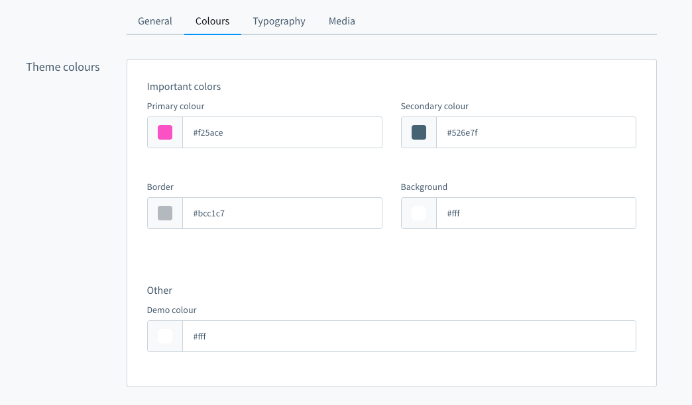
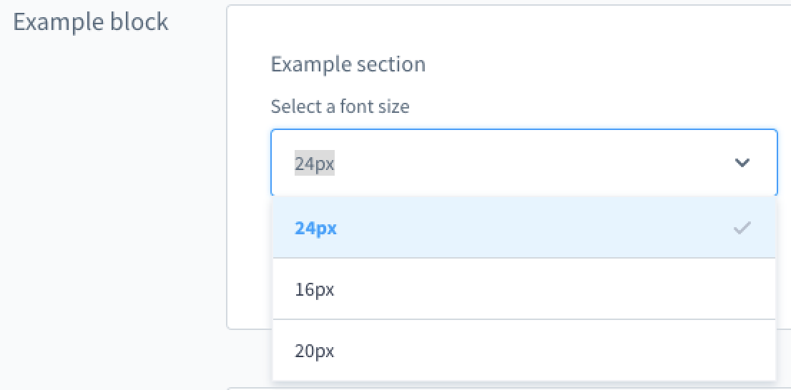
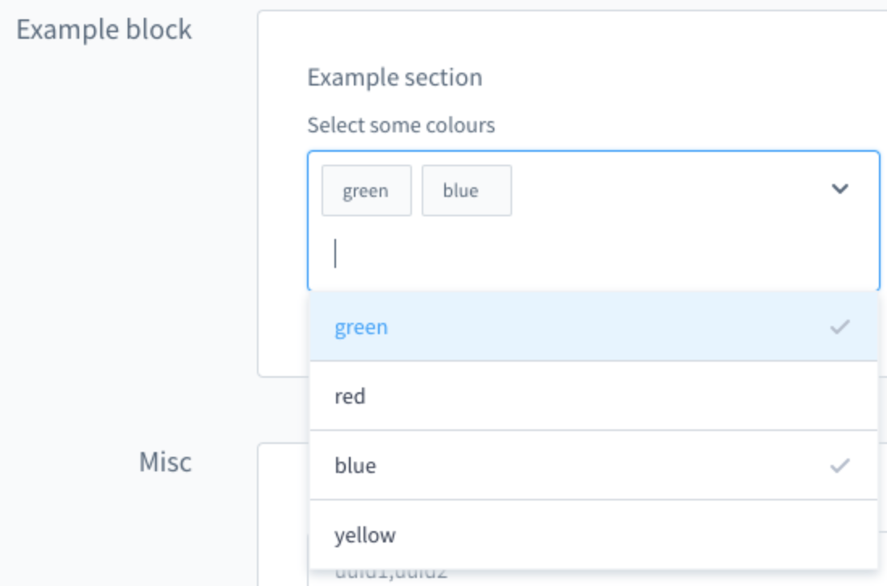

# Shopware 6 — Multiple themes & sales channel assignment: complete reference

Sources: `guides/plugins/themes/configuration/theme-inheritance-configuration.md`,
`guides/plugins/themes/inheritance/add-theme-inheritance.md`,
`guides/plugins/themes/configuration/theme-configuration.md`

---

## Contents

- [Concept: base theme + channel-specific themes](#concept-base-theme--channel-specific-themes)
- [Assigning a theme to a sales channel](#assigning-a-theme-to-a-sales-channel)
- [configInheritance: inheriting configuration](#configinheritance-inheriting-configuration)
- [Practical example: base theme + holiday theme](#practical-example-base-theme--holiday-theme)
- [Sections in theme.json explained (inheritance)](#sections-in-themejson-explained-inheritance)
- [Admin: config tabs, blocks, sections](#admin-config-tabs-blocks-sections)
- [Custom select fields (examples)](#custom-select-fields-examples)
- [All config field types](#all-config-field-types)

## Concept: base theme + channel-specific themes

**Use case:** One corporate design theme for all sales channels, with special themes for
particular periods or target groups (e.g. Christmas, sales weeks, different countries).

```
SwagBasicExampleTheme  (base: corporate design)
├── defines base colors, logo, typography
└── SwagHolidayTheme   (inherits from base, only for Advent)
    ├── overrides the primary color
    └── adds new fields (Advent calendar color)
```

---

## Assigning a theme to a sales channel

```bash
bin/console theme:change
```

Interactive flow:
```
Please select a sales channel:
[0] Storefront | 64bbbe810d824c339a6c191779b2c205
[1] Headless | 98432def39fc4624b33213a56b8c944d
> 0

Please select a theme:
[0] Storefront
[1] SwagBasicExampleTheme
[2] SwagHolidayTheme
> 2
```

Every sales channel can use a **different** theme. Themes are not active globally
(a difference from normal plugins).

---

## configInheritance: inheriting configuration

`configInheritance` in `theme.json` defines which themes are used as configuration sources.

```json
{
  "configInheritance": [
    "@Storefront",
    "@SwagBasicExampleTheme"
  ]
}
```

**How it works:**
- All configuration fields of the named themes are available in the current theme
- Values are inherited (the parent value appears with an inheritance anchor in the admin)
- Fields can be overridden explicitly
- Snippets are inherited as well
- The relationship is set on `plugin:install`; to update: `bin/console theme:refresh`

> **Note:** `@Storefront` is **always** inherited, even without an explicit `configInheritance`.

> Available **since Shopware 6.4.8.0**.

---

## Practical example: base theme + holiday theme

### Base theme (`SwagBasicExampleTheme/src/Resources/theme.json`)

```json
{
  "name": "SwagBasicExampleTheme",
  "author": "Shopware AG",
  "views": ["@Storefront", "@Plugins", "@SwagBasicExampleTheme"],
  "style": [
    "app/storefront/src/scss/overrides.scss",
    "@Storefront",
    "app/storefront/src/scss/base.scss"
  ],
  "script": [
    "@Storefront",
    "app/storefront/dist/storefront/js/swag-basic-example-theme/swag-basic-example-theme.js"
  ],
  "asset": ["@Storefront", "app/storefront/src/assets"],
  "config": {
    "fields": {
      "sw-color-brand-primary": {
        "type": "color",
        "value": "#399",
        "editable": true,
        "tab": "colors",
        "block": "themeColors",
        "section": "importantColors"
      },
      "sw-brand-icon": {
        "type": "url",
        "value": "/our-logo.png",
        "editable": true
      }
    }
  }
}
```

### Derived theme (`SwagHolidayTheme/src/Resources/theme.json`)

```json
{
  "name": "SwagBasicExampleThemeExtend",
  "author": "Shopware AG",
  "views": [
    "@Storefront",
    "@Plugins",
    "@SwagBasicExampleTheme",
    "@SwagBasicExampleThemeExtend"
  ],
  "style": [
    "app/storefront/src/scss/overrides.scss",
    "@SwagBasicExampleTheme",
    "app/storefront/src/scss/base.scss"
  ],
  "script": [
    "@Storefront",
    "@SwagBasicExampleTheme",
    "app/storefront/dist/storefront/js/swag-example-plugin-theme-extended/swag-example-plugin-theme-extended.js"
  ],
  "asset": [
    "@Storefront",
    "@SwagBasicExampleTheme",
    "app/storefront/src/assets"
  ],
  "configInheritance": [
    "@Storefront",
    "@SwagBasicExampleTheme"
  ],
  "config": {
    "fields": {
      "sw-brand-icon": {
        "type": "url",
        "value": "/our-logo-holidays.png",
        "editable": true
      },
      "sw-advent-calendar-background-color": {
        "type": "color",
        "value": "#399",
        "editable": true
      }
    }
  }
}
```

**What happens here:**
- `sw-brand-icon` is **overridden** (a different logo for the holidays)
- `sw-advent-calendar-background-color` is a **new field** (only for this theme)
- All other fields from `SwagBasicExampleTheme` and `@Storefront` are **inherited**

---

## Sections in theme.json explained (inheritance)

### `views` (Twig templates)
```json
"views": ["@Storefront", "@Plugins", "@SwagBasicExampleTheme", "@SwagBasicExampleThemeExtend"]
```
Order of template resolution: later entries override earlier ones.

### `style` (SCSS)
```json
"style": ["overrides.scss", "@SwagBasicExampleTheme", "base.scss"]
```
`overrides.scss` **must come first** (Bootstrap variable overrides), then the parent theme, then your own SCSS.

### `script` (JavaScript)
```json
"script": ["@Storefront", "@SwagBasicExampleTheme", "dist/js/my-theme.js"]
```
Base → parent → your own JS.

### `asset` (assets/images)
```json
"asset": ["@Storefront", "@SwagBasicExampleTheme", "app/storefront/src/assets"]
```
Include assets from parent themes if needed.

---

## Admin: config tabs, blocks, sections

Configuration fields can be structured:



```json
"config": {
  "fields": {
    "sw-color-brand-primary": {
      "type": "color",
      "value": "#399",
      "editable": true,
      "tab": "colors",
      "block": "themeColors",
      "section": "importantColors"
    }
  }
}
```

Snippets for translations (as of Shopware 6.7.1.0):
- Tab: `sw-theme.<technicalName>.<tabName>.label`
- Block: `sw-theme.<technicalName>.<tabName>.<blockName>.label`
- Field: `sw-theme.<technicalName>.<tabName>.<blockName>.<sectionName>.<fieldName>.label`

---

## Custom select fields (examples)

### Single select

```json
"my-single-select-field": {
  "type": "text",
  "value": "24",
  "custom": {
    "componentName": "sw-single-select",
    "options": [{"value": "16"}, {"value": "20"}, {"value": "24"}]
  },
  "editable": true
}
```



### Multi select

```json
"my-multi-select-field": {
  "type": "text",
  "editable": true,
  "value": ["green", "blue"],
  "custom": {
    "componentName": "sw-multi-select",
    "options": [{"value": "green"}, {"value": "red"}, {"value": "blue"}, {"value": "yellow"}]
  }
}
```



---

## All config field types

| Type | Description |
|---|---|
| `color` | Color picker |
| `text` | Text input |
| `number` | Number input (with `custom.numberType`, `min`, `max`) |
| `fontFamily` | Font family selection |
| `media` | Media selection |
| `checkbox` | Boolean checkbox |
| `switch` | Boolean switch |
| `url` | URL input |

**Config field options:**

| Name | Meaning |
|---|---|
| `label` | Translations (deprecated as of 6.8, now via snippets) |
| `helpText` | Help text (deprecated as of 6.8) |
| `type` | Field type (see above) |
| `editable` | `false` = do not show in the admin |
| `tab` | Tab group name |
| `block` | Block group name |
| `section` | Section group name |
| `custom` | Free-form data (not processed, available via API) |
| `scss` | `false` = do not inject as an SCSS variable |
| `fullWidth` | `true` = admin component at full width |
